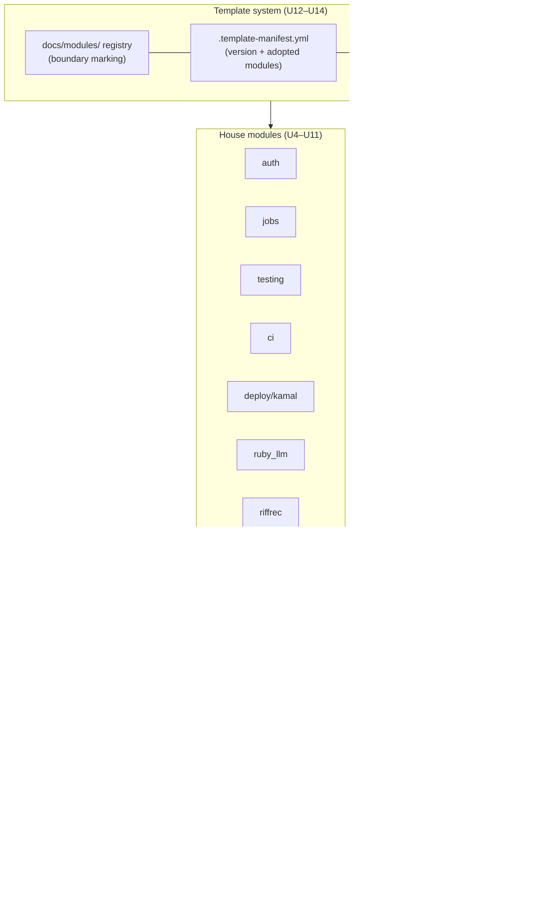
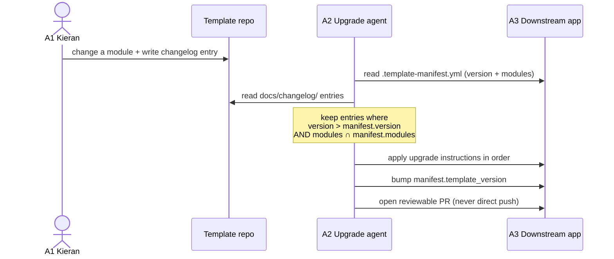
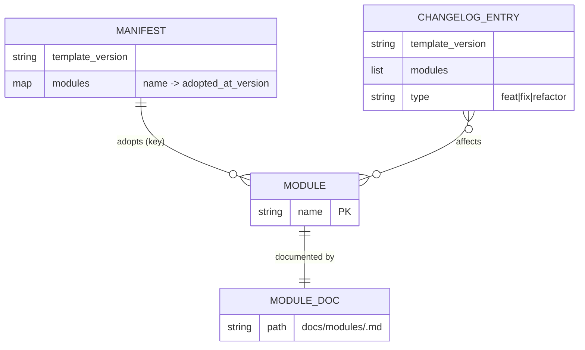

# Compound Stack Rails Template - Plan

## Goal Capsule

- **Objective:** Build a canonical, runnable Rails starter app that the fleet of Kieran's Rails projects converges on, with agent-executable changelog entries as the upgrade delivery mechanism.
- **Product authority:** Kieran. Stack picks are informed by the pattern survey landing in `docs/patterns/`.
- **Open blockers:** None remaining — the pattern survey (`docs/patterns/SUMMARY.md`) resolved every stack pick. Execution-time unknowns are enumerated under Open Questions.

---

## Product Contract

> **Product Contract preservation:** unchanged. All R/A/F/AE IDs, decisions, and scope below are carried verbatim from the `ce-brainstorm` requirements-only artifact. Planning added the Planning Contract, Implementation Units, Verification Contract, and Definition of Done only. One HOW-level nuance is recorded in KTD9 (riffrec ships as an in-repo no-op-degrading wrapper, not a hard dependency on the private package) — this honors R9 as written and changes no product scope.

### Summary

A canonical Rails application — Rails + Inertia/React + Kamal + the house libraries — that serves as the template for the fleet. New apps start by cloning it; existing apps converge on it à la carte. Upgrades are delivered by agents that read the template's changelog against a small per-app manifest recording the adopted template version and modules.

### Problem Frame

Sixteen Rails projects share overlapping but drifting stacks: each app re-decides auth, deployment, jobs, serialization, and conventions, and improvements made in one app never reach the others. Keeping them aligned by hand does not scale, and there is no single place where "the current best way I build Rails apps" lives.

### Key Decisions

- **Canonical runnable app over template script or docs-only.** A real, booting app is what upgrade agents diff against and what new apps clone. Script or docs-only variants drift invisibly and offer nothing verifiable.
- **Manifest + agent-executable changelog over per-module upgrade skills.** Each app carries a manifest (template version, modules adopted); agents read changelog entries since that version for those modules and apply them. Entries get promoted into state-detecting skills only when a plain entry proves insufficient.
- **Modular from day one.** Apps adopt pattern areas independently, so the canonical app is structured as independently adoptable modules, not a monolith.
- **Stack picks are survey-driven and now approved.** One opinionated pick per area, from `docs/patterns/SUMMARY.md` ("What compound-stack-rails should adopt"): Ruby 3.4.2, Rails ~> 8.1.3, SQLite + solid_cache/solid_queue/solid_cable, propshaft, npm, Tailwind v4, Kamal ~> 2.12 with ERB-templated env-driven `deploy.yml`; `app/frontend` + vite_rails, React 19 + TypeScript, snake_case pages, base `InertiaController`, SSR wired but off; Rails 8 generator auth (`has_secure_password` + DB-backed Session model, OmniAuth as opt-in linking, no open registration); Solid Queue in Puma; Minitest + fixtures + Vitest; GitHub Actions 3-job skeleton + JS check; `AGENTS.md` real with `CLAUDE.md` symlinked; `ruby_llm ~> 1.16` first-class. `leva` optional add-on; `rails_js_logger` dropped.
- **Riffrec ships built in.** The template includes riffrec feedback capture as a default module, configured to report to a riffrec-dashboard connection via placeholder environment variables — no real credentials or live endpoints in the template.

### Actors

- A1. Kieran — edits the template, writes/approves changelog entries, reviews upgrade PRs.
- A2. Upgrade agent — orchestrated agent pointed at a downstream app; reads the template repo, its changelog, and the app's manifest; lands an upgrade PR.
- A3. Downstream app — any fleet Rails app carrying a template manifest.

### Requirements

**Template repo**

- R1. The template is a runnable Rails app that boots and deploys via Kamal out of the box.
- R2. Every stack area (auth, frontend, jobs, testing, deploy, serialization, house libraries) is an independently adoptable module with its own documentation in the repo.
- R3. The repo carries a changelog whose entries are written as upgrade instructions an agent can execute against a downstream app, not as human release notes.

**Upgrade delivery**

- R4. Each downstream app carries a small manifest recording the template version it is on and which modules it has adopted.
- R5. An upgrade agent, given only the app repo and the template repo, can determine what is owed (changelog entries since the manifest version, filtered to adopted modules), apply them, and bump the manifest.
- R6. Upgrades land as reviewable PRs on the downstream app, not direct pushes.

**Adoption**

- R7. New apps can be created from the template and are born with a complete manifest.
- R8. An existing app can adopt a single module without adopting the rest of the stack.

**Riffrec module**

- R9. The template ships with riffrec feedback capture wired in as a default module, pointing at a riffrec-dashboard connection through placeholder configuration (env vars); no real credentials, API keys, or live endpoints appear anywhere in the template.

### Key Flows

- F1. Template upgrade reaches a downstream app
  - **Trigger:** Kieran changes something in the template and writes a changelog entry.
  - **Actors:** A1, A2, A3
  - **Steps:** Agent is pointed at the app; reads the app's manifest; reads changelog entries newer than the manifest version for adopted modules; applies the instructions; bumps the manifest; opens a PR.
  - **Covers:** R3, R4, R5, R6
- F2. Existing app adopts a module
  - **Trigger:** Kieran decides an app should take on a template module (e.g., the Kamal setup).
  - **Actors:** A1, A2, A3
  - **Steps:** Agent reads the module's documentation in the template; applies it to the app; records the module and current template version in the manifest; opens a PR.
  - **Covers:** R2, R4, R8

### Acceptance Examples

- AE1. **Covers R3, R5, R6.** Given tada carries a manifest with the Kamal module adopted, when Kieran changes the template's Kamal configuration and writes a changelog entry, then an agent pointed at tada lands a mergeable PR applying the change unattended — this is the first-proof gate for the whole system.
- AE2. **Covers R8.** Given an existing app with no manifest, when an agent is asked to adopt one module, then only that module's changes land and the manifest records exactly that module.

### Success Criteria

- AE1 passes on a real app with no human intervention between "changelog entry written" and "PR opened."
- A new app created from the template boots and deploys via Kamal without manual wiring.

### Scope Boundaries

- **Deferred for later:** the reverse promotion loop (patterns flowing from apps back into the template) — starts only after the forward loop has worked once; per-module upgrade skills — promoted from changelog entries as needed, not built up front.
- **Likely excluded:** Cora — it has its own team and momentum; convergence there is opportunistic at best.

### Dependencies / Assumptions

- The pattern survey (complete, output in `docs/patterns/` with a `SUMMARY.md` ranking) supplies the evidence for stack picks.
- Upgrade agents run through Erf orchestration; the template repo is a registered Erf context.
- Assumption: changelog authoring discipline holds — every template change that affects downstream apps gets an agent-executable entry. This is the system's single point of failure.

### Outstanding Questions

Resolved during planning (see Key Technical Decisions):

- Manifest format and location → KTD10 (`.template-manifest.yml` at repo root).
- Changelog entry format → KTD11 (`docs/changelog/` per-entry files + `CHANGELOG.md` index).
- How the canonical app marks module boundaries → KTD10 + KTD12 (`docs/modules/*.md` + machine-readable `modules:` list in the manifest).
- TypeScript version pin → KTD3 (`typescript ^5.7`, the stable end of the survey's 5.7–7.0 drift).
- Second Kamal `job` role by default → KTD6 (single `web` role; `job` role shipped commented-out as the opt-in scale path).
- Alba/Typelizer typed serialization → KTD13 (parked; hand-written prop hashes are the default; documented as an optional add-on).

Deferred to implementation (see Open Questions): exact gem/npm patch versions, the initial template semantic version, and Rails-8.1-generator output drift.

---

## Planning Contract

### Approach

Bootstrap a genuinely booting Rails 8.1 app with the framework's own generators, then layer the house conventions module by module, then build the template-system meta layer (module registry, manifest, changelog) that turns a plain app into an upgrade-delivery source. Ordering guarantees an app that boots early (U1) and accretes modules without ever leaving a broken state.

The build has three concentric layers:

1. **Bootable core (U1–U3):** Rails skeleton + Inertia/Vite/React/TS/Tailwind frontend + SSR-wired-but-off. After this layer `bin/dev` boots and a demo Inertia page renders.
2. **House modules (U4–U11):** auth, jobs, testing, CI, Kamal deploy, ruby_llm, riffrec, agent conventions. Each is an independently adoptable module with its own `docs/modules/<name>.md`.
3. **Template system (U12–U14):** module registry + boundary marking, the `.template-manifest.yml` format and the template's own born-complete manifest, and the agent-executable changelog format with its seed entry. This layer is what makes F1/F2 and AE1/AE2 possible.

Because the template must **boot and pass its own test suite** with no secrets, every module degrades safely without configuration: auth ships with no open registration but a `users:create` task, riffrec no-ops when its env vars are unset, ruby_llm reads keys from ENV/credentials with test-safe fallbacks, and the ERB `deploy.yml` is validated by rendering it under fixture env vars rather than by a live deploy.

**External research:** none. Local grounding is exceptionally strong — the plan is drawn directly from a 12-app survey (`docs/patterns/`). No option set lives outside the repo.

### Key Technical Decisions

- **KTD1 — Bootstrap with `rails new` + the `inertia_rails` install generator, then adapt.** Running Rails 8.1's own generators (SQLite, propshaft, solid_cache/queue/cable, kamal, thruster, brakeman, rubocop-omakase, Minitest) and the `inertia_rails` installer (`--framework react --typescript --vite --tailwind`) guarantees a booting app and current generator output, which hand-assembly cannot. House conventions are applied on top. *Rationale:* the survey's modern cohort is exactly this generator output lightly adapted (auth.md, inertia-react.md).

- **KTD2 — Frontend root `app/frontend`, snake_case pages mirroring `controller#action`, `pages: '../pages'` shorthand.** Matches the unanimous modern-cohort convention (inertia-react.md rec 1–3). Reject `app/javascript`/esbuild/PascalCase (legacy Jumpstart lineage).

- **KTD3 — TypeScript `^5.7`.** The stable end of the survey's 5.7–7.0 drift; the Outstanding Question says "prefer stable." Ship a split `tsconfig.app.json` + `tsconfig.node.json` with a `npm run check` (`tsc --noEmit` on both + `vitest run`) — the convention present across thinkroom/tada/riffrec-dashboard/kieranklaassen-com (stack.md rec).

- **KTD4 — Base `InertiaController < ApplicationController` carries all `inertia_share`.** Controllers inherit from it, never `ApplicationController` directly, so a new page cannot ship ungated by omission (inertia-react.md rec 4). Standardize the initializer on `version = -> { ViteRuby.digest }`, `encrypt_history`, `always_include_errors_hash`, `use_script_element_for_initial_page`, `use_data_inertia_head_attribute` (rec 5).

- **KTD5 — SSR wired but off, with the `Net::HTTP` timeout monkeypatch carried verbatim.** The entrypoint branches `hydrateRoot`/`createRoot` on `el.dataset.serverRendered` from day one; `ssr_bundle`/`ssr_url`/`on_ssr_error` are configured but SSR stays disabled by default. `config/initializers/inertia_ssr_timeout.rb` bounds the SSR HTTP call (both SSR apps independently patched this identically — inertia-react.md rec 6). *Rationale:* costs nothing off, and turning SSR on later touches no entrypoint code.

- **KTD6 — Solid Queue in Puma; single `web` Kamal role; `job` role shipped commented-out.** `SOLID_QUEUE_IN_PUMA: true`, `config/queue.yml` (`threads: 3`, `processes: ENV JOB_CONCURRENCY`, `polling_interval: 0.1`, dispatcher `batch_size: 500`), `config/recurring.yml` with the mandatory hourly `SolidQueue::Job.clear_finished_in_batches` prune, `whenever`/`schedule.rb` dropped entirely (background-jobs.md rec 1–5). Resolves the "second role" Outstanding Question.

- **KTD7 — Rails 8 generator auth with the survey's operational hardening baked in.** `has_secure_password` + DB-backed `Session` model + `cookies.signed.permanent[:session_id]`; `MAXIMUM_PASSWORD_BYTES = 72` guard; generic `"Invalid email or password."` failure (no enumeration oracle); an explicitly-owned rate-limit store (not `Rails.cache`, which is a silent no-op under class-body eval timing); **no open registration route** — `bin/rails users:create` is the sole writer. OmniAuth is a documented opt-in for account-linking, not primary login (auth.md rec 1–6).

- **KTD8 — Kamal `deploy.yml` fully ERB-templated on `ENV.fetch("KAMAL_...")` with no defaults for tenant-specific keys.** `service`/`image`/`servers.web.hosts`/`proxy.hosts`/`registry.username`/`builder.arch`/`ssh.user` all env-driven; missing var fails the render loudly rather than silently reusing another tenant's config (the only shape proven to prevent a shared-host config leak — deployment-kamal.md rec 1). ghcr.io registry, kamal-proxy, SQLite (`WEB_CONCURRENCY: "1"` + volume at `/rails/storage`), `asset_path: /rails/public/vite`, thruster on `EXPOSE 80`, `/up` healthcheck, `minimum_version: 2.12.0` (rec 2–9). Ship `.kamal/secrets` with shell-indirection (`$(gh auth token)`, `$(cat config/master.key)` — **placeholders only, no resolved secrets committed**) and `DEPLOYING.md`.

- **KTD9 — Riffrec ships as an in-repo, no-op-degrading wrapper, not a hard dependency on the private `github:kieranklaassen/riffrec` package.** The template must `npm ci` and boot with no GitHub auth and no secrets, so a private-package pin is disqualified. Instead ship: a Ruby `Riffrec` config object reading `ENV["RIFFREC_API_KEY"]`/`ENV["RIFFREC_ENDPOINT"]` (placeholder names, no live values), `Riffrec.configured?` true only when both are present; a `feedback_capture_enabled` shared prop on `InertiaController` (gated on `Riffrec.configured?`); and a `RiffrecProvider` React component that renders its children unchanged and mounts nothing when the prop is false. The module doc marks the exact drop-in point where the real `riffrec` npm package replaces the stub for apps that adopt the live widget. *This honors R9 as written* — "wired in as a default module, pointing at a riffrec-dashboard connection through placeholder configuration (env vars); no real credentials, API keys, or live endpoints" — without breaking boot or committing secrets.

- **KTD10 — Manifest = `.template-manifest.yml` at repo root; the template ships its own born-complete copy.** Schema: `template_version` (semver string) + `modules:` (a map of module-name → the template_version at which the app adopted it). The template's own manifest lists **every** module at the current `template_version`, so a clone is born complete (R7). A downstream app that adopts one module lists exactly that module (R8/AE2). *Rationale:* one small machine-readable file both marks which modules exist and records adoption state; YAML matches the repo's `deploy.yml`/`queue.yml`/`recurring.yml` idiom.

- **KTD11 — Changelog = per-entry files under `docs/changelog/` + a generated `CHANGELOG.md` index.** Each entry is `docs/changelog/<template_version>-<NNN>-<slug>.md` with frontmatter (`template_version`, `modules:` affected list, `type:` feat/fix/refactor) and a body written as **imperative upgrade instructions an agent executes against a downstream app** (not human release notes — R3). An upgrade agent filters entries to `template_version > manifest.template_version` ∩ `modules ∩ manifest.modules`, applies them in order, and bumps the manifest (R5). Ship the format spec (`docs/changelog/README.md`) + one seed entry recording the `0.1.0` initial template.

- **KTD12 — Module boundaries are marked by `docs/modules/<name>.md` docs plus the manifest's `modules:` keys.** Each module doc states: what the module is, the exact files/paths that constitute it (the boundary), how to adopt it into an existing app (R8), and how to verify adoption. The set of module docs and the set of manifest keys are kept in 1:1 correspondence, enforced by a test (see U12 test scenarios).

- **KTD13 — Alba/Typelizer parked; hand-written prop hashes are the default.** Only 1/8 Inertia apps use typed serializers; the fleet hand-writes props and `.slice(...)` (never `as_json`, which leaks `password_digest`). Ship a `docs/modules/serialization.md` documenting the hand-written-hash default and Alba/Typelizer as a future opt-in (inertia-react.md rec 7–8).

- **KTD14 — `AGENTS.md` is the real file; `CLAUDE.md` is a symlink to it.** One canonical, tool-agnostic file (thinkroom/riffrec-dashboard pattern). Seed `docs/solutions/` with the house YAML-frontmatter convention and a lightly-seeded root `CONCEPTS.md`; do **not** pre-populate `.claude/agents|commands|hooks` (least-consistent part of the survey — claude-conventions.md rec 1–7).

### High-Level Technical Design

**Module map — the three concentric layers.** Every leaf is an independently adoptable module (R2) with a `docs/modules/*.md` boundary doc and a `.template-manifest.yml` key.



**F1 — a template upgrade reaches a downstream app** (the AE1 first-proof gate). Nothing in this sequence runs inside this build; the template's job is to ship the manifest schema, the changelog format, and the docs that make each step executable.



**Manifest ↔ changelog ↔ module relationship.** The three template-system artifacts stay mutually consistent, enforced by tests in U12–U14.



---

## Output Structure

Expected top-level shape after the build (illustrative scope declaration; per-unit `Files` lists are authoritative). Rails-generated directories are abbreviated.

```text
compound-stack-rails/
├── .template-manifest.yml            # U13 — template's born-complete manifest
├── AGENTS.md                         # U11 — real file
├── CLAUDE.md -> AGENTS.md            # U11 — symlink
├── CONCEPTS.md                       # U11 — lightly seeded glossary
├── CHANGELOG.md                      # U14 — generated index
├── DEPLOYING.md                      # U8 — Kamal deploy runbook
├── README.md                         # updated: what this template is + how upgrades flow
├── .env.example                      # U9/U10 — placeholder env var names only
├── Dockerfile                        # U8 — thruster, EXPOSE 80
├── Gemfile / package.json            # U1/U2/U9 — pinned stack
├── app/
│   ├── controllers/
│   │   ├── application_controller.rb
│   │   ├── inertia_controller.rb     # U2/U4/U9 — base, all inertia_share
│   │   ├── sessions_controller.rb    # U4
│   │   └── concerns/authentication.rb# U4
│   ├── models/{user,session}.rb      # U4
│   └── frontend/                     # U2
│       ├── entrypoints/inertia.tsx   # CSR/SSR branch
│       ├── pages/…                    # snake_case demo + auth pages
│       ├── lib/riffrec_provider.tsx  # U10 — no-op-degrading wrapper
│       └── styles/application.css    # Tailwind v4
├── config/
│   ├── deploy.yml                    # U8 — ERB, env-driven, no defaults
│   ├── queue.yml / recurring.yml     # U5
│   └── initializers/
│       ├── inertia_rails.rb          # U2
│       ├── inertia_ssr_timeout.rb    # U3
│       ├── ruby_llm.rb               # U9
│       └── riffrec.rb                # U10
├── lib/tasks/users.rake              # U4 — users:create
├── docs/
│   ├── modules/*.md                  # U12 — one per module (R2, boundary)
│   ├── changelog/{README.md,*.md}    # U14 — format spec + seed entry
│   ├── solutions/                    # U11 — seeded convention
│   └── patterns/                     # existing survey (kept)
├── test/                             # U6 — Minitest + fixtures
├── vitest.config.ts                  # U6 — Vitest + RTL + jsdom
├── .kamal/secrets                    # U8 — shell-indirection placeholders
└── .github/workflows/ci.yml          # U7 — scan_ruby / lint / check_js / test
```

---

## Implementation Units

### U1. Bootable Rails 8.1 skeleton

- **Goal:** A Rails 8.1 app that boots (`bin/rails server`) with the house persistence stack, before any frontend.
- **Requirements:** R1.
- **Dependencies:** none.
- **Files:** `Gemfile`, `.ruby-version` (`3.4.2`), `config/database.yml` (SQLite multi-db: primary/cache/queue/cable), `config/application.rb`, `bin/*`, generated skeleton.
- **Approach:** Bootstrap with `rails new` (Rails ~> 8.1.3, SQLite, propshaft, solid_cache/queue/cable, kamal, thruster, brakeman, rubocop-rails-omakase, Minitest; skip Hotwire/jbuilder/importmap since Inertia+Vite replace them). Pin Ruby via `.ruby-version` and `ruby file: ".ruby-version"` in the Gemfile (single-source versioning, per stack.md rec). Keep the app module name `CompoundStackRails`; new apps rename on clone (documented in U13's module doc).
- **Execution note:** This is scaffolding + config; prefer a boot smoke-check (`bin/rails runner` / `bin/rails about`) over unit coverage.
- **Patterns to follow:** `docs/patterns/stack.md` §3.
- **Test scenarios:** `Test expectation: none -- pure scaffold/config; the boot smoke-check in the Verification Contract covers it.`
- **Verification:** `bin/rails about` prints Rails 8.1.x / Ruby 3.4.2; `bundle install` resolves; the four SQLite databases are declared in `config/database.yml`.

### U2. Inertia + Vite + React 19 + TypeScript + Tailwind v4 frontend

- **Goal:** `bin/dev` boots web + Vite and a snake_case demo Inertia page renders in the browser.
- **Requirements:** R1, R2.
- **Dependencies:** U1.
- **Files:** `package.json` (npm, `package-lock.json`), `vite.config.ts`, `tsconfig.json` + `tsconfig.app.json` + `tsconfig.node.json`, `config/initializers/inertia_rails.rb`, `app/controllers/inertia_controller.rb`, `app/controllers/application_controller.rb`, `app/frontend/entrypoints/inertia.tsx`, `app/frontend/pages/home/index.tsx`, `app/frontend/styles/application.css`, `app/views/layouts/application.html.erb`, `config/routes.rb`, `Procfile.dev`, `bin/dev`.
- **Approach:** Run the `inertia_rails` install generator (`--framework react --typescript --vite --tailwind`) to wire `vite_rails`/`vite-plugin-ruby` + `@tailwindcss/vite` + `@inertiajs/react` into `app/frontend`. Then apply house conventions (KTD2/KTD4): base `InertiaController` carrying `inertia_share flash:` and `locale:`; initializer set to `version = -> { ViteRuby.digest }`, `encrypt_history`, `always_include_errors_hash`, `use_script_element_for_initial_page`, `use_data_inertia_head_attribute`; entrypoint uses `createInertiaApp({ pages: '../pages', … })` with a `setup` that branches `hydrateRoot`/`createRoot` on `el.dataset.serverRendered === "true"` (SSR-ready even though off). Add a split tsconfig + `npm run check` = `tsc -p tsconfig.app.json --noEmit && tsc -p tsconfig.node.json --noEmit && vitest run`. A `HomeController < InertiaController` renders `render inertia: "home/index"`.
- **Patterns to follow:** `docs/patterns/inertia-react.md` §Recommendation 1–5; `docs/patterns/stack.md` (split-tsconfig + `npm run check`).
- **Test scenarios:**
  - Happy path: `GET /` renders Inertia component `home/index` (`assert_inertia_component "home/index"` via `inertia_rails/minitest`).
  - Happy path: the home page passes a prop (e.g., `name`) and `assert_inertia_props` sees it.
  - Integration: `InertiaController` shares `flash` — set a flash, assert it appears in the Inertia props hash.
  - Frontend (Vitest + RTL): the `home/index` page component renders its heading given a `name` prop.
- **Verification:** `bin/dev` starts web + Vite with no error; `/` renders the React page; `npm run check` passes; `bin/rails test` for the home controller passes.

### U3. SSR wired but off + `Net::HTTP` timeout patch

- **Goal:** SSR can be turned on later by env/config alone, with no entrypoint change; the hung-SSR-process footgun is pre-patched.
- **Requirements:** R1, R2.
- **Dependencies:** U2.
- **Files:** `config/initializers/inertia_rails.rb` (SSR keys), `config/initializers/inertia_ssr_timeout.rb`, `package.json` (SSR build script `vite build --ssr`), `app/views/layouts/application.html.erb` (`inertia_ssr_head`).
- **Approach:** Add `ssr_bundle`/`ssr_url`/`on_ssr_error` (logs the failing component, falls back to CSR) to the initializer but leave `ssr_enabled` off by default. Carry `config/initializers/inertia_ssr_timeout.rb` verbatim from thinkroom/kieranklaassen-com — `TIMEOUT_SECONDS = Float(ENV.fetch("INERTIA_SSR_TIMEOUT", "2"))`, `InertiaRails::SSRRenderer.prepend` + `Net::HTTP.singleton_class.prepend` bounding open/read timeout (KTD5). Add the `inertia_ssr_head` helper tag to the layout.
- **Execution note:** SSR stays off; verify the patch is loadable and the app still boots CSR — do not stand up a Node SSR server in this build.
- **Patterns to follow:** `docs/patterns/inertia-react.md` §Recommendation 6.
- **Test scenarios:**
  - Happy path: the app boots with the timeout initializer loaded and `ssr_enabled` false; `GET /` still renders CSR.
  - Edge: `INERTIA_SSR_TIMEOUT` unset → the patch uses the `2`-second default without raising (assert the constant resolves).
- **Verification:** app boots with both initializers loaded; no SSR process required; CSR render unaffected.

### U4. Auth module — Rails 8 generator pattern + house hardening

- **Goal:** DB-backed session auth with the survey's operational hardening; no open registration.
- **Requirements:** R1, R2.
- **Dependencies:** U2.
- **Files:** `app/models/user.rb`, `app/models/session.rb`, `app/controllers/concerns/authentication.rb`, `app/controllers/sessions_controller.rb`, `app/frontend/pages/auth/sign_in.tsx`, `config/routes.rb`, `db/migrate/*_create_users.rb`, `db/migrate/*_create_sessions.rb`, `lib/tasks/users.rake`, `test/fixtures/users.yml`, `test/models/user_test.rb`, `test/controllers/sessions_controller_test.rb`, `docs/modules/auth.md`.
- **Approach:** Run `bin/rails generate authentication`, then adapt to the house standard (KTD7): `User` with `has_secure_password`, `has_many :sessions`, `normalizes :email_address`, `MAXIMUM_PASSWORD_BYTES = 72` validation guarding bcrypt truncation, `MINIMUM_PASSWORD_LENGTH`; `Session` AR model (`user_agent`, `ip_address`); `Authentication` concern with `require_authentication`, `resume_session` (`Session.find_by(id: cookies.signed[:session_id])`), `start_new_session_for` setting `cookies.signed.permanent[:session_id]` (`httponly`, `same_site: :lax`); `SessionsController#create` using `User.authenticate_by`, a generic `"Invalid email or password."` failure for both unknown-email and wrong-password, and `rate_limit to: 10, within: 3.minutes` against an explicitly-owned `ActiveSupport::Cache::MemoryStore` (not `Rails.cache`). Remove any generated registration route; add `bin/rails users:create` as the sole user writer. Base `InertiaController` includes the auth gate (default-on). Document OmniAuth as an opt-in account-linking path in the module doc, not shipped.
- **Execution note:** Implement the credential-check and rate-limit behavior test-first — these are the security-load-bearing paths.
- **Patterns to follow:** `docs/patterns/auth.md` §Recommendation 1–6 (tada/diskman/riffrec-dashboard).
- **Test scenarios:**
  - Happy path: valid email + password via `POST` session route creates a `Session` row and sets the signed cookie; subsequent request is authenticated.
  - Error path: wrong password returns the generic failure message and creates no session.
  - Error path (enumeration): unknown email returns a byte-identical message to wrong-password (assert equal strings).
  - Edge: password over 72 bytes is rejected by the `MAXIMUM_PASSWORD_BYTES` validation.
  - Edge: password under `MINIMUM_PASSWORD_LENGTH` is rejected.
  - Error path (rate limit): the 11th attempt within 3 minutes is throttled (assert the owned store is used, not `Rails.cache`).
  - Happy path: `require_authentication` redirects an unauthenticated request away from a gated page.
  - Integration: `bin/rails users:create` creates a persisted, authenticatable user; no registration route exists (`assert_raises` on the route helper / `assert_recognizes` fails).
  - Frontend (Vitest): `auth/sign_in` page renders the form and surfaces a server error prop.

### U5. Background jobs module — Solid Queue in Puma

- **Goal:** Solid Queue is the ActiveJob backend, in-Puma by default, with the mandatory hourly prune.
- **Requirements:** R1, R2.
- **Dependencies:** U1.
- **Files:** `config/queue.yml`, `config/recurring.yml`, `config/environments/production.rb` (or `application.rb`) queue-adapter config, `app/jobs/application_job.rb`, remove `config/schedule.rb`, `docs/modules/jobs.md`.
- **Approach:** Configure the Solid Queue backend (KTD6): `queue.yml` single worker pool `queues: "*"`, `threads: 3`, `processes: ENV.fetch("JOB_CONCURRENCY", 1)`, `polling_interval: 0.1`, dispatcher `polling_interval: 1` / `batch_size: 500`; `recurring.yml` with a per-environment top-level key each carrying the hourly `clear_finished_jobs` entry (`SolidQueue::Job.clear_finished_in_batches`) — document the `config_from`-silently-loads-nothing gotcha in the module doc. Delete the `whenever` `schedule.rb` stub. Deploy defaults (`SOLID_QUEUE_IN_PUMA: true`, commented-out `job:` role) live in U8's `deploy.yml`.
- **Execution note:** Mostly config; verify the recurring command is a real, evaluable Ruby expression.
- **Patterns to follow:** `docs/patterns/background-jobs.md` §Recommendation 1–5.
- **Test scenarios:**
  - Happy path: `recurring.yml` for each environment key parses and its `clear_finished_jobs` command string evaluates without error (mirror tada's `recurring_schedule_test.rb`).
  - Edge: `JOB_CONCURRENCY` unset → `queue.yml` resolves `processes` to the `1` default.
  - Config: `config/schedule.rb` does not exist (assert absence).

### U6. Testing module — Minitest + fixtures + Vitest

- **Goal:** The template's own suite is green and the frontend test toolchain runs.
- **Requirements:** R1, R2. Advances the Verification Contract for every other unit.
- **Dependencies:** U2 (Inertia assertions), U4 (auth fixtures).
- **Files:** `test/test_helper.rb`, `test/application_system_test_case.rb` (opt-in, documented), `vitest.config.ts`, `app/frontend/test/setup.ts`, `test/fixtures/*.yml`, `docs/modules/testing.md`.
- **Approach:** `test_helper.rb` with `fixtures :all`, `require "inertia_rails/minitest"`, and `parallelize(workers: :number_of_processors)` — document the known override cases (CI/SQLite locking, shared in-memory stores) in the module doc (testing.md rec 8). Vitest + `@testing-library/{react,jest-dom,user-event}` + jsdom, wired into `npm run test` and `npm run check`. Ship Capybara/Selenium and VCR/WebMock as documented opt-in add-ons, not defaults.
- **Patterns to follow:** `docs/patterns/testing.md` §Recommendation 1–8.
- **Test scenarios:**
  - Meta: `bin/rails test` runs green with parallel workers (all unit tests from U2/U4/U5 pass together).
  - Meta: `npm run test` (Vitest) runs green including the U2/U4 component tests.
  - Config: `inertia_rails/minitest` helpers are available in integration tests (a smoke test asserting `assert_inertia_component` exists).

### U7. CI module — GitHub Actions skeleton

- **Goal:** CI mirrors the local gates; SHA-pinned; Vite pre-build avoids parallel-worker flakiness.
- **Requirements:** R1, R2.
- **Dependencies:** U4, U5, U6.
- **Files:** `.github/workflows/ci.yml`, `docs/modules/ci.md`.
- **Approach:** Four jobs (ci.md rec 1–6): `scan_ruby` (brakeman + bundler-audit), `lint` (rubocop with the `tmp/rubocop` cache keyed on `.ruby-version`+`.rubocop.yml`+`.rubocop_todo.yml`+`Gemfile.lock`, with the `github.run_id` cache-bust on the default branch), `check_js` (`actions/setup-node` `cache: npm`, `npm ci`, `npm run check`, `npm audit --omit=dev --audit-level=moderate`), `test` (`bin/vite build --mode test` **before** `bin/rails db:test:prepare test` to avoid the Vite autoBuild race). Trigger on `pull_request` + `push: [main]`. Pin all actions to commit SHAs with version comments. `ruby/setup-ruby@v1` with `bundler-cache: true`. No matrix; system/browser jobs documented as opt-in.
- **Execution note:** Config; correctness is proven by the same gates running locally (Verification Contract). No live CI run is required in this build (no remote).
- **Patterns to follow:** `docs/patterns/ci.md` §Recommendation 1–8.
- **Test scenarios:** `Test expectation: none -- CI YAML; validated by the local gates it mirrors. Optionally assert the workflow YAML parses and pins actions to 40-char SHAs.`
- **Verification:** `ci.yml` parses as valid YAML; every `uses:` is SHA-pinned; the job set matches the four-job skeleton.

### U8. Deploy module — Kamal (ERB-templated, env-driven)

- **Goal:** A deploy config that renders under env, fails loud on missing tenant keys, and never carries a secret.
- **Requirements:** R1, R2.
- **Dependencies:** U1, U5.
- **Files:** `config/deploy.yml` (ERB), `Dockerfile`, `.kamal/secrets`, `DEPLOYING.md`, `bin/thrust` (from Rails), `test/deploy_config_test.rb`, `docs/modules/deploy.md`.
- **Approach:** ERB-template `deploy.yml` on `ENV.fetch("KAMAL_...")` with **no defaults** for `service`/`image`/`hosts`/`proxy.hosts`/`registry.username`/`builder.arch`/`ssh.user` (KTD8). Defaults: `registry.server` `ghcr.io`, kamal-proxy `ssl: true` + `healthcheck.path: /up`, `minimum_version: 2.12.0`, SQLite env (`WEB_CONCURRENCY: "1"`, `SOLID_QUEUE_IN_PUMA: true`), volume `<KAMAL_STORAGE_VOLUME>:/rails/storage`, `asset_path: /rails/public/vite`, single `web` role with a **commented-out** `job:` role. `Dockerfile`: `ruby:3.4.2-slim`, installs `sqlite3`, `EXPOSE 80`, `CMD ["./bin/thrust", "./bin/rails", "server"]`. `.kamal/secrets` uses shell-indirection placeholders only (`KAMAL_REGISTRY_PASSWORD=$(gh auth token)`, `RAILS_MASTER_KEY=$(cat config/master.key)`, `RIFFREC_API_KEY=$RIFFREC_API_KEY`) — **no resolved values**. `DEPLOYING.md` documents the `.kamal/deploy.env` sourcing step and the worktree-doesn't-inherit-secrets caveat.
- **Execution note:** No live deploy (no remote). Prove correctness by rendering `deploy.yml`'s ERB under fixture env vars in a test, following tada's `deploy_config_test.rb`.
- **Patterns to follow:** `docs/patterns/deployment-kamal.md` §Recommendation 1–11.
- **Test scenarios:**
  - Happy path: with all `KAMAL_*` fixture env vars set, `deploy.yml` ERB renders to valid YAML and `service`/`image`/`hosts` reflect the env values.
  - Error path (fail-loud): with `KAMAL_IMAGE` unset, rendering raises `KeyError` (assert the no-default guarantee).
  - Security: no committed file under `.kamal/` or `config/deploy.yml` contains a resolved secret or a live hostname (assert against a denylist of literal-secret shapes).
  - Config: `Dockerfile` exposes 80 and uses the thruster CMD.

### U9. House libraries module — ruby_llm first-class

- **Goal:** `ruby_llm` is a working first-class default that boots test-safe with no live keys.
- **Requirements:** R1, R2.
- **Dependencies:** U1.
- **Files:** `Gemfile` (`ruby_llm ~> 1.16`), `config/initializers/ruby_llm.rb`, `.env.example`, `docs/modules/ruby_llm.md`, `docs/modules/serialization.md` (KTD13 parked-Alba doc), `test/initializers/ruby_llm_test.rb`.
- **Approach:** Add `ruby_llm ~> 1.16`. Ship an initializer modeled on lifegarden's (house-libraries.md rec 1): keys via `ENV[...].presence || Rails.application.credentials.dig(...)` fallback for openai/anthropic/gemini, `config.default_model = ENV.fetch("RUBY_LLM_MODEL", "gemini-2.5-flash")`, `config.request_timeout = ENV.fetch("RUBY_LLM_REQUEST_TIMEOUT", "60").to_i`, `config.model_registry_class`, `config.use_new_acts_as = true`, and an `ActiveSupport::Notifications.subscribe("chat.ruby_llm")` structured-logging subscriber. Keys are unset in test/CI — the initializer must load without raising when no key is present. Document `leva` as an optional add-on (with the `mount Leva::Engine => "/leva"` step) and `rails_js_logger` as dropped (does not exist — rec 2/3).
- **Patterns to follow:** `docs/patterns/house-libraries.md` §Recommendation 1–3.
- **Test scenarios:**
  - Happy path: the app boots with the ruby_llm initializer loaded and no API keys set (no raise).
  - Edge: `RUBY_LLM_MODEL` unset → `default_model` resolves to the `gemini-2.5-flash` fallback.
  - Integration: publishing a `chat.ruby_llm` `ActiveSupport::Notifications` event is picked up by the subscriber (assert it logs without error).

### U10. Riffrec module — feedback capture wired in, no secrets

- **Goal:** Riffrec is a default, wired-in module that no-ops safely when unconfigured and points at a riffrec-dashboard connection purely through placeholder env vars.
- **Requirements:** R1, R2, R9.
- **Dependencies:** U2.
- **Files:** `config/initializers/riffrec.rb`, `app/controllers/inertia_controller.rb` (shared prop), `app/frontend/lib/riffrec_provider.tsx`, `app/frontend/entrypoints/inertia.tsx` (wrap app), `.env.example` (placeholder names), `docs/modules/riffrec.md`, `test/controllers/riffrec_share_test.rb`, `app/frontend/lib/riffrec_provider.test.tsx`.
- **Approach:** Per KTD9. Ruby `Riffrec` config object (in the initializer) exposing `Riffrec.configured?` (`ENV["RIFFREC_API_KEY"].present? && ENV["RIFFREC_ENDPOINT"].present?`) and `Riffrec.client_config` (the endpoint + a public capture key, **never** a secret). `InertiaController` adds `inertia_share feedback_capture_enabled: -> { Riffrec.configured? }` and `inertia_share riffrec: -> { Riffrec.client_config if Riffrec.configured? }`. `RiffrecProvider` renders `children` unchanged and mounts the capture widget only when `feedback_capture_enabled` is true; when false it is a pure pass-through. The entrypoint wraps `<App>` in `<RiffrecProvider>`. `.env.example` lists `RIFFREC_API_KEY=` and `RIFFREC_ENDPOINT=` with **no values**. The module doc marks the exact line where the real `github:kieranklaassen/riffrec` npm package replaces the stub provider for apps adopting the live widget, and states the no-secrets/no-live-endpoint invariant.
- **Execution note:** Verify the no-op path (unset env) and the wired path (fixture env) both render; never commit a real key or endpoint.
- **Patterns to follow:** `docs/patterns/house-libraries.md` §Recommendation 4 (integration shape); tada's `feedback_recorder_enabled` shared-prop gating (`docs/patterns/inertia-react.md` tada §).
- **Test scenarios:**
  - Happy path (unconfigured): with `RIFFREC_*` unset, `Riffrec.configured?` is false and `GET /` shares `feedback_capture_enabled: false` and no `riffrec` config.
  - Happy path (configured): with fixture `RIFFREC_API_KEY`/`RIFFREC_ENDPOINT` set, the shared props include `feedback_capture_enabled: true` and a `riffrec` config carrying only the endpoint + public key (assert no secret/`password`-shaped field).
  - Security: grep the repo tree for a resolved riffrec key or a live `riffrec` hostname → none present.
  - Frontend (Vitest): `RiffrecProvider` renders children unchanged when `enabled=false`; renders children and mounts nothing that throws when `enabled=true` with a stub config.

### U11. Agent conventions module — AGENTS.md + docs seeds

- **Goal:** One canonical agent-facing doc and the house documentation conventions, seeded.
- **Requirements:** R2.
- **Dependencies:** U8 (references `DEPLOYING.md`), U1.
- **Files:** `AGENTS.md`, `CLAUDE.md` (symlink → `AGENTS.md`), `CONCEPTS.md`, `docs/solutions/README.md` (frontmatter convention + one example), `docs/modules/agent-conventions.md`, `.claude/settings.json` (optional, minimal — documented).
- **Approach:** `AGENTS.md` as the real file with the standardized sections (claude-conventions.md rec 5): Local development (`bin/dev`, Vite `skipProxy` caveat), git-workflow guardrail (never commit/push to main), Deploying (Kamal + pointer to `DEPLOYING.md`), Documented knowledge (pointer to `docs/solutions/` + `CONCEPTS.md`), and an Architecture one-liner ("Rails owns routes and props; React pages do not fetch a parallel JSON API"). `CLAUDE.md` is a symlink to `AGENTS.md`. Seed `docs/solutions/` with the YAML-frontmatter convention (`title`, `module`, `date`, `problem_type`, `component`, `tags`, `applies_when`) and a lightly-seeded `CONCEPTS.md` with the standard framing line. Do **not** pre-populate `.claude/agents|commands|hooks` (rec 6).
- **Patterns to follow:** `docs/patterns/claude-conventions.md` §Recommendation 1–7.
- **Test scenarios:** `Test expectation: none -- docs/symlink. Optionally assert CLAUDE.md is a symlink resolving to AGENTS.md and that AGENTS.md contains the git-guardrail and Deploying sections.`
- **Verification:** `CLAUDE.md` resolves to `AGENTS.md`; `AGENTS.md` carries all standardized sections; `docs/solutions/` and `CONCEPTS.md` exist with the house framing.

### U12. Module registry + boundary marking

- **Goal:** Every module has a boundary doc, and the doc set stays in 1:1 correspondence with the manifest's module keys.
- **Requirements:** R2, R8.
- **Dependencies:** U4–U11 (each contributes its `docs/modules/<name>.md`).
- **Files:** `docs/modules/README.md` (registry + module-doc template), all `docs/modules/*.md` (finalized), `test/template/modules_registry_test.rb`.
- **Approach:** Define the module-doc template (KTD12): each `docs/modules/<name>.md` states the module's purpose, the exact files/paths that constitute it (the boundary), the adopt-into-existing-app steps (R8), and how to verify adoption. `docs/modules/README.md` is the registry index. A test asserts the set of `docs/modules/*.md` basenames equals the set of `.template-manifest.yml` `modules:` keys (excluding `README`), so a module can never be documented-but-unregistered or registered-but-undocumented.
- **Patterns to follow:** module-doc shape mirrors the survey's per-area recommendation sections.
- **Test scenarios:**
  - Happy path: every `.template-manifest.yml` module key has a matching `docs/modules/<key>.md`.
  - Error path: a manifest key with no module doc (or vice versa) fails the correspondence test.
  - Content: each module doc contains an "Adopt into an existing app" section (assert the heading exists) — enforces R8-readiness.

### U13. Manifest format + the template's born-complete manifest

- **Goal:** The manifest schema exists and the template ships its own complete copy, so a clone is born complete.
- **Requirements:** R4, R7.
- **Dependencies:** U12.
- **Files:** `.template-manifest.yml`, `docs/modules/README.md` (manifest schema section) or `docs/template-manifest.md`, `test/template/manifest_test.rb`, `README.md` (clone → born-with-manifest note).
- **Approach:** Per KTD10. `.template-manifest.yml` = `template_version: "0.1.0"` + `modules:` mapping every module name → `"0.1.0"`. Document the schema and the "a new app cloned from the template inherits this manifest" mechanic (R7), plus the app-rename step. A test validates the manifest parses, `template_version` is valid semver, and every value is a semver string ≤ `template_version`.
- **Patterns to follow:** YAML config idiom matching `config/queue.yml`/`deploy.yml`.
- **Test scenarios:**
  - Happy path: `.template-manifest.yml` parses; `template_version` is semver; the template's own manifest lists every registered module at `template_version` (born-complete — R7).
  - Edge: a module `adopted_at` version greater than `template_version` fails validation.
  - Integration (with U12): manifest keys ↔ module docs correspondence holds (shared assertion).

### U14. Agent-executable changelog format + seed entry

- **Goal:** The changelog format that makes F1/AE1 executable, plus the initial entry.
- **Requirements:** R3, R5, R6.
- **Dependencies:** U13.
- **Files:** `docs/changelog/README.md` (format spec + the filter algorithm an upgrade agent runs), `docs/changelog/0.1.0-001-initial-template.md` (seed entry), `CHANGELOG.md` (index), `test/template/changelog_test.rb`, `AGENTS.md` (pointer to the changelog + upgrade-agent instructions).
- **Approach:** Per KTD11. `docs/changelog/README.md` specifies: the per-entry filename convention `<template_version>-<NNN>-<slug>.md`; the frontmatter schema (`template_version`, `modules:` affected list, `type:`); the rule that entry bodies are **imperative upgrade instructions an agent executes against a downstream app** (R3), never human release notes; and the exact filter+apply algorithm the upgrade agent runs (`version > manifest.version` ∩ `modules ∩ manifest.modules`, apply in order, bump manifest, open a PR — R5/R6). Write one seed entry (`0.1.0-001-initial-template.md`) describing the initial template. `CHANGELOG.md` is the human-readable index. `AGENTS.md` points here and states the "upgrades land as reviewable PRs, never direct pushes" rule (R6).
- **Execution note:** The downstream execution of F1/AE1 is out of scope for this build (no downstream app, no remote — see Scope Boundaries / Open Questions). This unit ships the format, the algorithm spec, and the seed entry that make it executable later.
- **Patterns to follow:** `docs/plans/` filename convention (riffrec-dashboard's `YYYY-MM-DD-NNN-<slug>` shape) adapted to version-prefixed changelog entries.
- **Test scenarios:**
  - Happy path: every `docs/changelog/*.md` entry has valid frontmatter (`template_version` semver, `modules:` a non-empty list, `type` in the allowed set).
  - Error path (referential integrity): a changelog entry naming a module absent from `.template-manifest.yml` fails the test (R3/R5 depend on modules being real).
  - Happy path: the seed entry `0.1.0-001-initial-template.md` exists and its `template_version` matches the manifest's `template_version`.
  - Content: `docs/changelog/README.md` documents the version+module filter algorithm (assert the heading/section exists) — the executable core of R5.

---

## Verification Contract

The template is verified by gates that run **without any secret, live endpoint, or remote** (the build ships local-only):

1. **Install:** `bundle install` and `npm ci` succeed on Ruby 3.4.2.
2. **Boot smoke:** `bin/dev` starts web + Vite with no error; `GET /` renders the demo Inertia page (manual/scripted browser hit or a request test asserting a 200 + Inertia component).
3. **Ruby tests:** `bin/rails test` is green (all U2/U4/U5/U8/U9/U10/U12/U13/U14 test scenarios), running under `parallelize`.
4. **JS check:** `npm run check` is green (`tsc --noEmit` on both tsconfigs + `vitest run`, covering U2/U4/U10 component tests).
5. **DB prepare:** `bin/rails db:test:prepare` succeeds against the multi-database SQLite config.
6. **Lint/scan baseline:** `rubocop`, `brakeman`, and `bundler-audit` run clean (or with a committed, documented baseline).
7. **Deploy render (no deploy):** the ERB `deploy.yml` renders under fixture `KAMAL_*` env and fails loudly when a required key is missing (U8).
8. **Secret/endpoint gate:** no resolved credential or live hostname is committed anywhere (`.kamal/secrets`, `config/deploy.yml`, riffrec config, `.env.example` all carry placeholders only) — U8/U10 tests plus a tree-wide denylist grep.
9. **Template-system integrity:** manifest ↔ module-docs correspondence (U12), manifest schema (U13), and changelog referential integrity (U14) all pass.

## Definition of Done

- R1–R9 are each satisfied and traceable to at least one implementation unit and its tests.
- `bin/dev` boots; `bin/rails test` and `npm run check` are green; the Verification Contract gates 1–9 pass.
- `.template-manifest.yml` exists at repo root listing **every** module at `template_version 0.1.0` (born-complete — R7).
- Every module (auth, frontend, jobs, testing, deploy, ruby_llm, riffrec, agent-conventions, serialization) has a `docs/modules/<name>.md` boundary doc with an "Adopt into an existing app" section (R2, R8); the doc set matches the manifest keys 1:1.
- `docs/changelog/README.md` specifies the agent-executable entry format + the version/module filter algorithm (R3, R5), the "reviewable PR, never direct push" rule is documented (R6), and one seed entry exists.
- Riffrec is wired in as a default module, no-ops when unconfigured, and carries no real credential or live endpoint (R9, KTD9).
- `AGENTS.md` is the real file; `CLAUDE.md` symlinks to it.
- No git remote is configured — shipping is **local-only** (commits, no push/PR); this is expected, not a failure.

---

## Risks & Dependencies

- **Generator-output drift (medium).** Rails 8.1 and `inertia_rails` generator output may differ slightly from the surveyed apps' hand-adapted state. *Mitigation:* bootstrap with the real generators (KTD1), then adapt to the documented conventions; the test suite is the backstop.
- **Scope-to-green in one pipeline pass (medium).** Fourteen units to a booting, fully-green state is substantial. *Mitigation:* strict dependency ordering means the app boots at U2 and every subsequent unit keeps it green; a partial completion still yields a running app plus passing tests for completed modules.
- **Riffrec fidelity vs. bootability (low, resolved).** The real widget is a private package; shipping it hard would break boot and risk secret leakage. *Resolution:* KTD9's no-op-degrading in-repo wrapper honors R9 while keeping the template bootable and secret-free.
- **Recurring-schedule env-key gotcha (low).** Solid Queue's `config_from` silently loads nothing if the current env key is absent from `recurring.yml`. *Mitigation:* ship a top-level key per environment and document it (U5).
- **Dependency — no remote (accepted).** No `origin` is configured; the AE1 first-proof gate (an agent landing a PR on a downstream app) cannot run in this build. *Handling:* this build ships the manifest/changelog/module format that makes AE1 executable later; downstream execution is explicitly out of scope (Scope Boundaries, Open Questions).

## Open Questions (deferred to implementation)

- Exact gem/npm **patch** versions (resolve at `bundle install`/`npm ci` time within the survey's `~>`/`^` constraints).
- The initial **template semantic version** — planned as `0.1.0` (pre-1.0, forward loop unproven); confirm at write time.
- Whether the Rails 8.1 `authentication` generator emits a `PasswordsController`/reset flow to keep or trim for the "no open registration" default (decide when the generator output is in hand; the module doc records the decision).
- Precise `docs/solutions/` frontmatter field set to seed (superset from riffrec-dashboard vs. the shorter cora shape) — pick when writing U11.

## Assumptions

- **Semantic per-module adoption is name-keyed.** A module's identity is its `docs/modules/<name>.md` basename == its `.template-manifest.yml` key; the correspondence test (U12) is the enforcement. If a finer-grained boundary (sub-modules) is later needed, it is an additive change, not a reshape.
- **The template's app name (`CompoundStackRails`) is renamed on clone.** New apps rename; the manifest/changelog machinery is name-agnostic. Documented in U13's module doc.
- **`npm` (not yarn/pnpm) and a committed `package-lock.json`** are the JS package-manager default (stack.md rec).

## Sources & Research

- `docs/patterns/SUMMARY.md` — ranked decisions and "What compound-stack-rails should adopt" (the approval source).
- `docs/patterns/stack.md` — Ruby/Rails/SQLite/propshaft/npm/Tailwind/Kamal picks (KTD1, KTD3).
- `docs/patterns/inertia-react.md` — `app/frontend`, snake_case pages, base `InertiaController`, initializer defaults, SSR + timeout patch, Alba-parked (KTD2, KTD4, KTD5, KTD13).
- `docs/patterns/auth.md` — Rails 8 generator auth + hardening, no open registration (KTD7).
- `docs/patterns/background-jobs.md` — Solid Queue in Puma, queue/recurring shape (KTD6).
- `docs/patterns/testing.md` — Minitest + fixtures + `inertia_rails/minitest` + Vitest (U6).
- `docs/patterns/ci.md` — 3-job + JS-check skeleton, SHA-pinning, Vite pre-build (U7).
- `docs/patterns/deployment-kamal.md` — ERB env-driven `deploy.yml`, ghcr.io, thruster, `/up`, `2.12.0` (KTD8).
- `docs/patterns/house-libraries.md` — `ruby_llm ~> 1.16` first-class, riffrec integration shape, leva/rails_js_logger disposition (KTD9, U9).
- `docs/patterns/claude-conventions.md` — `AGENTS.md`+symlink, `docs/solutions/`, `CONCEPTS.md`, minimal `.claude` (KTD14, U11).
- External research: none (local grounding via the 12-app survey is authoritative; no external option set).
