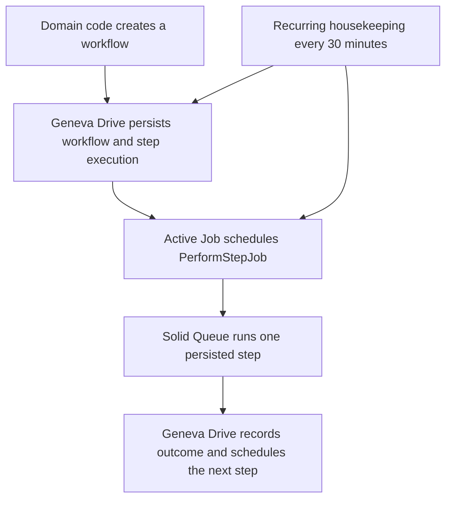
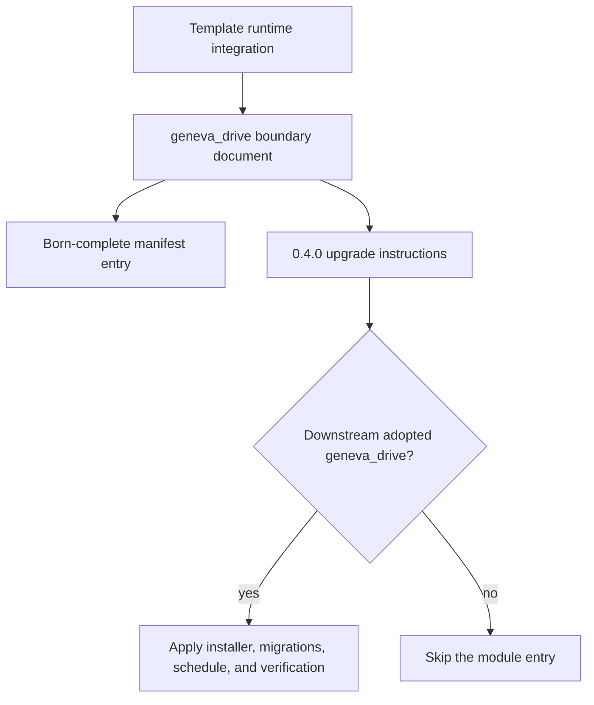

# Geneva Drive Module - Plan

## Goal Capsule

- **Objective:** Add Geneva Drive as a born-complete, independently adoptable backend module in the Rails stack.
- **Authority:** The user request governs product scope. Repository module and upgrade conventions govern packaging. Geneva Drive 0.5.0 documentation and source govern runtime integration.
- **Execution profile:** Install the released gem, commit its generated persistence layer, schedule housekeeping, prove Rails 8.1/SQLite/Solid Queue compatibility, and publish downstream adoption instructions.
- **Stop conditions:** Stop if the released gem cannot boot or migrate on Rails 8.1.3.1, if generated schema changes conflict with the template's SQLite topology, or if completing the change requires a production/downstream domain workflow or commercial admin component. A test-only workflow used solely for compatibility proof remains in scope.
- **Tail ownership:** LFG owns review, commits, pull request creation, and CI follow-through after implementation.

---

## Product Contract

### Summary

The template will ship Geneva Drive's released open-source workflow engine as a default backend capability and expose it as a separately adoptable module. The integration includes durable storage, recurring housekeeping, verification, fleet registration, and agent-executable upgrade guidance.

### Problem Frame

The stack has Active Job and Solid Queue but no first-class record of progress through durable multi-step business procedures. Adding only the gem would leave new clones without required tables, recovery scheduling, module boundaries, or a safe downstream adoption path.

### Requirements

**Runtime integration**

- R1. The bundle must include the released Geneva Drive 0.5 line through RubyGems and lock the resolved version reproducibly.
- R2. Fresh clones must contain the installer-generated Geneva Drive initializer, migrations, and primary-database schema required by version 0.5.0.
- R3. Every configured environment must schedule `GenevaDrive::HousekeepingJob` every 30 minutes through the existing Solid Queue recurring-task inheritance.
- R4. The integration must boot and complete a representative workflow on Ruby 3.4.2, Rails 8.1.3.1, SQLite, and both the test Active Job adapter and the template's separate-database Solid Queue production topology without credentials or external services.
- R5. Documentation must describe duplicate-delivery protection narrowly and require domain-level idempotency for external side effects.

**Module and fleet contract**

- R6. `geneva_drive` must be a registered module whose boundary document states its files, jobs-module prerequisite, adoption procedure, upgrade procedure, first-workflow example, verification, console-level operator procedures, operating constraints, sensitive-error-data posture, and LGPLv3/commercial licensing options.
- R7. The template manifest, module registries, stack overview, and agent guidance must list Geneva Drive so fresh clones remain born-complete.
- R8. A versioned changelog entry must support explicitly chosen downstream adoption without applying Geneva Drive to apps that adopted only the jobs module. The module document must explain that a maintainer first chooses the module and follows its adoption procedure; after successful verification the app records `geneva_drive` in its manifest, so later module-filtered changelog entries become eligible.
- R9. Future Geneva Drive upgrades must rerun the upstream installer and review newly generated migrations before the template version is advanced.

### Acceptance Examples

- AE1. Given a fresh clone, when setup prepares the database and the Rails test suite boots, then both Geneva Drive tables and their released 0.5.0 indexes exist and no secret or environment variable is required.
- AE2. Given a test workflow tied to a fixture record, when the workflow is speed-run, then its steps execute in order once and the workflow finishes with persisted execution history.
- AE3. Given any production, development, or test recurring-task configuration, when the YAML anchor is resolved, then `geneva_drive_housekeeping` points to `GenevaDrive::HousekeepingJob` at a 30-minute cadence.
- AE4. Given a downstream app that chooses the module, when an upgrade agent follows the 0.4.0 entry, then it installs the released gem, runs the installer and migrations, merges housekeeping, verifies the integration, and records `geneva_drive: "0.4.0"`.
- AE5. Given an operator using only the open-source engine, when a workflow pauses or housekeeping falls behind, then the module runbook explains how to inspect the persisted failure, resume or cancel the workflow, and identify when the next tagged release's recovery index is needed.

### Scope Boundaries

- Include the open-source engine, generated schema, initializer, housekeeping, smoke coverage, module documentation, and fleet metadata.
- Exclude app-specific workflow classes and product behavior; downstream apps define workflows around their own domain records.
- Exclude routes, Inertia props, frontend code, and admin UI. The open-source engine exposes no user-facing route surface, and the commercial admin product is separate.
- Exclude use of unreleased `main` features, including workflow metadata, configurable error reporting, and the housekeeping recovery index.
- Exclude legal conclusions about a downstream product's distribution model. The module must disclose the dual-license options and tell adopters to confirm their licensing basis.

---

## Planning Contract

### Key Technical Decisions

- KTD1. **Use `gem "geneva_drive", "~> 0.5.0"` from RubyGems.** The lockfile resolves the current 0.5.0 release while the pessimistic constraint permits patches and blocks unreleased or potentially breaking 0.6 changes. This satisfies R1 and avoids tracking a moving GitHub branch.
- KTD2. **Treat the upstream installer as the schema authority, with a local SQLite data-preservation correction.** Run the version-locked generator, preserve all six v0.5.0 migrations, remove and restore the inbound step-execution foreign key around the generated nullable-hero table swap, migrate, and commit `db/schema.rb`. Rerun the generator for every future gem upgrade per R2 and R9 rather than hand-copying or collapsing historical migrations, then reapply the correction if upstream still emits the unsafe swap.
- KTD3. **Make housekeeping part of the existing recurring-task anchor.** Add the upstream-recommended 30-minute job beside Solid Queue pruning so all three environments inherit the same task and the jobs module needs no new worker topology. This satisfies R3.
- KTD4. **Prove behavior with a small test-only workflow and schedule contract tests.** Upstream allows Rails 8.1 but does not test it directly, so local execution on this exact stack is required for R4 rather than relying on gem metadata alone.
- KTD5. **Keep the integration backend-only and zero-secret.** Geneva Drive uses the primary database and Active Job; it needs no credentials, env vars, route mount, controller, or frontend adapter. This preserves the stack's Rails-owned flow and satisfies R6 without creating a parallel API.
- KTD6. **Describe durability without promising exactly-once side effects.** Persisted state, locks, and unique indexes prevent duplicate completion of one step attempt, but a crash after an external effect and before finalization can trigger housekeeping recovery. Module guidance must require stable idempotency keys for payments, email, and other non-transactional effects per R5.
- KTD7. **Ship Geneva Drive in the born-complete default despite its standing cost.** The user asked to add it to both the modules and the stack, and this template's default-module contract includes the dependency and operational scaffolding needed for a fresh clone to work immediately. The stack overview and module document must therefore make the otherwise easy-to-miss costs visible: unused clones still carry two tables and a recurring job, and proprietary adopters must confirm whether LGPLv3 or a purchased commercial license is appropriate.

### High-Level Technical Design

The runtime path keeps business state in the primary database and execution transport in the existing Active Job/Solid Queue stack:

The fleet path keeps adoption and upgrades module-filtered:

### Assumptions

- A1. “Add to modules and the stack” means install the open-source engine and its required operational scaffolding, not invent a default domain workflow.
- A2. Version 0.4.0 is the next template release because the current template is 0.3.0 and prior new-module additions advance the pre-1.0 minor version.
- A3. The template accepts Geneva Drive's released operational defaults: 30-day finished/canceled retention, one-hour in-progress recovery threshold, 15-minute scheduled recovery threshold, `:reattempt` recovery, batch size 1,000, and immediate enqueue behavior in test.
- A4. The existing primary SQLite and separate Solid Queue database topology remains unchanged. `GenevaDrive.with_inline_enqueue` is not used because the records and jobs do not co-commit in one database.

### System-Wide Impact

- **Primary database:** Adds Geneva Drive workflow and step-execution tables, indexes, stored exception details, and retention responsibilities.
- **Jobs:** Adds step jobs to the existing `default` queue and a recurring recovery/cleanup job. No new process role is needed because the worker already consumes all queues.
- **Testing:** Adds direct compatibility proof for Rails 8.1/SQLite and expands the recurring-task and agent-module registries.
- **Fleet upgrades:** Advances the template to 0.4.0 and introduces a module-filtered, reviewable migration path for downstream apps.
- **Operations:** Lost scheduled jobs can recover after the 15-minute threshold plus up to one housekeeping interval. Paused workflows remain until an operator or application resumes or cancels them.

### Risks & Dependencies

- Upstream CI covers Rails 8.0, not Rails 8.1. The focused workflow test and full suite are release gates.
- The v0.5.0 SQLite nullable-hero migration rebuilds the Geneva Drive workflow table and is not reversibly expressed. Its generated parent-table drop cascades into existing step history, so this integration temporarily removes and restores that foreign key and proves row preservation on populated data. Downstream apps must retain the correction, review generated migrations, and back up persistent data before upgrades.
- The released housekeeping scan lacks an unreleased index added after a production timeout. Keep v0.5.0 reproducible, document the scale risk, and evaluate the next tagged release rather than cherry-picking `main`.
- Error messages and full backtraces are stored in the primary database. Workflow authors must avoid placing secrets or unnecessary sensitive data in raised exception text.
- The 30-day cleanup default applies only to finished and canceled workflows. Paused workflows retain their stored exception details until an operator or application resolves them, so the tables and database backups must be treated as sensitive diagnostic data.
- The gem is LGPLv3 or separately commercially licensed. The module documentation must make that visible to proprietary downstream adopters.

---

## Implementation Units

### U1. Install the released engine and schema

- **Goal:** Add the version-constrained dependency and the complete v0.5.0 generated persistence/configuration surface.
- **Requirements:** R1, R2, R9; supports AE1.
- **Dependencies:** None.
- **Files:** `Gemfile`, `Gemfile.lock`, `config/initializers/geneva_drive.rb`, the six generator-created `db/migrate/*geneva_drive*.rb` files, `db/schema.rb`, `test/migrations/geneva_drive_migration_test.rb`.
- **Approach:** Add the patch-line constraint, update only the relevant bundle, run the upstream installer from the locked version, preserve its six migration files, and migrate the schema. Correct the nullable-hero SQLite migration so its parent-table swap removes and restores the inbound cascading foreign key instead of deleting existing step history. Keep the initializer on the released defaults, correcting any generated comment that names `stuck_executing_threshold` instead of the actual `stuck_in_progress_threshold` setting.
- **Execution note:** This unit is dependency and schema installation. Prefer generator/migration/boot evidence before changing generated output by hand.
- **Patterns to follow:** `Gemfile` dependency comments, `config/initializers/ruby_llm.rb`, the committed migration and `db/schema.rb` conventions.
- **Test scenarios:** Seed a pre-migration SQLite workflow and step execution on an isolated connection, run the nullable-hero migration, and assert both rows survive, both hero columns become nullable, and `PRAGMA foreign_key_check` returns no rows.
- **Verification:** Bundler resolves Geneva Drive 0.5.0 and its transitive dependencies; migrations apply cleanly; Rails boots; schema contains the expected workflow and step-execution tables and unique indexes.

### U2. Wire housekeeping and prove runtime behavior

- **Goal:** Make recovery/cleanup operational and verify the released engine works on the template's exact runtime stack.
- **Requirements:** R3, R4; covers AE1, AE2, AE3.
- **Dependencies:** U1.
- **Files:** `config/recurring.yml`, `test/jobs/recurring_schedule_test.rb`, `test/workflows/geneva_drive_smoke_test.rb`, and the existing test-only Solid Queue database configuration needed by the integration smoke.
- **Approach:** Add `geneva_drive_housekeeping` to the existing shared schedule anchor. Define a test-only workflow with a fixture hero and exercise the upstream test helpers without adding application workflow classes. Add one production-topology smoke that temporarily selects the Solid Queue adapter with its separate disposable queue database, creates a workflow outside an open transaction, confirms a persisted `GenevaDrive::PerformStepJob` on the `default` queue, performs it, and restores global adapter state.
- **Execution note:** Start with failing schedule and workflow smoke assertions so Rails 8.1 or generator incompatibilities are observed before integration fixes are made.
- **Patterns to follow:** `config/recurring.yml`, `test/jobs/recurring_schedule_test.rb`, `test/initializers/ruby_llm_test.rb`, and upstream `GenevaDrive::TestHelpers` examples.
- **Test scenarios:**
  - Covers AE3. Load each environment's resolved recurring config and assert the Geneva Drive task has the exact job class and 30-minute schedule.
  - Covers AE2. Create a test workflow for a fixture user, speed-run it, and assert ordered completed executions plus a finished workflow state.
  - Deliver the same persisted step job twice and assert the step body is not applied twice.
  - Raise from a step and assert the workflow pauses with persisted error details; resume it and assert the failed step is retried rather than skipped.
  - Assert test configuration uses immediate enqueue semantics so transactional tests do not wait for an outer commit that never occurs.
  - Exercise the configured Active Job path rather than only the speed-run helper: persist a step job through Solid Queue's separate test database, perform it, and assert the workflow finishes.
  - Force the separate-database enqueue to fail after workflow persistence, make the scheduled execution overdue, run housekeeping, and assert recovery re-enqueues and completes it within the documented threshold-plus-cadence window.
  - Assert the loaded gem version is the documented 0.5.0 release so any patch-line lockfile change is visible and triggers the installer/migration review required by R9.
- **Verification:** Focused workflow and recurring-schedule tests pass, both job classes load, and the full Rails suite remains green.

### U3. Publish the module and fleet upgrade contract

- **Goal:** Register Geneva Drive everywhere the live stack and upgrade agent discover modules.
- **Requirements:** R5, R6, R7, R8, R9; covers AE4 and AE5.
- **Dependencies:** U1, U2.
- **Files:** `docs/modules/geneva_drive.md`, `docs/modules/README.md`, `.template-manifest.yml`, `docs/changelog/0.4.0-001-add-geneva-drive-module.md`, `CHANGELOG.md`, `README.md`, `AGENTS.md`, `test/template/agent_conventions_test.rb`.
- **Approach:** Document the exact runtime boundary and adoption steps, including the `jobs` prerequisite and preflight, a minimal first workflow, explicit opt-in for existing apps, installer reruns on every version change, the local initializer-comment correction after generator reruns, migration review and backup, housekeeping, idempotent step authoring, exception-content hygiene, sensitive paused-workflow retention, console-level inspection/resume/cancel procedures, dual licensing, and the released-main scale caveat. The operating section must tell adopters to watch housekeeping duration relative to its 30-minute interval and table growth, then move to the next tagged release containing the recovery index if those signals become material. Register only `geneva_drive` in the new changelog entry so jobs-only downstream apps do not receive it. Advance the born-complete template to 0.4.0 and make agent guidance derive module coverage from the manifest.
- **Patterns to follow:** `docs/modules/copse.md`, `docs/modules/ruby_llm.md`, `docs/changelog/0.3.0-001-add-copse-module.md`, `.template-manifest.yml`, and `test/template/manifest_test.rb`.
- **Test scenarios:**
  - The module boundary doc contains the required purpose, files, adoption, and verification sections and is linked from the registry.
  - The manifest and module docs remain in one-to-one correspondence with `geneva_drive` adopted at 0.4.0.
  - The new changelog entry names a real module, is the newest template version, and contains self-contained upgrade and verification instructions.
  - Every manifest module, including Geneva Drive, appears in the canonical `AGENTS.md` module enumeration.
  - The live `README.md` stack and module list include Geneva Drive and retain the already-adopted `ruby_native` and `copse` entries.
  - The README stack entry surfaces the LGPLv3/commercial choice; the module document explains operator recovery, sensitive error retention, and how an existing app explicitly adopts the new module before future filtered upgrades apply.
- **Verification:** Template registry, manifest, changelog, and agent-convention tests pass; the documentation states the license and operational caveats without exposing any credential or requiring unrelated app changes.

---

## Verification Contract

| Gate | Applies to | Done signal |
|---|---|---|
| `bin/rails db:migrate` | U1 | Released migrations apply and update `db/schema.rb` without warnings or manual schema edits. |
| `bin/rails test test/workflows/geneva_drive_smoke_test.rb test/jobs/recurring_schedule_test.rb` | U2 | Workflow lifecycle, duplicate delivery, failure/resume, enqueue mode, and schedule inheritance pass. |
| Focused Solid Queue integration command documented by U2 | U2 | A Geneva Drive step job persists in the separate Solid Queue test database, runs from the `default` queue, and finishes its workflow. |
| `bin/rails test test/template/manifest_test.rb test/template/modules_registry_test.rb test/template/changelog_test.rb test/template/agent_conventions_test.rb` | U3 | Module, manifest, changelog, and canonical guidance stay consistent. |
| `bin/rails db:test:prepare test` | All | The complete Rails suite passes from the committed schema. |
| `bin/rubocop -f github` | All | Ruby and test additions satisfy repository style. |
| `bin/brakeman --no-pager` and `bin/bundler-audit` | All | No new static-analysis or dependency advisory finding blocks the integration. |
| `npm run check` | All | The unchanged frontend gate remains green. |

Browser verification is not applicable because this module adds no route, page, controller prop, or frontend surface.

---

## Definition of Done

- The Gemfile constraint and lockfile resolve released Geneva Drive 0.5.0, not `main`.
- The six v0.5.0 installer migrations, initializer, and resulting schema are committed and reproducible from a fresh test database; a populated SQLite migration proof prevents the nullable-hero swap from cascading into step history.
- Housekeeping is inherited by production, development, and test at a 30-minute cadence.
- Focused tests prove workflow completion, duplicate-delivery protection, failure/resume behavior, transactional-test enqueue behavior, and schedule resolution on Rails 8.1.3.1/SQLite.
- `geneva_drive` is present in the boundary-doc registry, born-complete manifest, stack overview, agent guidance, changelog index, and a self-contained 0.4.0 upgrade entry.
- Module documentation covers generator reruns after every version change, external-effect idempotency, exception-content hygiene, sensitive paused-workflow retention, console operations, retention/recovery defaults, separate-database constraints, released-main drift and monitoring signals, and LGPLv3/commercial licensing.
- All Verification Contract gates pass, eligible review findings are resolved or durably recorded, and abandoned experimental code or generated artifacts are absent from the final diff.

---

## Sources & Research

- [Geneva Drive README](https://github.com/julik/geneva_drive/blob/v0.5.0/README.md) — install sequence, 30-minute housekeeping schedule, supported databases, Ruby/Rails floors.
- [Geneva Drive manual](https://github.com/julik/geneva_drive/blob/v0.5.0/MANUAL.md) — persistence, workflow lifecycle, idempotency boundaries, test helpers, and upgrade guidance.
- [Version 0.5.0 generator](https://github.com/julik/geneva_drive/blob/v0.5.0/lib/generators/geneva_drive/install/install_generator.rb) — six migration templates and initializer ownership.
- [Version 0.5.0 changelog](https://github.com/julik/geneva_drive/blob/v0.5.0/CHANGELOG.md) — Rails 8 and Solid Queue enqueue fixes.
- [Current unreleased changelog](https://github.com/julik/geneva_drive/blob/main/CHANGELOG.md) — later schema, error-reporting, metrics, and housekeeping-index changes intentionally excluded from this plan.
- [RubyGems package metadata](https://rubygems.org/gems/geneva_drive) — current published version, dependency constraints, and licenses.
- [LGPLv3 license](https://github.com/julik/geneva_drive/blob/v0.5.0/LICENSE-LGPL.txt) and [commercial terms](https://github.com/julik/geneva_drive/blob/v0.5.0/LICENSE-COMMERCIAL.txt) — downstream licensing disclosure.
