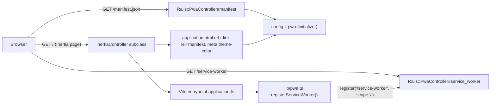
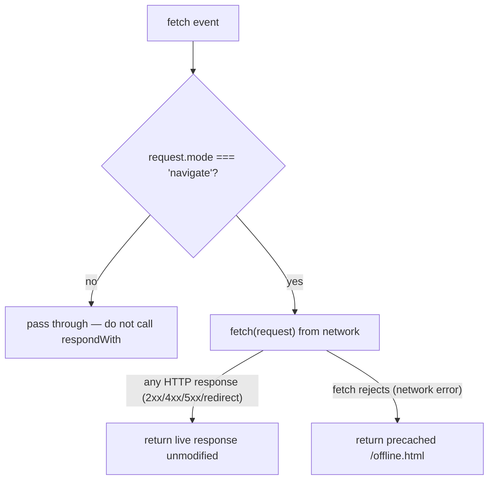

# PWA Module - Plan

## Goal Capsule

- **Objective:** Make the template installable as a Progressive Web App out of the box, and package that capability as an independently adoptable `pwa` module a downstream app can bring in with one changelog entry.
- **Authority:** The user request governs product scope ("add PWA support as a module so you can add a PWA to the app too"). Repository module, manifest, and changelog conventions govern packaging. Rails 8.1's built-in `Rails::PwaController` and the browser installability criteria govern the runtime integration.
- **Execution profile:** Turn on the PWA scaffolding Rails already generated (manifest + service worker views, commented routes and layout link), give it a single app-level config so a downstream app renames it in one place, register the service worker from the existing Vite entrypoint, prove it with controller and Vitest coverage, and publish the module boundary, manifest entry, and 0.5.0 upgrade entry.
- **Stop conditions:** Stop if enabling the routes or layout link breaks the Inertia round trip (`GET /` no longer renders `home/index`), if serving the service worker requires bypassing `force_ssl` or the browser gate in a way that weakens production, or if the work grows into push notifications, offline data sync, or a per-app icon pipeline — those are follow-ups, not this module.
- **Tail ownership:** LFG owns review, commits, pull request creation, and CI follow-through after implementation.

---

## Product Contract

### Summary

The template will ship a working PWA surface — a web app manifest, a minimal service worker with an offline fallback, the layout tags browsers look for, and client-side service worker registration — and expose it as a `pwa` module with a boundary doc, born-complete manifest entry, and an agent-executable changelog entry so existing fleet apps can adopt it.

### Problem Frame

Rails 8.1 generates PWA scaffolding (`app/views/pwa/manifest.json.erb`, `app/views/pwa/service-worker.js`) but leaves the routes and the `<link rel="manifest">` commented out. The template inherited that dormant state: the manifest names the app `CompoundStackRails` with `theme_color: "red"`, nothing registers a service worker, and no module doc tells a downstream app how to turn it on. An app built from the template is therefore not installable, and there is no upgrade path to make it so.

### Requirements

**Runtime integration**

- R1. `GET /manifest.json` must return a valid web app manifest (`application/json`) with `name`, `short_name`, `start_url`, `scope`, `display: standalone`, `theme_color`, `background_color`, and at least one 512×512 icon (plain and maskable), publicly — no session required.
- R2. `GET /service-worker` must return JavaScript (`text/javascript`) publicly, served by Rails (not `public/`) so it is never cached for a year by the static-file headers.
- R3. Every Inertia page's `<head>` must carry `<link rel="manifest">` and a `<meta name="theme-color">` whose value matches the manifest's `theme_color`.
- R4. App identity used by the PWA surface (name, short name, description, theme and background colors) must come from one config location so a downstream app renames/re-brands in a single file; the layout's `application-name` meta and default `<title>` read the same source.
- R5. The service worker must never cache Inertia responses or break the Inertia round trip: network-first for navigation requests, falling back to a precached static offline page **only when `fetch` rejects (network error)** — any HTTP response, including 4xx/5xx and redirects, is returned unmodified; non-navigation requests (Inertia XHR, Vite assets, API-shaped calls) pass through untouched.
- R6. The client must register the service worker at `/service-worker` with scope `/` from the existing Vite entrypoint, only when `navigator.serviceWorker` exists (no-op under SSR and unsupported browsers), and must not throw if registration fails.

**Module and fleet contract**

- R7. `pwa` must be a registered module with a `docs/modules/pwa.md` boundary doc following the module-doc template (purpose, files, adopt, verify), listed in `docs/modules/README.md`, `README.md`, and the `AGENTS.md` module enumeration, and present in `.template-manifest.yml` at `"0.5.0"`.
- R8. A `docs/changelog/0.5.0-001-add-pwa-module.md` entry, indexed in `CHANGELOG.md`, must give an upgrade agent self-contained imperative steps to adopt the module into an existing app and verify it; `template_version` advances to `0.5.0`.

### Acceptance Examples

- AE1. Given a fresh clone with no user signed in, when a browser requests `/manifest.json`, then it receives `200 application/json` whose `name` matches the configured app name and whose `icons` include a 512×512 `maskable` entry.
- AE2. Given a fresh clone, when a browser requests `/service-worker`, then it receives `200` JavaScript with no redirect to a sign-in page.
- AE3. Given the home page, when rendered, then the `<head>` contains `<link rel="manifest" href="/manifest.json">` and `<meta name="theme-color" content="<configured color>">`.
- AE4. Given a supported browser loading any page, when the entrypoint runs, then `navigator.serviceWorker.register` is called once with `/service-worker` and `{ scope: "/" }`; given no `serviceWorker` on `navigator`, nothing is called and nothing throws.
- AE5. Given the service worker is active and the network is unavailable, when the user navigates to a page, then the offline fallback page is shown; given the network is available, the live Rails response is served unmodified.
- AE6. Given a downstream app that adopts `pwa`, when an upgrade agent follows the 0.5.0 entry, then it adds the config, views, routes, layout tags, client registration, and tests, runs the verification, and records `pwa: "0.5.0"`.

### Scope Boundaries

- Include: manifest, service worker, offline fallback page, layout tags, single-source PWA config, client registration, Rails + Vitest coverage, module doc, manifest entry, changelog entry, README/AGENTS registration.
- Exclude: Web Push (VAPID keys, subscription storage, push handlers) — the generated service worker's commented push example stays as a pointer, not live code. Exclude offline data caching of Inertia pages, background sync, and any "install" UI/prompt component. Exclude a per-app icon generation pipeline; the module documents the icon contract (512×512 PNG at `public/icon.png`) and adopters supply their own artwork. Exclude Ruby Native; that module covers native store distribution and is orthogonal.

#### Deferred to Follow-Up Work

- Web Push notifications as a separate `push` (or `pwa` extension) changelog entry once a real app needs them.
- An install-prompt React component (`beforeinstallprompt`) if product teams want an in-app "Install" affordance.
- Apple splash/startup images and `apple-mobile-web-app-status-bar-style` tuning.

---

## Planning Contract

### Key Technical Decisions

- KTD1. **Use Rails 8.1's built-in `Rails::PwaController` and the generated `app/views/pwa/*` templates.** Uncomment the two routes and the layout link rather than adding a custom controller, a `public/manifest.json`, or a Vite PWA plugin. The controller already skips forgery protection and sits outside `InertiaController`, so the files are public without touching the auth gate (R1, R2). Serving from Rails, not `public/`, keeps the service worker out of the 1-year `public_file_server` cache (R2). The service-worker route pins `defaults: { format: :js }` so it resolves regardless of the request's `Accept` header (see A3); the manifest route stays as generated so `pwa_manifest_path(format: :json)` emits `/manifest.json`.
- KTD2. **One PWA config object in a Rails initializer (`config/initializers/pwa.rb` → `Rails.application.config.x.pwa`).** Name, short name, description, theme color, and background color live there; `manifest.json.erb`, the layout's `theme-color`/`application-name` metas, and the default `<title>` read it (R4). This replaces the hardcoded `CompoundStackRails` / `"red"` values and gives the changelog entry a single "edit this file" step for adopters. This is the repo's first `config.x` use — `config/initializers/riffrec.rb` is a `module_function` module, a different shape; `config.x` is chosen because ERB views and the layout read plain values with no behaviour.
- KTD3. **Minimal, Inertia-safe service worker: network-first navigations with a static offline fallback, nothing else cached.** Inertia pages depend on the `X-Inertia` XHR round trip and asset `version` checks; caching those produces stale-page and version-mismatch bugs. The worker precaches only `public/offline.html` and `public/icon.png` on install, intercepts `fetch` only for `request.mode === "navigate"`, tries the network, and falls back to the offline page only when `fetch` rejects — never on a 4xx/5xx response (R5). Precache entries are fetched with `cache: "reload"` because `public/` is served with a 1-year `cache-control` in production; without it a versioned cache bucket is refilled from the stale browser HTTP cache. This satisfies installability without a caching strategy the template cannot safely generalize.
- KTD4. **Register from `app/frontend/lib/pwa.ts`, called by the existing `application.ts` entrypoint.** A small exported `registerServiceWorker()` guarded on `typeof navigator !== "undefined" && "serviceWorker" in navigator` keeps it SSR-safe and testable under Vitest/jsdom (R6). Register in every environment so developers can verify installability locally (copse's `*.localhost` hostnames are secure contexts in Chromium and Firefox; Safari treats them as insecure and the guard no-ops there). The one dev-time consequence: a stopped `bin/dev` server renders the offline page instead of the browser's connection error — KTD5's page copy is written to make that unambiguous.
- KTD5. **Static offline page in `public/offline.html`, matching the existing `public/404.html` family.** No route, no controller, no auth; precacheable by URL. Styling mirrors the Rails error pages so it needs no Vite build. Copy says "can't reach the server" (covering both offline and server-down) with a retry link, so developers seeing it after a `bin/dev` restart are not misled into thinking their network is down.
- KTD6. **Version 0.5.0, new `pwa` module key.** Prior new-module additions (`ruby_native` 0.2.0, `copse` 0.3.0, `geneva_drive` 0.4.0) each advanced the pre-1.0 minor version; this follows suit. The changelog entry names only `[pwa]` so apps that adopted only `frontend` do not receive it unsolicited. The module depends on `frontend` (layout + Vite entrypoint) and the doc says so.

### High-Level Technical Design

Request path for the PWA surface versus the Inertia pages it must not disturb:

Service worker fetch decision (directional guidance, not implementation specification):

### Assumptions

- A1. "Add PWA support as a module" means the template ships installable by default (born-complete) and the same capability is documented and changelogged for existing apps; it does not mean push notifications or offline-first data.
- A2. The existing `public/icon.png` (512×512) and `public/icon.svg` are acceptable template icons for installability; adopters replace them with their own artwork. The module doc states the size contract and that a `purpose: maskable` icon needs safe-zone padding (the template icon is reused unpadded and may be cropped on some launchers).
- A3. Rails discards browser-like `Accept` headers — including the integration-test default (`text/xml,…,*/*;q=0.5`) — and falls back to `formats: [:html]`, so an extension-less `GET /service-worker` raises `ActionView::MissingTemplate` unless the route pins `defaults: { format: :js }`. Only a bare `Accept: */*` (what the browser's service-worker fetch sends) resolves the `.js` template without the pin. Bare `/manifest` is likewise unsupported; `/manifest.json` is canonical. Verified in-memory against this app during review.
- A4. Registering the service worker in every environment is the accepted trade-off (see KTD4/KTD5): local installability checks work in Chromium/Firefox, and the offline page copy makes a stopped dev server unambiguous. Gating on `import.meta.env.PROD` is not planned; if implementation finds a concrete dev breakage beyond the documented one, record it in the module doc and revisit.
- A5. No CSP is active (the initializer is fully commented), so no `worker-src`/`manifest-src` directives need adjusting now; the module doc notes them for apps that enable CSP, and notes that `Rails::ApplicationController` carries its own controller-level `content_security_policy` block that governs the PWA responses independently of the app initializer.

### System-Wide Impact

- **Routes:** Two new public GET routes (`/manifest(.:format)`, `/service-worker`). They bypass `InertiaController` and therefore the auth gate and `allow_browser` — intended.
- **Layout:** Every page gains a manifest link and theme-color meta; `application-name` and default title now read from config instead of literals.
- **Frontend:** One new lib module and its test; the `application.ts` entrypoint gains a real import in place of scaffold comments.
- **Static files:** `public/offline.html` added.
- **Fleet:** Template advances to 0.5.0; `.template-manifest.yml`, `docs/modules/README.md`, `README.md`, `AGENTS.md`, `CHANGELOG.md` all gain `pwa`. `test/template/*` tests enforce the 1:1 correspondence automatically.
- **Production:** `force_ssl` is already on, satisfying the HTTPS requirement for service workers. Kamal/Thruster serve `public/` for the offline page and icons.

### Risks & Dependencies

- A service worker is sticky: once registered in a user's browser it persists across deploys. The worker must call `self.skipWaiting()` on install and `clients.claim()` on activate, version its cache name, **and** precache with `new Request(url, { cache: "reload" })` — `public/` ships with a 1-year `cache-control` in production (2 days in development), so a version bump alone would refill the new cache from the stale browser HTTP cache. The module doc explains how to unregister during debugging.
- **Sequencing:** `main` is at `template_version: "0.3.0"`; Geneva Drive's 0.4.0 lives on the unmerged `feat/geneva-drive-module` branch (PR #8). This plan's 0.5.0 assumes 0.4.0 lands first. The PWA branch is cut from `feat/geneva-drive-module` (stacked), and its PR must not merge before #8 does; if #8 changes, rebase before running the U3 template tests. Cutting from `main` instead would ship 0.5.0 with no 0.4.0 and a manifest missing `geneva_drive`.
- Accidentally intercepting non-navigation requests would break Inertia visits and Vite HMR. U1's worker must early-return for anything not `mode: "navigate"`; U2's test and a manual dev smoke cover this.
- `allow_browser versions: :modern` on `ApplicationController` does not apply to `Rails::PwaController` — good for installability, but worth stating in the doc so nobody "fixes" it by moving the routes onto `ApplicationController`.
- Lighthouse/Chrome installability criteria drift. The plan targets the stable set (HTTPS, manifest with name/icons/start_url/display, registered service worker); the doc points at `chrome://inspect` / DevTools Application panel for verification rather than promising a Lighthouse score.
- Depends on the `frontend` module (layout and Vite entrypoint). The doc and changelog entry state this prerequisite.

---

## Implementation Units

### U1. Serve the manifest and service worker from a single PWA config

- **Goal:** Turn the dormant Rails PWA scaffolding into a live, config-driven, Inertia-safe surface.
- **Requirements:** R1, R2, R3, R4, R5; covers AE1, AE2, AE3, AE5.
- **Dependencies:** None.
- **Files:** `config/initializers/pwa.rb` (new), `app/views/pwa/manifest.json.erb`, `app/views/pwa/service-worker.js`, `public/offline.html` (new), `config/routes.rb`, `app/views/layouts/application.html.erb`, `test/controllers/pwa_test.rb` (new).
- **Approach:** Create the initializer holding `config.x.pwa` (name, short_name, description, theme_color, background_color) with template defaults ("Compound Stack Rails", a neutral colour instead of `"red"`). Rewrite `manifest.json.erb` to read those values and add `id`/`short_name`; keep both 512×512 icon entries (`any` + `maskable`) pointing at `public/icon.png`. Uncomment the two routes, adding `defaults: { format: :js }` to the service-worker route so it resolves regardless of `Accept` header (A3); leave the manifest route as generated. In the layout, replace the commented manifest link with the live `pwa_manifest_path(format: :json)` tag, add `<meta name="theme-color">`, and make `application-name` and the `<title>` fallback read the config. Replace the service worker's comment-only body with: a versioned cache name; an `install` handler that precaches `/offline.html` and `/icon.png` via `new Request(url, { cache: "reload" })` and calls `self.skipWaiting()`; an `activate` handler that prunes old cache versions and calls `clients.claim()`; and a `fetch` handler that early-returns for anything but `request.mode === "navigate"`, otherwise responds with `fetch(request)` and falls back to the cached offline page only in the rejection path (never on `!response.ok`) — leave the push-notification example as a trailing comment block. Write `public/offline.html` in the style of `public/404.html` with "can't reach the server" copy and a retry link.
- **Execution note:** Start with the failing controller tests for `/manifest.json` and `/service-worker` (status, content type, public access, config-derived values), then enable routes/views until green — expect `MissingTemplate` on `/service-worker` until the route's `defaults: { format: :js }` is in place. Verify the service worker's `mode: "navigate"` guard, `cache: "reload"` precache, and rejection-only fallback by inspection and a `bin/dev` smoke in the DevTools Application panel (toggle Offline → offline page; stop the server → offline page; normal → live); the worker's JS itself is not unit-tested in this unit.
- **Patterns to follow:** `config/initializers/riffrec.rb` (config object + browser-safe exposure), `test/controllers/home_controller_test.rb` and `test/controllers/riffrec_share_test.rb` (integration test shape), `public/404.html` (static page style), Rails 8 generated `app/views/pwa/*` as the baseline.
- **Test scenarios:**
  - Covers AE1. `GET /manifest.json` without a session → 200, `application/json`, parsed JSON has `name`, `short_name`, `start_url: "/"`, `scope: "/"`, `display: "standalone"`, `theme_color`, `background_color`, and an `icons` entry with `sizes: "512x512"` and `purpose: "maskable"`.
  - `manifest.json` `name` and `theme_color` equal `Rails.application.config.x.pwa` values (override the config inside the test to prove it is read, not hardcoded).
  - Covers AE2. `GET /service-worker` without a session → 200, JavaScript content type, body contains `addEventListener("fetch"` and no redirect to `new_session_path`.
  - Covers AE3. `GET /` → response body includes `<link rel="manifest" href="/manifest.json">` and a `theme-color` meta equal to the configured value; `home/index` Inertia component still renders (existing assertion stays green).
  - R4 layout reads: `GET /` with the config overridden in the test → `<meta name="application-name">` and the default `<title>` reflect the overridden name, proving the layout reads config rather than literals.
  - `public/offline.html` exists and the service worker source references the same path it precaches, with `cache: "reload"` on the precache request.
  - Edge (documented, not supported): bare `/manifest` without `.json` raises `MissingTemplate` under a browser `Accept` header; `/manifest.json` is the canonical URL the layout emits and the only one tested.
- **Verification:** `bin/rails test test/controllers/pwa_test.rb test/controllers/home_controller_test.rb` passes; `bin/dev` → DevTools Application panel shows the manifest parsed and a service worker activated; toggling "Offline" and reloading shows `offline.html`; navigating normally shows live pages and Inertia visits still work.

### U2. Register the service worker from the frontend

- **Goal:** Have every page register the worker safely (SSR-safe, unsupported-browser-safe, failure-tolerant).
- **Requirements:** R6; covers AE4.
- **Dependencies:** U1 (route must exist for the registration to succeed at runtime; the unit itself only needs the URL contract).
- **Files:** `app/frontend/lib/pwa.ts` (new), `app/frontend/lib/pwa.test.ts` (new), `app/frontend/entrypoints/application.ts`.
- **Approach:** Export a `registerServiceWorker()` that returns early when `navigator.serviceWorker` is absent, otherwise calls `register("/service-worker", { scope: "/" })` after `window` `load` (or immediately if already loaded) and swallows/`console.warn`s rejections. Replace the scaffold `console.log` chatter in `application.ts` with the import and call. Keep the Inertia entrypoint (`inertia.tsx`) untouched.
- **Execution note:** Implement test-first under Vitest/jsdom by stubbing `navigator.serviceWorker` with a `vi.fn()` `register`.
- **Patterns to follow:** `app/frontend/lib/riffrec_provider.tsx` + `riffrec_provider.test.tsx` (lib module with co-located Vitest test), `vitest.config.ts` include glob.
- **Test scenarios:**
  - Covers AE4. With `navigator.serviceWorker.register` stubbed to resolve, calling `registerServiceWorker()` invokes it exactly once with `"/service-worker"` and `{ scope: "/" }`.
  - With no `serviceWorker` property on `navigator`, the function returns without calling anything and without throwing.
  - With `register` stubbed to reject, the function does not throw (rejection is handled) and a warning is emitted.
  - Calling twice in one page lifecycle does not double-register (idempotent guard), or the test documents that browsers de-duplicate and the guard is unnecessary — pick one and assert it.
- **Verification:** `npm run check` green (tsc app + node, Vitest); in `bin/dev`, DevTools shows the worker registered with scope `/` on first load.

### U3. Publish the `pwa` module and fleet upgrade contract

- **Goal:** Register the module everywhere the template, fleet, and upgrade agent discover modules, and ship the 0.5.0 upgrade entry.
- **Requirements:** R7, R8; covers AE6.
- **Dependencies:** U1, U2.
- **Files:** `docs/modules/pwa.md` (new), `docs/modules/README.md`, `.template-manifest.yml`, `docs/changelog/0.5.0-001-add-pwa-module.md` (new), `CHANGELOG.md`, `README.md`, `AGENTS.md`.
- **Approach:** Write the boundary doc per the module-doc template: what it is (installable manifest + minimal Inertia-safe worker + offline fallback), the exact file boundary (initializer, two views, offline page, the two routes, the layout tags, `lib/pwa.ts` + test, entrypoint call, controller test, icons), the `frontend` prerequisite, adoption steps, verification (tests + DevTools Application panel), and gotchas: worker stickiness and how to unregister, why nothing dynamic is cached, why precache uses `cache: "reload"` (1-year `public/` cache), the rejection-only offline fallback, the icon size contract and maskable safe-zone padding, the `defaults: { format: :js }` route pin, the stopped-dev-server → offline-page behaviour, CSP directives if enabled (including `Rails::ApplicationController`'s own policy block), `allow_browser` not applying, Safari treating `*.localhost` as insecure, and Web Push being a deferred extension. Add the registry row, manifest key `pwa: "0.5.0"`, bump `template_version` to `"0.5.0"`, add `pwa` to the `AGENTS.md` enumeration and `README.md` module list/stack line, write the changelog entry in the imperative style of `0.3.0-001-add-copse-module.md` (copy files, uncomment routes, edit the initializer values, add layout tags, wire the entrypoint, run tests, record manifest), and index it in `CHANGELOG.md` under a new `## 0.5.0` heading.
- **Execution note:** This is documentation and registry work; let `test/template/*` drive it — they enforce the module-doc sections, registry README link, manifest 1:1 correspondence, changelog frontmatter/newest-version, and the `AGENTS.md` enumeration. The `README.md` module list is not test-enforced; check it by hand.
- **Patterns to follow:** `docs/modules/copse.md` and `docs/modules/riffrec.md` (doc shape), `docs/changelog/0.3.0-001-add-copse-module.md` (entry shape), `docs/modules/README.md` table, `CHANGELOG.md` section format.
- **Test scenarios:**
  - `docs/modules/pwa.md` opens with `# Module: pwa` and contains the `Files (the module boundary)`, `Adopt into an existing app`, and `Verify adoption` sections; `docs/modules/README.md` links `(pwa.md)`.
  - `.template-manifest.yml` has `pwa: "0.5.0"`, `template_version: "0.5.0"`, and the module-doc set matches manifest keys 1:1.
  - The new changelog entry has valid frontmatter (`template_version: "0.5.0"`, `modules: [pwa]`, `type: feat`) and is the newest version, matching the manifest.
  - `AGENTS.md` enumeration includes `pwa` (existing `agent_conventions_test`).
  - `README.md` module list includes `pwa`.
- **Verification:** `bin/rails test test/template/manifest_test.rb test/template/modules_registry_test.rb test/template/changelog_test.rb test/template/agent_conventions_test.rb` passes; a reader of the changelog entry alone can adopt the module without the template diff.

---

## Verification Contract

| Gate | Applies to | Done signal |
|---|---|---|
| `bin/rails test test/controllers/pwa_test.rb test/controllers/home_controller_test.rb` | U1 | Manifest and service worker are public, correctly typed, config-driven; Inertia home page still renders with the new head tags. |
| `npm run check` | U2 | tsc ×2 clean; `pwa.test.ts` proves registration, no-op, and failure tolerance. |
| `bin/rails test test/template/manifest_test.rb test/template/modules_registry_test.rb test/template/changelog_test.rb test/template/agent_conventions_test.rb` | U3 | Module, manifest, changelog, README/AGENTS registration consistent at 0.5.0. |
| `bin/dev` + DevTools Application panel | U1, U2 | Manifest parsed without errors, service worker activated with scope `/`, offline reload shows `offline.html`, online Inertia visits unaffected. |
| `bin/rails test` | All | Full Ruby suite green. |
| `bin/rubocop -f github` | All | Ruby additions satisfy repository style. |

Browser verification applies: the DevTools smoke above is the installability proof; `ce-test-browser` should load `/`, assert the manifest link and theme-color meta exist, fetch `/manifest.json` and `/service-worker` for 200s, and confirm an Inertia visit still works.

---

## Definition of Done

- `/manifest.json` and `/service-worker` are served publicly by `Rails::PwaController`, values derived from `config/initializers/pwa.rb`.
- Every page's `<head>` carries the manifest link and a matching `theme-color` meta; `application-name` and default title read the same config.
- The service worker precaches only the offline page and icon (with `cache: "reload"`), calls `skipWaiting`/`clients.claim`, intercepts only navigation requests, falls back only when `fetch` rejects, and leaves Inertia/Vite traffic untouched; `public/offline.html` exists.
- The PWA branch is stacked on `feat/geneva-drive-module`; its PR is not merged ahead of PR #8.
- `app/frontend/lib/pwa.ts` registers the worker from `application.ts`, is SSR/unsupported-browser safe, and is covered by Vitest.
- `pwa` is present in `docs/modules/`, the registry README, `.template-manifest.yml` at `0.5.0`, `README.md`, `AGENTS.md`, `CHANGELOG.md`, and a self-contained `0.5.0-001` changelog entry.
- All Verification Contract gates pass; no push-notification code, install-prompt UI, or icon pipeline crept into the diff.

---

## Sources & Research

- Rails 8.1 `Rails::PwaController` (`railties/lib/rails/pwa_controller.rb`) — renders `pwa/manifest` and `pwa/service-worker` without layout, skips forgery protection.
- Generated scaffolding already in the repo: `app/views/pwa/manifest.json.erb`, `app/views/pwa/service-worker.js`, commented routes in `config/routes.rb`, commented link in `app/views/layouts/application.html.erb`.
- Module/fleet conventions: `docs/modules/README.md` (module-doc template), `docs/changelog/README.md` (entry convention and filter algorithm), `test/template/*_test.rb` (enforced 1:1 correspondence), `docs/changelog/0.3.0-001-add-copse-module.md` and `0.4.0-001-add-geneva-drive-module.md` (precedent for new-module minor bumps).
- Frontend test pattern: `app/frontend/lib/riffrec_provider.test.tsx`, `vitest.config.ts`.
