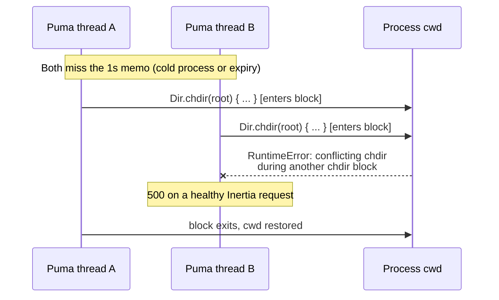
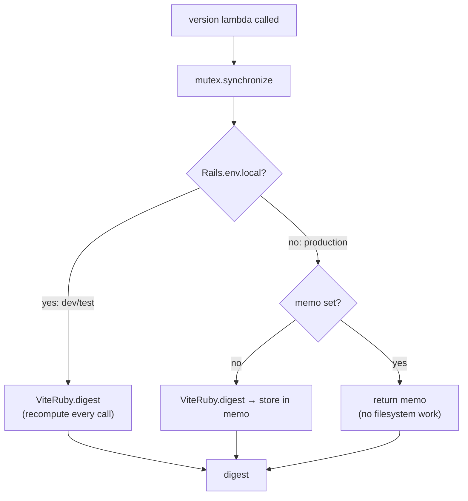

# fix: Serialize the Inertia asset-version digest across Puma threads

## Summary

`config.version = -> { ViteRuby.digest }` crashes under concurrency. `ViteRuby.digest`
enters a **process-wide `Dir.chdir` block**, and two Puma threads inside it at once
raise `RuntimeError: conflicting chdir during another chdir block` — a 500 on an
otherwise healthy Inertia request.

Guard the call with a mutex, and memoize outside `development`/`test` where the
digest cannot change for the life of the process. Ship it as template version
**0.5.1** for the `frontend` module.

---

## Problem Frame

`config/initializers/inertia_rails.rb:6` evaluates the Inertia asset version per
request:

```ruby
config.version = -> { ViteRuby.digest }
```

`ViteRuby.digest` delegates to `ViteRuby::Builder#watched_files_digest`
(vite_ruby 3.10.2, `lib/vite_ruby/builder.rb:54`):

```ruby
def watched_files_digest
  return @last_digest if @last_digest_at && Time.now - @last_digest_at < 1

  config.within_root do
    files = Dir[*config.watched_paths].reject { |f| File.directory?(f) }
    file_ids = files.sort.map { |f| "#{File.basename(f)}/#{Digest::SHA1.file(f).hexdigest}" }
    @last_digest_at = Time.now
    @last_digest = Digest::SHA1.hexdigest(file_ids.join("/"))
  end
end
```

and `config.within_root` (`lib/vite_ruby/config.rb:84`) is:

```ruby
def within_root(&block)
  Dir.chdir(File.expand_path(root), &block)
end
```

Three defects follow from that one call:

1. **`Dir.chdir` with a block is process-wide.** Ruby permits only one active
   block-form `chdir` per process. Two Puma threads entering it concurrently
   raise `RuntimeError: conflicting chdir during another chdir block`.
2. **The 1-second memo narrows the window but never closes it.** Every expiry
   reopens it, and the first request after boot is always unmemoized — the worst
   case is a cold process taking a burst of traffic.
3. **The memo itself is unsynchronized.** `@last_digest` / `@last_digest_at` are
   read and written by concurrent threads with no lock, so a torn read can hand
   back a digest from a half-finished computation.

Secondary cost: because the lambda is per-request, every Inertia response in
production globs `app/frontend/**/*` plus the lockfiles and SHA1s each file
(bounded by the 1s memo). That is real filesystem work on a hot path for a value
that cannot change between deploys.

**Evidence.** Reproduced downstream in WineMap: 40 concurrent requests carrying
`X-Inertia: true` produced 2 × HTTP 500. The same load with the mutex in place —
120 concurrent requests — produced 0 errors.

This is a template-wide defect: every app cloned from this template and every
downstream app that adopted the `frontend` module carries the same initializer.

---

## Requirements

| ID | Requirement |
|----|-------------|
| R1 | Concurrent evaluation of the Inertia version lambda never raises `conflicting chdir during another chdir block`. |
| R2 | Concurrent evaluation returns one consistent digest value, not a torn read. |
| R3 | `development` and `test` keep live-recompute behavior — a rebuilt frontend invalidates client history with no server restart. |
| R4 | Production stops doing per-request filesystem work for a value that cannot change for the process's life. |
| R5 | A regression test reproduces the race and genuinely fails when the fix is removed. |
| R6 | Template bookkeeping ships the fix to the fleet: 0.5.1 changelog entry scoped to `frontend`, `CHANGELOG.md` index, manifest bump. |
| R7 | The diagnosis is captured in `docs/solutions/` so it is not rediscovered. |

---

## Key Technical Decisions

### KTD1 — One mutex around the whole `ViteRuby.digest` call

The lock must wrap the entire call, not just the chdir. The early-return memo
check reads `@last_digest_at` / `@last_digest`, so a lock that covered only the
chdir block would still leave the memo racy (defect 3). Wrapping the whole call
makes the memo read-and-write atomic too, which is what R2 requires.

A `Mutex` local to the initializer, captured by the lambda's closure, is the right
scope: one lock per process, invisible to the rest of the app, no constant to
collide with. It survives `instance_exec` — `InertiaRails::Configuration#evaluate_option`
calls `controller.instance_exec(&value)` when a controller is bound, which rebinds
`self` but not the lexical closure, so both the lock and the memo stay reachable.

### KTD2 — Memoize outside `development` and `test`; recompute inside them

**Decision: memoize, gated on `Rails.env.local?`.** The user asked for this to be
decided explicitly, so here is the reasoning on both sides.

*For memoizing in production:* under Kamal a rebuilt frontend means a new image
and a new container, so the watched files cannot change for the life of the
process. Computing once removes the per-request glob+SHA1 entirely (R4). It also
turns the mutex into an uncontended fast path after the first request, instead of
a global serialization point every Inertia response has to queue behind — a bare
mutex fixes the crash but leaves every request taking a process-wide lock.

*Against:* it adds an environment branch, and the existing comment on lines 4-5
says the lambda exists precisely so a rebuilt frontend invalidates client history
without a restart. That property is real and must not be lost in development.

*Resolution:* keep the live-recompute path for `Rails.env.local?` (development and
test) and memoize everywhere else. The branch is two lines and the comment carries
the why.

**Why `local?` and not `production?`:** memoizing in `test` would defeat the
regression test. After the first call the memo would short-circuit every
subsequent call before it reached `Dir.chdir`, so the test would pass with the
mutex removed — it would prove nothing. Keeping `test` on the live path is what
makes R5 achievable. `Rails.env.local?` (Rails 7.1+; this repo is on 8.1.3.1)
is exactly `development || test`.

**Lazy, not eager.** Memoize on first call rather than computing at boot. Boot-time
computation would run during `assets:precompile` and every `rails` invocation, and
would turn a recoverable per-request error into a boot failure if the watched
paths were somehow unreadable.

### KTD3 — Fix the template, not the gem

Upstream `vite_ruby` should arguably not use `Dir.chdir` at all (`Dir.glob` accepts
a `base:` keyword). That is a gem-level fix on someone else's release schedule.
The template controls its own initializer, so the guard belongs here. Note this in
the solution doc as the upstream-fix escape hatch.

---

## High-Level Technical Design

Why the crash happens — two threads, one process-wide working directory:



After the fix — the lock serializes entry, and the memo means production pays once:



---

## Implementation Units

### U1. Guard the version lambda with a mutex and memoize outside dev/test

**Goal:** Close the race (R1, R2), keep dev/test live (R3), stop per-request
filesystem work in production (R4).

**Requirements:** R1, R2, R3, R4

**Dependencies:** none

**Files:**
- `config/initializers/inertia_rails.rb` (modify)

**Approach:** Replace the bare lambda with a closure over a `Mutex` and a memo
local. Inside `synchronize`, branch on `Rails.env.local?`: recompute live for
development and test, memoize (`||=`) otherwise. Keep the existing lines 4-5
comment's intent and extend it to name the actual hazard — the process-wide
`Dir.chdir` inside `ViteRuby::Builder#watched_files_digest` — not just the word
"thread safety". A future reader must be able to tell *why* the lock is there
without opening the gem.

Keep the edit to this one config assignment. Do not introduce a constant, an
initializer module, or a new file.

**Patterns to follow:** `config/initializers/inertia_ssr_timeout.rb` is the house
precedent for a comment that names the upstream file and line being worked
around, and explains the failure mode rather than restating the code.

**Test scenarios:** covered by U2.

**Verification:** `bin/rails runner 'puts InertiaRails.configuration.version'`
prints a 40-char SHA1. `bin/rails test` green.

---

### U2. Regression test that reproduces the concurrent-chdir race

**Goal:** Prove the race is real and stays fixed (R5).

**Requirements:** R1, R2, R5

**Dependencies:** U1

**Files:**
- `test/initializers/inertia_version_thread_safety_test.rb` (create)

**Approach:** Drive **the configured lambda** via `InertiaRails.configuration.version`
— never a hand-rolled copy of it, which would prove nothing about the initializer.
The reader is generated by `Configuration::OPTION_NAMES` and routes through
`evaluate_option`, so this is the exact path a request takes.

Release many threads from a barrier so they collide inside the digest computation,
and repeat for several rounds. Between rounds, defensively clear vite_ruby's
1-second memo (`@last_digest_at` on `ViteRuby.instance.builder`) so each round
genuinely re-enters `Dir.chdir` rather than short-circuiting. Guard the reset with
`instance_variable_defined?` so a gem rename degrades the test's sensitivity
rather than erroring; add a comment recording that this reaches into gem internals
on purpose and why.

Collect results with `Thread#value`, which re-raises in the joining thread — so a
`conflicting chdir` failure surfaces as a test error rather than a silently dead
thread.

**Execution note:** Verify the test is genuinely load-bearing: temporarily remove
the mutex from U1, confirm the test goes **red** with `conflicting chdir during
another chdir block`, then restore the fix and confirm green. A concurrency test
that has never been observed failing is not a regression test. Record the observed
red output in the ce-work verification evidence.

**Test scenarios:**
- Many threads (≥ 32) released simultaneously calling `InertiaRails.configuration.version`
  raise nothing — specifically no `RuntimeError` matching `/conflicting chdir/`.
- All threads observe the same digest value (`results.uniq.size == 1`) — proves R2,
  no torn read of the memo.
- The returned digest is a non-blank String (guards against the lambda silently
  returning `nil` and the test passing vacuously).
- Repeated across several rounds with the vite_ruby memo cleared between them, so
  the unmemoized path — the one that actually chdirs — is exercised every round.
- Sanity: a single-threaded call returns the same value as the concurrent runs.

**Verification:** `bin/rails test test/initializers/inertia_version_thread_safety_test.rb`
green with the fix, red without it.

---

### U3. Ship 0.5.1 to the fleet: changelog entry, index, manifest

**Goal:** Make the fix applicable unattended to every downstream app that adopted
`frontend` (R6).

**Requirements:** R6

**Dependencies:** U1, U2

**Files:**
- `docs/changelog/0.5.1-001-inertia-version-chdir-race.md` (create)
- `CHANGELOG.md` (modify)
- `.template-manifest.yml` (modify)

**Approach:** Follow `docs/changelog/README.md` exactly. Frontmatter:
`template_version: "0.5.1"`, `modules: [frontend]`, `type: fix`. The body is
imperative and **self-contained** — an upgrade agent must be able to apply and
confirm it without reading this template's diff. It needs the symptom (so an
operator recognizes it in their logs), the replacement code, and a verify step.

Add a `## 0.5.1` section at the top of `CHANGELOG.md` matching the existing entry
style (`- **0.5.1-001** · _fix_ · frontend — [Title](path). Description.`).

Bump `template_version` to `"0.5.1"` in `.template-manifest.yml`. **Module
adopted-at values stay untouched** — `frontend` remains `"0.1.0"`; it is not being
newly adopted.

**Patterns to follow:** `docs/changelog/0.2.1-001-enforce-production-ssl.md` is the
closest shape — a `fix` entry that states the defect, gives the exact replacement,
and closes with a `## Verify` section.

**Test scenarios:**
- `test/template/changelog_test.rb` passes: valid frontmatter, `modules` are real
  manifest keys, and manifest `template_version` equals the newest entry version
  (this test will fail if the manifest bump is forgotten — it is the referential
  integrity guard).
- `test/template/manifest_test.rb` passes: semver valid, every adopted-at ≤
  `template_version`, manifest keys still match `docs/modules/*.md` 1:1.

**Verification:** `bin/rails test test/template/` green.

---

### U4. Solution write-up

**Goal:** Capture the diagnosis durably (R7).

**Requirements:** R7

**Dependencies:** U1

**Files:**
- `docs/solutions/inertia-vite-digest-chdir-race.md` (create)

**Approach:** Follow `docs/solutions/README.md` frontmatter exactly: `title`,
`module: frontend`, `date: 2026-09-17`, `problem_type: bug`,
`component: config/initializers/inertia_rails.rb`, `tags`, `applies_when`. Body is
**Problem / Cause / Solution / Prevention**, a screen or two.

Cover what a future reader cannot reconstruct from the diff: that `Dir.chdir` is
process-wide and block-form allows only one at a time; that the 1s memo hides the
bug in light testing and surfaces it under concurrency; the WineMap reproduction
numbers; the production-vs-development decision from KTD2 and why `local?` rather
than `production?` (the test would otherwise be vacuous); and the upstream escape
hatch from KTD3 (`Dir.glob(base:)` would remove the need for `chdir` entirely).

Generalize the lesson: **any gem call that enters `Dir.chdir` is unsafe on a
threaded server request path.** That is the transferable finding.

**Test scenarios:** `Test expectation: none -- documentation only.`

**Verification:** Frontmatter matches the README convention; the file reads as a
diagnosis, not a changelog restatement.

---

## Verification Contract

| Gate | Command | Expectation |
|------|---------|-------------|
| Ruby suite | `bin/rails test` | green, including the new thread-safety test |
| Template integrity | `bin/rails test test/template/` | green — catches a forgotten manifest bump |
| Regression proof | remove mutex → `bin/rails test test/initializers/inertia_version_thread_safety_test.rb` | **red** with `conflicting chdir`, then green once restored |
| Frontend gate | `npm run check` | tsc ×2 clean, Vitest green |
| CI | `gh pr checks` | `scan_ruby`, `lint`, `check_js`, `test`, `Cursor Bugbot` all pass |

---

## Scope Boundaries

**In scope:** the initializer guard, the regression test, the 0.5.1 template
bookkeeping, the solution write-up.

### Deferred to Follow-Up Work

- Upstreaming a `Dir.glob(base:)` patch to `vite_ruby` so `within_root` no longer
  needs `chdir` (KTD3). Worth doing; not this PR.
- Auditing the rest of the app for other gem calls that enter `Dir.chdir` on a
  request path. The solution doc names the pattern so the next audit has a handle.

### Out of Scope

- Changing `encrypt_history`, SSR configuration, or anything else in the
  initializer.
- Upgrading `vite_ruby`.
- Touching the open dependabot PRs.

---

## Risks

| Risk | Mitigation |
|------|------------|
| The concurrency test is flaky — passes even without the fix | Barrier-release the threads, clear the vite_ruby memo between rounds, use ≥ 32 threads and several rounds. U2's execution note requires observing it red before accepting it. |
| Memoizing hides a legitimately changed digest in production | Only `Rails.env.local?` is exempted, and under Kamal a frontend rebuild produces a new container. Recorded in KTD2 and the solution doc. |
| The gem-internals memo reset breaks on a `vite_ruby` upgrade | Guarded with `instance_variable_defined?`; a rename weakens sensitivity rather than erroring, and the comment says why the coupling exists. |
| Forgetting the manifest bump | `test/template/changelog_test.rb` asserts manifest version equals the newest changelog entry — CI catches it. |

---

## Definition of Done

- [ ] `config/initializers/inertia_rails.rb` guards `ViteRuby.digest` with a mutex and memoizes outside `Rails.env.local?`, with a comment naming the process-wide `Dir.chdir`.
- [ ] `test/initializers/inertia_version_thread_safety_test.rb` exists, drives `InertiaRails.configuration.version`, and was **observed red** with the mutex removed.
- [ ] `docs/changelog/0.5.1-001-inertia-version-chdir-race.md` is agent-executable and self-contained.
- [ ] `CHANGELOG.md` carries a `## 0.5.1` section in house style.
- [ ] `.template-manifest.yml` is at `0.5.1`; module adopted-at values unchanged.
- [ ] `docs/solutions/inertia-vite-digest-chdir-race.md` follows the README frontmatter convention.
- [ ] `bin/rails test` and `npm run check` green locally; all five CI checks green on the PR.
- [ ] Landed as a PR against `main` — never a direct push.
