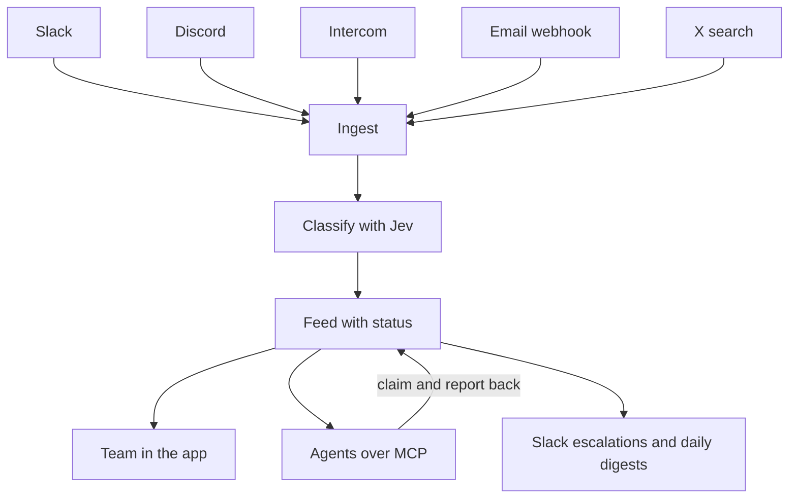
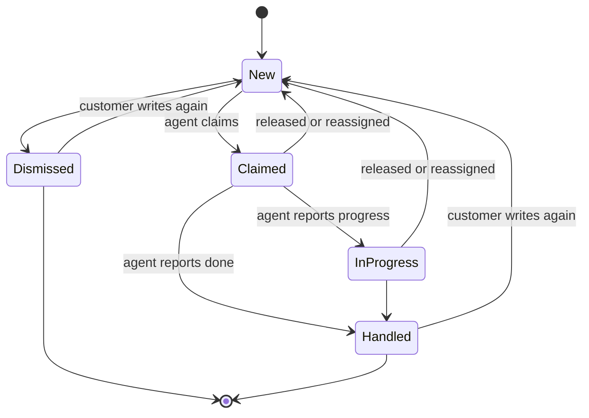
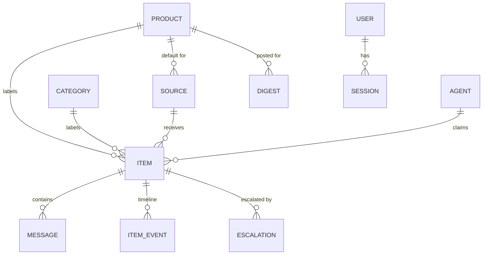
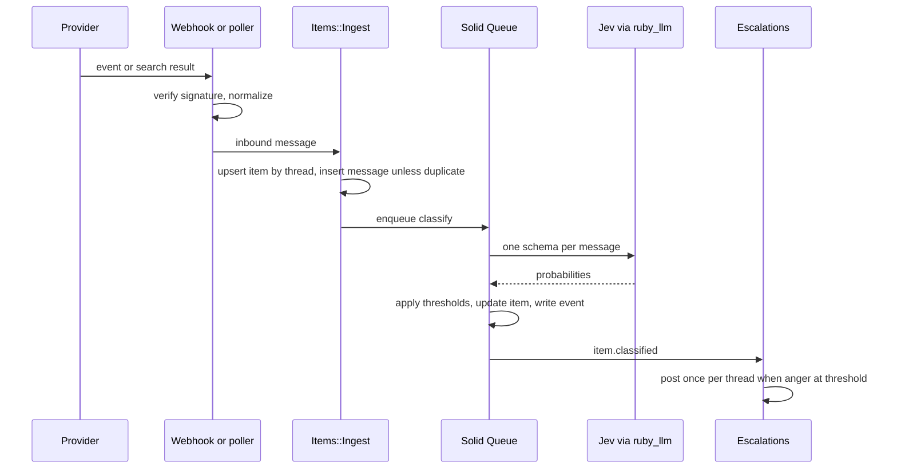
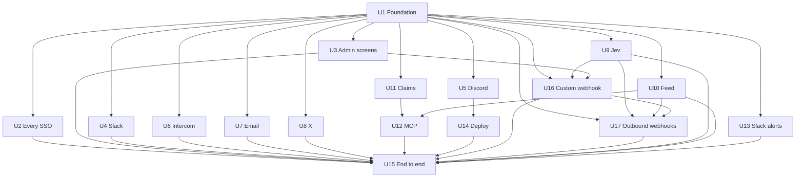

# happyhappy - Plan

## Goal Capsule

- **Objective:** Build the full happyhappy app: connect Every's customer channels, classify every message for sentiment, product, and category, keep a clean feed of sentiment and status, let any agent work that feed over MCP and report back, and push escalations and daily digests to Slack.
- **Product authority:** Kieran Klaassen. The Product Contract below wins on behavior. Items marked `decided (brief)` are Kieran's answers. Items marked `assumed default` are recommended defaults taken under his standing preference; he can override any of them.
- **Execution profile:** One foundation unit (U1) lands first. Then eleven units run in parallel, then four, then a final end-to-end unit. See Sequencing and parallel waves.
- **Stop conditions:** Stop and ask if a unit would change product behavior in the Product Contract, add a new external service beyond those named here, or install Action Mailbox.
- **Tail ownership:** Each unit ships as its own branch and PR against `main`. Never push to `main` (see `AGENTS.md`).
- **Open blockers:** None.

---

## Product Contract

Product Contract preservation: changed R8 to name provider webhooks for email (`decided (brief)`); added Key decisions for email ingestion and positioning, and the assumed defaults under Dependencies and assumptions. No other scope change.

### Summary

happyhappy is an internal Every tool that listens to Slack, Discord, Intercom, email, and X. It classifies each message for sentiment, product, and category, and turns the result into one feed with a status per item. Any agent connects over MCP to read the feed, claim items, and report back. Angry customers are escalated to a Slack support channel, and each product gets a daily Slack digest of the good and the bad.

### Problem frame

Every runs several products, and customer sentiment about them lands in many places: community Slack and Discord servers, Intercom conversations, support email, and posts on X. Nobody sees all of it at once. A complaint in a Discord channel can sit unanswered while the same issue shows up in Intercom, and praise gets lost as easily as anger. There is no single place that says how people feel about each product right now and whether anyone has dealt with what they said.

Agents can now do much of the handling, but they need a clean, trustworthy input and a way to say what they did. Without that, agent work is invisible and the same item gets picked up twice or not at all.

### Actors

- A1. Every team member: signs in with an every.to account and can do everything, from reading the feed to configuring products, sources, agents, and alerts.
- A2. Agent: any MCP-capable agent, such as Cursor or Baby Agent, that reads the feed, claims items, handles them with its own tools, and reports back.
- A3. Customer: the person who wrote the original message on a source channel. Never signs in.
- A4. Slack support channel: where escalations and digests land for the team.

### Key decisions

- **One plan for the whole app.** The product areas ship as ordered delivery slices of one plan. (session-settled: user-directed, chosen over a first plan owning one area such as the feed: Kieran wants the full app planned now.)
- **Sign in with Every, like Baby Agent.** Every SSO is the only production login. Governs R1, R4. (session-settled: user-directed, chosen over Google OAuth as in Thinkroom: match how Every's other apps sign in.)
- **Every every.to person gets full access.** No admin role in v1. `decided (brief)`. Governs R2, R3. (session-settled: user-directed, chosen over a named admin list or promoting admins in the app: everyone at Every can use and configure it.)
- **TypeSafe Jev is the classifier.** Classification runs through Jev via `ruby_llm-typesafe`, which answers each question as a calibrated probability. `decided (brief)`. Governs R14, R16.
- **Products and one global category list are defined by the team.** Jev picks from known options, so happyhappy classifies against configured lists rather than inventing labels. `decided (brief)`. Governs R5, R6, R14. (session-settled: user-directed, chosen over per-product categories: global first is simpler.)
- **Agents connect over MCP.** MCP is the one mechanism for agents to read, claim, and report, so any agent can plug in. `decided (brief)`. Governs R21, R23, R24. (session-settled: user-directed, chosen over webhooks to Baby Agent or building webhooks, a token feed, and MCP at once: MCP lets Kieran pick any agent.)
- **Every connector ingests through provider APIs or webhooks.** Email arrives through an inbound-email provider webhook, not Action Mailbox. `decided (brief)`. Governs R8. (session-settled: user-directed, chosen over Rails Action Mailbox: keep every source on API connections or webhooks.)
- **Push-first ingestion.** Sources that can push (Slack events, Discord gateway, Intercom webhooks, inbound email webhook) push; X is searched on a schedule. Governs R8.
- **Default thresholds come from Jev probabilities.** Low confidence below 0.6, escalation at 0.8 anger probability, and a four-hour report-back window, all adjustable. `assumed default` (Kieran asked for these to be set here). Governs R16, R27, R28.
- **Kamal on Hetzner.** Deploy with the stack's env-driven Kamal setup to Hetzner, like Kieran's other apps. `decided (brief)`. Governs R35. (session-settled: user-directed, chosen over Render as used for Every checks: Kamal on Hetzner is easier and matches his other apps.)
- **Webhooks everywhere.** Wherever happyhappy takes or produces data, a webhook option exists: a custom inbound webhook source per product, including a sync mode that returns labels so a product can use happyhappy as its classifier, and outbound webhook endpoints for events. `decided (brief)`. Governs R36, R37, R38, R39, R40, R41, R42. (session-settled: user-directed, chosen over MCP-only agent access with webhook push deferred: Kieran wants webhook options everywhere, alongside MCP.)
- **Digest every day.** Each product's digest posts daily and carries both positive and negative highlights. `decided (brief)`. Governs R31. (session-settled: user-directed, chosen over skipping quiet days: a daily rhythm of good and bad is the point.)
- **Positioning: an internal Every tool, agent-first, with Jev-calibrated classification.** This separates it from Modem, which is a multi-tenant product. `assumed default`.

### How the pieces connect



### Requirements

**Access**

- R1. Production sign-in uses Sign in with Every only; there are no passwords.
- R2. Only people with a verified every.to email address can sign in; anyone else sees a clear refusal.
- R3. Every signed-in person has full access, including configuration; there are no roles in v1.
- R4. Local development has a dev-only login that never exists in production.

**Products and taxonomy**

- R5. Team members can add, edit, and retire products, each with a name, a short description, and hint words such as aliases and feature names.
- R6. There is one global category list, such as bug, billing, feature request, onboarding, and praise, that team members can edit.
- R7. Retiring a product or category keeps its past items and labels readable.

**Sources**

- R8. Team members can connect five source types: Slack public channels the bot has joined, Discord channels in servers the bot is invited to, Intercom new conversations and customer replies, inbound email delivered by a provider webhook, and X keyword or mention searches.
- R9. A source can carry a default product that classification may override.
- R10. The same message is stored once, even if it arrives twice.
- R11. Every item links back to the original message and keeps its author, channel, and time.
- R12. Each source shows its health: connected or not, last message received, and the latest error.
- R13. X searches run against a team-set monthly spend limit and pause, visibly, when it is reached.

**Classification**

- R14. Each item is classified for sentiment (complaint, praise, question, or neutral), product, category, and anger, each as a probability.
- R15. An item that is not about any configured product is marked as not relevant and stays out of the default feed.
- R16. When a label's probability is below the low-confidence threshold, default 0.6, the item is flagged for human review instead of being trusted.
- R17. Team members can correct any label; the correction wins and is shown as human-set.

**Feed and status**

- R18. Every item has a status: new, claimed, in progress, handled, or dismissed.
- R19. The team feed filters by product, sentiment, category, status, source, and time range.
- R20. Each product has a sentiment overview showing volume and mix over time, with notable complaints and praise.
- R21. Agents reach the feed over MCP with the same filters the team uses.
- R22. Each item has a timeline of what happened to it: arrival, classification, corrections, claims, agent reports, and status changes.

**Agents over MCP**

- R23. Team members can issue a named access token to each agent, and revoking it cuts that agent off immediately.
- R24. Over MCP, an agent can list and read items, claim an item, and report back on it.
- R25. A claimed item belongs to that agent until it reports the item handled, releases it, or a person reassigns it.
- R26. An agent's report records what it did, an optional link, and a new status.
- R27. An item claimed without a report for longer than the report-back window, default four hours, is flagged as overdue.

**Alerts and reports**

- R28. When an item's anger probability reaches the escalation threshold, default 0.8, happyhappy posts an escalation to that product's Slack support channel within five minutes.
- R29. An escalation shows the quote, the product, the source, the customer's handle, and a link to the item.
- R30. One customer thread produces at most one escalation until its status changes.
- R31. Each product gets a Slack digest every day with sentiment mix, top categories, the day's standout praise and complaints, and what agents handled; a quiet day says so.
- R32. Team members choose each product's Slack channel, escalation threshold, and digest time.

**Custom and outbound webhooks**

- R36. Team members can create a custom webhook source per product, each with its own URL and signing secret.
- R37. A custom webhook accepts a signed JSON message with text, author, thread key, permalink, and optional metadata, and ingests it like any other source.
- R38. A custom webhook request in sync mode classifies inline and returns the labels, within a rate limit and bounded size and time.
- R39. The custom webhook payload, signature, and a curl example are documented in `docs/`.
- R40. Team members can register outbound webhook endpoints with a URL, a secret, the events to send (item arrived, item classified, status changed, escalated, agent reported), and filters by product, category, and sentiment.
- R41. Outbound deliveries are signed, retried with backoff, and logged with their last error.
- R42. The endpoints screen shows recent deliveries and has a test-send button.

**Reliability and hosting**

- R33. A failed classification or post retries and never drops the item.
- R34. Customer message content stays inside happyhappy, its configured model provider, Every's Slack workspace, and the agents the team has issued tokens to.
- R35. The app deploys with Kamal to Hetzner from the existing deploy setup.

### Item status lifecycle



### Key flows

- F1. Angry customer escalation
  - **Trigger:** A customer posts an angry message in a community Discord channel.
  - **Actors:** A3, A4, A1
  - **Steps:** The message is ingested and classified as a complaint about one product with anger above the threshold. happyhappy posts an escalation to that product's support channel. A team member opens the item from Slack and handles it or leaves it for an agent.
  - **Outcome:** The team sees it within minutes and the item's status shows who has it.
  - **Covered by:** R8, R14, R18, R28, R29, R30

- F2. Agent works the feed
  - **Trigger:** A team member points an agent, such as Cursor, at happyhappy's MCP with a token.
  - **Actors:** A2, A1
  - **Steps:** The agent lists new complaints for one product, claims one, handles it with its own tools, and reports back what it did with a new status. The report appears on the item's timeline.
  - **Outcome:** Agent work is visible, and no item is worked by two agents.
  - **Covered by:** R21, R22, R23, R24, R25, R26, R27

- F3. Product setup
  - **Trigger:** A team member adds a new Every product.
  - **Actors:** A1
  - **Steps:** They create the product with hint words, connect its Discord channel and Intercom inbox as sources, set a default product on those sources, pick a Slack support channel, and set the digest time.
  - **Outcome:** Messages about the product start flowing into the feed and alerts go to the right channel.
  - **Covered by:** R5, R8, R9, R12, R32

- F4. Human correction
  - **Trigger:** A team member sees an item filed under the wrong product.
  - **Actors:** A1
  - **Steps:** They change the product label. The item moves in the feed, and the timeline records the correction.
  - **Outcome:** People can trust the feed because it can be fixed.
  - **Covered by:** R17, R22

### Acceptance examples

- AE1. **Covers R2.** Given someone signs in with a gmail.com account through Every SSO, when sign-in completes, they see a refusal page and no session is created.
- AE2. **Covers R16.** Given the low-confidence threshold is 0.6, when an item's product probability is 0.45, the item shows the best-guess product flagged for review.
- AE3. **Covers R15.** Given a Slack message says "anyone up for lunch?", when classified, it is marked not relevant and does not appear in the default feed or trigger alerts.
- AE4. **Covers R13.** Given the X monthly limit is reached on the 20th, when the next scheduled search is due, it does not run, and the X source shows paused for budget until the limit is raised or the month resets.
- AE5. **Covers R30.** Given a customer sends three angry Intercom replies in one conversation within an hour, when all three cross the threshold, the support channel gets one escalation, and the later replies appear on the same item's timeline.
- AE6. **Covers R27.** Given the report-back window is four hours, when an agent claimed an item five hours ago and has not reported, the item is flagged overdue in the feed.
- AE7. **Covers R25.** Given agent A has claimed an item, when agent B tries to claim it, the claim is refused and agent B is told the item is taken.
- AE8. **Covers R31.** Given a product had no new items yesterday, when its digest time arrives, the digest still posts and says it was a quiet day.

### Success criteria

- An angry message on any pushed source reaches the product's Slack support channel within five minutes; on X, within the poll interval plus five minutes.
- The team can answer "how do people feel about this product this week, and what has been handled" from one screen.
- Every agent claim ends in a report, a release, or an overdue flag; none disappear silently.
- Team corrections to labels become rarer over the first month as hint words and thresholds are tuned.

### Scope boundaries

**Deferred for later**

- Categories per product.
- Roles and permissions beyond every.to access.
- Replying to customers on source channels from inside happyhappy. Agents reply with their own tools and report back.
- Other channels such as Reddit, Hacker News, app store reviews, and GitHub.
- Categories the model discovers on its own.
- Linking one person across sources into a single profile.
- Backfilling old Slack history beyond what the rate limits allow.

**Outside this product's identity**

- A multi-tenant product sold to other companies. happyhappy is for Every.
- A support inbox or ticketing system. Intercom stays the place support work happens.
- General social listening across the whole web.

**Deferred to follow-up work**

- Mounting the stack's riffrec and Flipper surfaces for happyhappy-specific flags.
- A JSON read API for non-MCP consumers.
- A retention rule for stored raw provider payloads.

### Dependencies and assumptions

- Every SSO is available to happyhappy the way it is to Baby Agent (`EveryInc/baby-agent`), with its own OAuth client.
- `ruby_llm-typesafe` needs `ruby_llm` 2.x; `ruby_llm` 2.0.0 was released on 2026-09-18.
- The agents Kieran wants to use, such as Cursor and Baby Agent, can connect to a remote MCP server with a bearer token.
- X costs $0.005 per post read and $0.010 per user read, with a cap of 3M post reads a month.
- Discord needs a review once the bot can see 10,000 unique users; the bot must be invited to each server.
- Slack history reads are tightly limited for apps outside the Slack Marketplace, so live events are the only Slack path.
- `assumed default`: email arrives through Postmark's inbound webhook.
- `assumed default`: each provider connects one Every account (one Slack workspace, one Discord bot, one Intercom workspace, one Postmark server, one X app); sources pick channels, inboxes, addresses, and queries inside it.
- `assumed default`: the daily users are Every's support and product people; today they watch each channel by hand.
- `assumed default`: the list of Every products and their channels comes from the team at setup.
- `decided (brief)`: Hetzner is the host. "Hedströer" was a transcription of Hetzner, which Kieran later confirmed.

### Sources and research

- `docs/modules/jobs.md`, `docs/modules/geneva_drive.md`, `docs/modules/ruby_llm.md`, `docs/modules/deploy.md`: background jobs, durable workflows, LLM access, and Kamal already in the stack.
- X API pay-per-use pricing: https://docs.x.com/x-api/getting-started/pricing
- Discord privileged intent review changes (June 2026): https://support-dev.discord.com/hc/en-us/articles/40281523410967
- Slack rate limit changes for non-Marketplace apps: https://docs.slack.dev/changelog/2025/05/29/rate-limit-changes-for-non-marketplace-apps/
- Intercom webhook topics: https://developers.intercom.com/docs/references/webhooks/webhook-models
- TypeSafe provider for RubyLLM: https://github.com/kieranklaassen/ruby_llm-typesafe
- Prior art: Modem (closest: Slack, Discord, Intercom, email into an agent that acts and exposes MCP), Octolens (public web listening with webhooks and MCP), Unwrap and Enterpret (enterprise feedback analysis with MCP).

---

## Planning Contract

### Key technical decisions

- KTD1. **One foundation unit owns the whole schema and the ingest contract.** U1 creates every table, model, fixture, and gem before parallel work starts. Parallel Rails branches that each add migrations collide on `db/schema.rb`; one schema owner removes that hazard. A later unit that finds a schema gap adds its own migration and regenerates `db/schema.rb` when it rebases on `main`.
- KTD2. **An item is a customer thread; messages hang off it.** Each connector maps a message to a thread key that is unique per provider (Slack channel plus `thread_ts` or `ts`, Discord channel plus reply chain, Intercom conversation id, the email thread's root `Message-ID` taken from `References`/`In-Reply-To` and from the first mail's own `Message-ID` header, X `conversation_id`, a custom source's public token plus the payload's thread key). Items are unique on source kind plus thread key, so a thread stays one item even when it moves between sources of the same kind; every key therefore carries whatever scopes it, such as the Slack channel. Classification runs per message. The item is relevant when any of its open messages is relevant; its product, category, and sentiment come from the latest relevant open message, falling back to the latest message while none are relevant; its anger is the highest among its relevant open messages, so an off-topic angry reply cannot raise it or trigger an escalation. Open messages are those received since the item's last status change. A new message reopens a handled or dismissed item to new; a claimed or in-progress item keeps its status and gains the timeline event. This is what makes AE5 and the handled-to-new reopen work. Governs R10, R18, R30.
- KTD3. **Connectors are thin adapters over one ingest service.** Each connector verifies its provider, normalizes to one inbound-message shape, and calls `Items::Ingest`. Dedupe is a unique index on source plus external message id. Governs R8, R10, R11.
- KTD4. **Provider credentials live in ENV, not the database.** One account per provider (see assumed defaults). Sources are rows that select channels, inboxes, addresses, and queries. This matches the deploy module's env-driven secrets and avoids Active Record encryption setup.
- KTD5. **Webhook endpoints sit outside the session gate.** They inherit from `ActionController::Base` directly, skip CSRF, and authenticate by provider signature or HTTP basic auth. `McpController` follows the same rule and authenticates by bearer token only. Each responds within the provider's ack window and enqueues any slow work.
- KTD6. **Discord runs as a separate long-lived process.** A `bin/discord` entry point runs a `discordrb` gateway bot inside the Rails environment, deployed as a second Kamal role on the same host. The web role never holds a gateway connection.
- KTD7. **Classification is one Jev request per message.** One TypeSafe schema batches: a Noul for relevance, a Choice for product with a none option, a Choice for category with an other option, a Choice for sentiment, and a Noul for anger. Products and categories feed the Choice criteria with their descriptions and hint words. Thresholds and routing stay in app code. Governs R14, R15, R16.
- KTD8. **`ruby_llm` moves to 2.x.** `ruby_llm-typesafe` requires `ruby_llm >= 2.0.0.rc3, < 3`. U1 bumps the gem and adapts `config/initializers/ruby_llm.rb` so the stack's own initializer test still passes. This diverges from the template's `ruby_llm` module until the template catches up.
- KTD9. **Classification in tests never calls TypeSafe.** A classifier seam returns canned answers in tests; `webmock` blocks real HTTP in the test environment.
- KTD10. **MCP uses the official `mcp` gem over Streamable HTTP.** A single `/mcp` route serves stateless requests. Each request authenticates with `Authorization: Bearer <agent token>`; tokens are stored as digests. The MCP endpoint is an agent protocol surface, not a page data API, so it does not break the "no parallel JSON API" rule in `AGENTS.md`. Governs R21, R23, R24.
- KTD11. **Claims are single-writer by database constraint.** Claiming sets the agent and time only where the item is unclaimed, in one conditional update. The losing agent gets a "taken" error. Governs R25, AE7.
- KTD12. **Domain events decouple classification from alerts.** Classification publishes an `item.classified` notification. Escalation subscribes to it. U13 can then build and test alerts without waiting for U9.
- KTD13. **Scheduled work uses Solid Queue recurring tasks.** X polling every 15 minutes, overdue detection every 5 minutes, and the digest dispatcher hourly, each added to every environment key in `config/recurring.yml` (see the jobs module gotcha).
- KTD14. **The item timeline is an append-only event table.** Ingest, classification, corrections, claims, reports, status changes, and escalations each write one event. The UI and MCP read the same events. Governs R22.
- KTD15. **Slack posting uses the bot token and `chat.postMessage` with Block Kit.** One Slack client wrapper serves escalations and digests. Governs R28, R29, R31.
- KTD16. **X spend is estimated before each call.** Each poll computes the worst-case cost of `max_results` posts plus author expansions and skips the call when it would pass the month's limit. Actual cost, computed from the returned post and user counts because X does not report cost, is added to the month's running total. The total resets on the first of the month. Governs R13, AE4.
- KTD17. **Webhook signing uses one scheme both ways.** Header `X-Happyhappy-Signature: t=<unix time>,v1=<hex HMAC-SHA256 of "<t>.<raw body>">`, with a five-minute window on inbound. Custom source and endpoint secrets are generated per record and stored with Active Record encryption, keyed from ENV; this is the one exception to KTD4. Governs R36, R37, R41.
- KTD18. **Sync mode is bounded.** `?sync=true` is rate-limited per source with Rails `rate_limit`, rejects bodies over 16 KB, and waits at most 10 seconds for Jev before answering with the item and a pending status. Without sync, the endpoint answers 202 after ingest. Governs R38.
- KTD19. **Outbound delivery fans out from the item timeline.** Each new timeline event of a subscribed kind matches endpoints by event and filters, creates one delivery row per endpoint, and enqueues a Solid Queue job that retries with exponential backoff up to 8 attempts. Delivery rows older than 30 days are pruned by a recurring task. Governs R40, R41.

### High-level technical design

**Data model**



- `settings`: one row with low-confidence threshold, report-back window, and default escalation threshold.
- `products`: name, slug, description, hint words, Slack channel id, escalation threshold override, digest hour, retired at.
- `categories`: name, description, position, retired at.
- `sources`: kind (slack, discord, intercom, email, x), name, default product, selector (channel id, inbox id, inbound address, or search query), status, last message at, last error, and for X: monthly limit, month spend, month key, since id.
- `items`: source, thread key, author handle, name, and email, permalink, status, product, category, sentiment, their probabilities, anger probability, relevant, needs review, human-set labels, claimed-by agent, claimed at, last reported at, status changed at, overdue, last message at.
- `messages`: item, source, external id, body, occurred at, raw payload, classification answers, classified at.
- `item_events`: item, kind, actor (user, agent, or system), data, created at.
- `agents`: name, token digest, last used at, revoked at.
- `escalations`: item, product, Slack channel, Slack message ts, posted at.
- `digests`: product, date, Slack message ts, posted at.

**Ingest and classify sequence**



**Process topology:** a `web` role runs Puma with Solid Queue in Puma (webhooks, UI, MCP, jobs). A `discord` role runs `bin/discord` from the same image. Both share the SQLite volume on one Hetzner host.

### Output structure

```text
app/
  controllers/
    webhooks/ (slack, intercom, postmark controllers)
    mcp_controller.rb
    products_controller.rb, categories_controller.rb, sources_controller.rb
    settings_controller.rb, agents_controller.rb
    items_controller.rb, item_labels_controller.rb, item_statuses_controller.rb, product_overviews_controller.rb
    sessions/every_controller.rb, dev_login/sessions_controller.rb
  frontend/pages/ (items, products, categories, sources, agents, settings, auth)
  frontend/components/ (app-nav, item-row, timeline, sentiment-chart)
  jobs/ (classify_message_job, x_poll_job, overdue_sweep_job, digest_dispatch_job, post_digest_job, post_escalation_job)
  models/ (setting, product, category, source, item, message, item_event, agent, escalation, digest)
  queries/items_query.rb
  services/
    items/ (ingest, inbound_message)
    classification/ (schema_builder, classifier, apply)
    connectors/ (slack, discord, discord_bot, intercom, postmark, x, x_budget)
    agents/ (claim, report, release, authenticate)
    escalations/check.rb
    slack/ (client, escalation_message, digest_message)
    mcp/ (server, tools/)
bin/discord
lib/omniauth/strategies/every.rb
```

### Sequencing and parallel waves



- Wave 0: U1.
- Wave 1, in parallel: U2, U3, U4, U5, U6, U7, U8, U9, U10, U11, U13.
- Wave 2, in parallel: U12, U14, U16.
- Wave 3: U17, after U16 has merged with `Webhooks::Signature` and the Active Record encryption setup.
- Wave 4: U15, after every other unit has merged.
- U18, the mood dashboard, was added after Wave 1 started. It needs only U1 and can merge at any point; U15 should cover it.

Conflict hotspots across parallel branches are `config/routes.rb`, `config/recurring.yml`, `.env.example`, and the app navigation component. Each unit adds its own lines in those files and rebases on `main` before merging; resolve by keeping both sides.

### Assumptions

- `assumed default`: `webmock` is added to the test group for HTTP stubbing.
- `assumed default`: the feed UI is server-filtered Inertia pages with query-string filters; no client-side data fetching.
- `assumed default`: the product overview chart covers 30 days by day, built from item counts per sentiment.
- `assumed default`: an escalation's "customer handle" is the source's author handle or email.
- `assumed default`: Slack source messages are ignored when they come from bots or from happyhappy itself.
- `assumed default`: messages older than 7 days at first sight never trigger escalations.
- `assumed default`: one app time zone comes from `APP_TIME_ZONE`; digest hours use it, and each digest covers the previous calendar day.
- `assumed default`: notable or standout items are the top 3 complaints by anger and the top 3 praise items by praise probability in the window.

---

## Implementation Units

| U-ID | Title | Key files | Depends on |
|---|---|---|---|
| U1 | Foundation: gems, schema, models, ingest core | `Gemfile`, `db/migrate/`, `app/models/`, `app/services/items/ingest.rb` | none |
| U2 | Every SSO and every.to gate | `lib/omniauth/strategies/every.rb`, `app/controllers/sessions/` | U1 |
| U3 | Products, categories, sources, settings screens | `app/controllers/products_controller.rb`, `app/frontend/pages/products/` | U1 |
| U4 | Slack connector | `app/controllers/webhooks/slack_controller.rb` | U1 |
| U5 | Discord connector | `bin/discord`, `app/services/connectors/discord.rb` | U1 |
| U6 | Intercom connector | `app/controllers/webhooks/intercom_controller.rb` | U1 |
| U7 | Email connector via Postmark inbound webhook | `app/controllers/webhooks/postmark_controller.rb` | U1 |
| U8 | X connector with spend cap | `app/jobs/x_poll_job.rb`, `app/services/connectors/x.rb` | U1 |
| U9 | Jev classification | `app/services/classification/`, `app/jobs/classify_message_job.rb` | U1 |
| U10 | Feed, item timeline, corrections, product overview | `app/controllers/items_controller.rb`, `app/frontend/pages/items/` | U1 |
| U11 | Agent tokens, claims, reports, overdue detection | `app/services/agents/`, `app/jobs/overdue_sweep_job.rb` | U1 |
| U12 | MCP server | `app/controllers/mcp_controller.rb`, `app/services/mcp/` | U10, U11 |
| U13 | Slack escalations and daily digests | `app/services/slack/`, `app/jobs/digest_dispatch_job.rb` | U1 |
| U14 | Kamal deploy on Hetzner | `config/deploy.yml`, `.kamal/secrets`, `DEPLOYING.md` | U5 |
| U15 | End-to-end flows and CI | `test/integration/`, `.github/workflows/ci.yml` | U2 to U14, U16, U17 |
| U16 | Custom inbound webhook source | `app/controllers/webhooks/custom_controller.rb`, `docs/custom-webhooks.md` | U1, U3, U9 |
| U17 | Outbound webhooks | `app/models/webhook_endpoint.rb`, `app/jobs/webhook_delivery_job.rb` | U1, U9, U10, U16 |
| U19 | Sun logo and a crowd on the sign-in page | `app/frontend/components/sun-logo.tsx`, `app/frontend/components/mood/login-crowd.tsx`, `public/icon.*` | U2, U18 |
| U18 | Mood dashboard home page | `app/queries/mood_scene.rb`, `app/frontend/pages/home/index.tsx`, `app/frontend/components/mood/` | U1 |

### U1. Foundation: gems, schema, models, ingest core

**Goal:** Give every later unit the gems, tables, models, fixtures, and ingest service it builds on.

**Requirements:** R5, R6, R7, R9, R10, R11, R18, R22, R33; KTD1, KTD2, KTD3, KTD8, KTD9, KTD14.

**Dependencies:** None.

**Files:**
- Modify: `Gemfile`, `Gemfile.lock`, `config/initializers/ruby_llm.rb`, `.env.example`, `docs/modules/ruby_llm.md` (record the 2.x delta)
- Create: `db/migrate/*` for `settings`, `products`, `categories`, `sources`, `items`, `messages`, `item_events`, `agents`, `escalations`, `digests`, and user columns `every_user_id`, `name`, `avatar_url`
- Create: `app/models/setting.rb`, `product.rb`, `category.rb`, `source.rb`, `item.rb`, `message.rb`, `item_event.rb`, `agent.rb`, `escalation.rb`, `digest.rb`
- Create: `app/services/items/ingest.rb`, `app/services/items/inbound_message.rb`
- Create: `config/initializers/typesafe.rb`, `test/support/fake_classifier.rb`, `app/frontend/components/app-nav.tsx` with an entry for every section the later units add
- Test: `test/models/*_test.rb` for each model, `test/services/items/ingest_test.rb`, `test/fixtures/*.yml`

**Approach:**
1. Add `ruby_llm ~> 2.0`, `ruby_llm-typesafe`, `mcp`, `discordrb`, `omniauth`, `omniauth-oauth2`, `slack-ruby-client`, and `faraday` to the Gemfile; add `webmock` to the test group. Adapt the `ruby_llm` initializer to 2.x per KTD8.
2. Write migrations and models with enums for source kind, item status, sentiment, and event kind. Unique index on messages by source and external id. Unique index on items by source kind and thread key (KTD2). Make `users.password_digest` nullable and add a unique index on `users.every_user_id`.
3. `Items::Ingest` takes a source and an inbound message, upserts the item by thread key, inserts the message unless it is a duplicate, reopens a handled item when a new message arrives, updates source health, writes `arrived` events, and enqueues classification by class name so U9 can supply the job.
4. Seed the default category list (bug, billing, feature request, onboarding, praise, other) and the settings row in `db/seeds.rb`.

**Patterns to follow:** `app/models/session.rb`, `app/models/user.rb`, `test/models/` style from the template; `docs/modules/jobs.md` for job conventions.

**Test scenarios:**
- Happy path: ingesting a new message creates one item, one message, and one `arrived` event, and enqueues classification.
- Edge case: ingesting the same external id twice keeps one message and one event. Covers R10.
- Edge case: a second message on the same thread key attaches to the existing item.
- Happy path: a new message on a handled or dismissed item sets it back to new and writes a status event.
- Edge case: a new message on a claimed or in-progress item keeps its status and adds an `arrived` event.
- Edge case: the same thread key arriving through a second source of the same kind attaches to the existing item.
- Happy path: a user with no password saves, and two users cannot share an `every_user_id`.
- Edge case: a message for a retired product's source still ingests and the item keeps the retired product readable. Covers R7.
- Happy path: ingest updates the source's last message time and clears its last error.
- Error path: an inbound message missing an external id raises a validation error and stores nothing.
- Integration: `Setting.current` returns the single settings row with defaults 0.6, 0.8, and 240 minutes.
- Integration: the `ruby_llm` initializer test passes on `ruby_llm` 2.x with no keys.

**Verification:** Schema loads from scratch, all model and ingest tests pass, and `bin/rails test` stays green.

### U2. Every SSO and every.to gate

**Goal:** Replace password login with Sign in with Every, allow only verified every.to addresses, and keep a dev-only login.

**Requirements:** R1, R2, R3, R4; AE1.

**Dependencies:** U1.

**Files:**
- Create: `lib/omniauth/strategies/every.rb`, `config/initializers/omniauth.rb`, `app/controllers/sessions/every_controller.rb`, `app/controllers/dev_login/sessions_controller.rb`, `app/frontend/pages/auth/sign_in.tsx`, `app/frontend/pages/auth/refused.tsx`
- Modify: `app/controllers/sessions_controller.rb`, `app/controllers/concerns/authentication.rb`, `app/models/user.rb`, `config/routes.rb`, `lib/tasks/users.rake`, `.env.example`
- Test: `test/lib/omniauth/strategies/every_test.rb`, `test/controllers/sessions/every_controller_test.rb`, `test/controllers/dev_login/sessions_controller_test.rb`, `app/frontend/pages/auth/sign_in.test.tsx`

**Approach:**
1. Port Baby Agent's `every` strategy in its legacy authorization-code mode with UserInfo identity; drop the workspace-deletion step-up and reauth context.
2. On callback, refuse unless the UserInfo email ends in `@every.to` and is verified; upsert the user by `every_user_id` as Baby Agent's `from_every_auth!` does.
3. Remove password sign-in and `has_secure_password` from `User`; the dev login exists only when `Rails.env.development?` and routes are drawn only there.
4. Read `EVERY_OAUTH_CLIENT_ID`, `EVERY_OAUTH_CLIENT_SECRET`, `EVERY_OAUTH_BASE_URL`, and `PUBLIC_BASE_URL` from ENV.

**Patterns to follow:** `EveryInc/baby-agent` files `lib/omniauth/strategies/every.rb`, `app/controllers/sessions/every_controller.rb`, `app/models/user/every_identity.rb`, `config/initializers/omniauth.rb`; the template's `Authentication` concern.

**Test scenarios:**
- Happy path: a verified `ana@every.to` callback creates the user and a session, then redirects to the feed.
- Covers AE1. A `someone@gmail.com` callback renders the refusal page and creates no session.
- Edge case: `ana@every.to.evil.com` and `ana@EVERY.TO ` are handled by exact, case-insensitive domain match on the normalized address.
- Error path: an OAuth failure or state mismatch lands on the sign-in page with an error and no session.
- Edge case: a returning user whose Every name changed gets the new name.
- Happy path: the dev login signs in a seeded every.to person in development.
- Error path: the dev login route does not exist in test or production environments.
- Integration: an unauthenticated visit to the feed redirects to sign-in; the webhooks and `/mcp` paths do not.

**Verification:** Only Sign in with Every appears in production, gmail addresses are refused, and all auth tests pass.

### U3. Products, categories, sources, settings screens

**Goal:** Let team members manage products, the global category list, sources with health, and thresholds.

**Requirements:** R3, R5, R6, R7, R9, R12, R13, R16, R32; F3.

**Dependencies:** U1.

**Files:**
- Create: `app/controllers/products_controller.rb`, `categories_controller.rb`, `sources_controller.rb`, `settings_controller.rb`
- Create: `app/frontend/pages/products/{index,form}.tsx`, `categories/index.tsx`, `sources/{index,form}.tsx`, `settings/edit.tsx`
- Modify: `config/routes.rb`, `app/controllers/inertia_controller.rb` shared props for navigation
- Test: `test/controllers/{products,categories,sources,settings}_controller_test.rb`, `app/frontend/pages/sources/index.test.tsx`

**Approach:**
1. CRUD with retire instead of delete for products and categories.
2. The source form shows kind-specific selector fields: Slack channel id, Discord channel id, Intercom inbox or team id, inbound address, or X query plus monthly limit.
3. The sources index shows health from U1 columns and a paused-for-budget badge for X.
4. Settings edits the low-confidence threshold, default escalation threshold, and report-back window with range validation between 0 and 1 for probabilities.

**Patterns to follow:** `app/controllers/home_controller.rb` and `app/frontend/pages/home/index.tsx` for Inertia props; hand-written prop hashes per `docs/modules/serialization.md`.

**Test scenarios:**
- Happy path: creating a product with hint words shows it in the list and in classification criteria input.
- Happy path: retiring a category hides it from new classification but keeps it on old items. Covers R7.
- Error path: a duplicate product name or slug shows a validation error.
- Error path: a threshold of 1.5 is rejected.
- Happy path: an X source saves its query and monthly limit, and the index shows spend against limit.
- Edge case: a source with no default product is allowed.
- Integration: every screen requires a signed-in user.

**Verification:** A team member can set up a product, its sources, and thresholds from the UI; tests pass.

### U4. Slack connector

**Goal:** Ingest public-channel messages from Slack through the Events API.

**Requirements:** R8, R10, R11, R12.

**Dependencies:** U1.

**Files:**
- Create: `app/controllers/webhooks/slack_controller.rb`, `app/services/connectors/slack.rb`
- Modify: `config/routes.rb`, `.env.example`
- Test: `test/controllers/webhooks/slack_controller_test.rb`, `test/services/connectors/slack_test.rb`

**Approach:**
1. Verify the v0 signature with `SLACK_SIGNING_SECRET` using `Slack::Events::Request#verify!` from `slack-ruby-client`, which also rejects timestamps older than five minutes.
2. Answer `url_verification` with the challenge.
3. For `event_callback` envelopes whose `event.type` is `message` with `channel_type` `channel` (`message.channels` is the subscription name, not the payload type) in a channel that matches a Slack source, map to an inbound message: external id `channel:ts`, thread key `channel:thread_ts` or `channel:ts`, author from the user id with a cached `users.info` lookup, permalink from `chat.getPermalink`, cached per message.
4. Ignore bot messages, edits, deletes, and messages from happyhappy's own bot user.
5. Return 200 fast; Slack retries carry the same event and dedupe by external id.

**Patterns to follow:** KTD3, KTD5.

**Test scenarios:**
- Happy path: a signed message event in a configured channel creates an item.
- Error path: a bad signature returns 401 and stores nothing.
- Error path: a stale timestamp returns 401.
- Happy path: `url_verification` returns the challenge.
- Edge case: a message in an unconfigured channel returns 200 and stores nothing.
- Edge case: a retried event with `X-Slack-Retry-Num` stores one message.
- Edge case: a bot message is ignored.
- Happy path: a thread reply attaches to the parent message's item.
- Edge case: the same `ts` seen in two configured channels creates two items.

**Verification:** Signed Slack events produce items with thread grouping; tests pass.

### U5. Discord connector

**Goal:** Ingest messages from configured Discord channels through a gateway bot process.

**Requirements:** R8, R10, R11, R12.

**Dependencies:** U1.

**Files:**
- Create: `bin/discord`, `app/services/connectors/discord.rb`, `app/services/connectors/discord_bot.rb`
- Modify: `.env.example`, `Procfile.dev`
- Test: `test/services/connectors/discord_test.rb`

**Approach:**
1. `bin/discord` boots Rails and starts a `discordrb` bot with `DISCORD_BOT_TOKEN`. Pass the message content intent as the integer `1 << 15` alongside guild message intents, because `discordrb` 3.8.0 has no named MESSAGE_CONTENT intent and `:all` leaves it out, so message text arrives empty. Enable the intent in the Discord Developer Portal. Run exactly one bot process.
2. On each message create in a channel matching a Discord source, map to an inbound message: external id the message id, thread key the referenced message's thread or the message id, author username, jump link.
3. Keep the mapping in `Connectors::Discord` as a plain function of the event data, so tests exercise it without a gateway.
4. Record connection errors on matching sources; rely on the library's reconnect and resume.

**Execution note:** Prove the mapping with unit tests; prove the gateway process with a manual smoke run against a test server.

**Patterns to follow:** KTD3, KTD6.

**Test scenarios:**
- Happy path: a message event in a configured channel creates an item with a jump link.
- Edge case: a reply to an earlier message joins that message's item.
- Edge case: bot authors and unconfigured channels are ignored.
- Edge case: the same message id twice stores one message.
- Error path: a gateway disconnect records the error on each Discord source.

**Verification:** Mapping tests pass and the bot ingests a real message in a smoke run.

### U6. Intercom connector

**Goal:** Ingest new customer conversations and replies from Intercom webhooks.

**Requirements:** R8, R10, R11, R12; AE5.

**Dependencies:** U1.

**Files:**
- Create: `app/controllers/webhooks/intercom_controller.rb`, `app/services/connectors/intercom.rb`
- Modify: `config/routes.rb`, `.env.example`
- Test: `test/controllers/webhooks/intercom_controller_test.rb`, `test/services/connectors/intercom_test.rb`

**Approach:**
1. Answer Intercom's HEAD validation request with 200.
2. Verify `X-Hub-Signature` as an HMAC-SHA1 of the raw body with `INTERCOM_CLIENT_SECRET`.
3. Handle `conversation.user.created` and `conversation.user.replied`. For created, the message is `data.item.source` with the author email at `source.author.email`; for replied, it is the last entry of the nested array at `data.item.conversation_parts.conversation_parts`, because the outer value is a `conversation_part.list` object rather than the list itself. External id is the part id (the source id for the first message), thread key is the conversation id. Intercom resends when it gets no 200 within 5 seconds, so answer fast; message-level dedupe covers the resend. Send `Intercom-Version: 2.16` on any conversation fetch.
4. Match the conversation to an Intercom source by team assignee or inbox id; fall back to a catch-all Intercom source when one exists. A conversation already on an item stays on that item even after reassignment (KTD2).
5. Strip HTML from part bodies to plain text.

**Patterns to follow:** KTD3, KTD5.

**Test scenarios:**
- Happy path: a signed `conversation.user.created` payload creates an item keyed by conversation id.
- Covers AE5 (ingest half). Three `conversation.user.replied` payloads in one conversation add three messages to one item.
- Error path: a bad signature returns 401.
- Happy path: HEAD returns 200.
- Edge case: admin replies and notes are ignored.
- Edge case: HTML bodies are stored as plain text.

**Verification:** Intercom payloads produce thread-grouped items; tests pass.

### U7. Email connector via Postmark inbound webhook

**Goal:** Ingest inbound email through Postmark's inbound webhook, with no Action Mailbox.

**Requirements:** R8, R10, R11, R12.

**Dependencies:** U1.

**Files:**
- Create: `app/controllers/webhooks/postmark_controller.rb`, `app/services/connectors/postmark.rb`
- Modify: `config/routes.rb`, `.env.example`, `config/application.rb`
- Test: `test/controllers/webhooks/postmark_controller_test.rb`, `test/services/connectors/postmark_test.rb`

**Approach:**
1. Authenticate with HTTP basic auth using `POSTMARK_INBOUND_USER` and `POSTMARK_INBOUND_PASSWORD`, set in the Postmark inbound webhook URL.
2. Route by the recipient address to an email source whose selector is that address.
3. Map to an inbound message: external id the top-level `MessageID`, which is Postmark's own id and serves dedupe only. Thread key is the thread's root `Message-ID`, read from the `Headers` array rather than any top-level field: the first `References` id, else `In-Reply-To`, else this mail's own `Message-ID`, so a first mail and its replies land on one key; fall back to the normalized subject plus sender when the mail carries none of those headers. Body from `StrippedTextReply` when present, else `TextBody`.
4. Replace `require "rails/all"` in `config/application.rb` with explicit framework requires that leave out `action_mailbox/engine`. The scaffold draws 14 `/rails/action_mailbox` routes today; after this unit it draws none. Do not install or configure Action Mailbox.

**Patterns to follow:** KTD3, KTD5.

**Test scenarios:**
- Happy path: an authenticated Postmark payload to a configured address creates an item with the sender's email as author.
- Edge case: a reply with `In-Reply-To` joins the original item.
- Error path: missing or wrong basic auth returns 401.
- Edge case: an unknown recipient returns 200 and stores nothing.
- Edge case: the same `MessageID` twice stores one message.
- Integration: the route set contains no `/rails/action_mailbox` routes and `db/schema.rb` has no `action_mailbox` tables.

**Verification:** Postmark payloads produce items; no Action Mailbox tables or routes exist; tests pass.

### U8. X connector with spend cap

**Goal:** Poll X recent search per X source and stop before the monthly spend limit.

**Requirements:** R8, R10, R11, R12, R13; AE4; KTD16.

**Dependencies:** U1.

**Files:**
- Create: `app/jobs/x_poll_job.rb`, `app/services/connectors/x.rb`, `app/services/connectors/x_budget.rb`
- Modify: `config/recurring.yml`, `.env.example`
- Test: `test/jobs/x_poll_job_test.rb`, `test/services/connectors/x_budget_test.rb`

**Approach:**
1. Every 15 minutes, for each active X source, call `GET /2/tweets/search/recent` with `X_BEARER_TOKEN`, the source query, `since_id`, `max_results` up to 100, and author expansions. Keep the first page's `meta.newest_id` and store that as the next `since_id`; recent search is reverse-chronological, so each later `next_token` page is older and its own `newest_id` would move the cursor backwards into posts already read. Recent search only covers 7 days, so a source paused longer loses the gap.
2. Map each post to an inbound message: external id the post id, thread key `conversation_id`, author username, post URL.
3. Before calling, skip and mark the source paused for budget when the worst-case cost would pass the limit; after calling, add actual cost and advance `since_id`.
4. Reset month spend and unpause when the month key changes.
5. Count author expansions as user reads in the estimate until billing is confirmed; `DEPLOYING.md` tells operators to also set a spending limit in the X developer console as a backstop.

**Patterns to follow:** KTD13, KTD16; `test/jobs/recurring_schedule_test.rb` for recurring entries.

**Test scenarios:**
- Happy path: a stubbed search response creates items and advances `since_id`.
- Covers AE4. When the limit is reached, the next run makes no HTTP call and the source shows paused for budget.
- Happy path: a response with `next_token` fetches the next page, and `since_id` advances to the first page's `newest_id`, not the last page's.
- Edge case: a new month resets spend and resumes polling.
- Error path: a 429 response records the error and keeps `since_id` unchanged.
- Edge case: replies in one conversation join one item.
- Integration: the recurring schedule includes the X poll in every environment key.

**Verification:** Polling respects the cap in tests, and no real HTTP runs in tests.

### U9. Jev classification

**Goal:** Classify each message with Jev and apply thresholds, relevance, review flags, and human-set labels.

**Requirements:** R14, R15, R16, R17, R33; AE2, AE3; KTD7, KTD9, KTD12.

**Dependencies:** U1.

**Files:**
- Create: `app/services/classification/schema_builder.rb`, `classifier.rb`, `apply.rb`, `app/jobs/classify_message_job.rb`
- Modify: `.env.example` for `TYPESAFE_API_KEY`
- Test: `test/services/classification/{schema_builder,apply}_test.rb`, `test/jobs/classify_message_job_test.rb`

**Approach:**
1. Build one schema per message from active products and categories per KTD7, including a none option for product and an other option for category.
2. Send the message body with its source and author as structured state.
3. Apply results per message: relevance below 0.5 marks that message not relevant; any label below the low-confidence threshold sets needs review; labels a human set are not overwritten. Roll the messages up to the item per KTD2, so an off-topic reply cannot hide a thread whose complaint is still open.
4. Write a `classified` event and publish `item.classified`.
5. Retry on provider errors with backoff; after final failure, record the error on the message and keep the item visible.

**Patterns to follow:** `ruby_llm-typesafe` README usage of `RubyLLM::Providers::TypeSafe::Schema` and `with_schema`; KTD9 seam.

**Test scenarios:**
- Happy path: canned answers set product, category, sentiment, anger, and relevance on the item.
- Covers AE2. A product probability of 0.45 keeps the best guess and flags review.
- Covers AE3. A low relevance answer marks the item not relevant.
- Edge case: a human-set product is not replaced by a new classification.
- Edge case: an off-topic reply on an angry product thread leaves the item relevant and keeps the product label from the last relevant message.
- Edge case: an off-topic reply with anger 0.95 on a calm product thread leaves the item anger unchanged and posts no escalation.
- Edge case: a retired product is not offered in the schema.
- Error path: a provider error retries, and after the final attempt the message shows the error and the item stays in the feed.
- Integration: classification publishes `item.classified` with the item id.

**Verification:** Classification tests pass with the fake classifier; a manual run with a real key classifies one message.

### U10. Feed, item timeline, corrections, product overview

**Goal:** Give the team the feed with filters, the item page with its timeline, label corrections, status changes, and a product overview.

**Requirements:** R17, R18, R19, R20, R22, R27 display; F4.

**Dependencies:** U1.

**Files:**
- Create: `app/controllers/items_controller.rb`, `item_labels_controller.rb`, `item_statuses_controller.rb`, `product_overviews_controller.rb`, `app/queries/items_query.rb`
- Create: `app/frontend/pages/items/{index,show}.tsx`, `app/frontend/pages/products/overview.tsx`, `app/frontend/components/{item-row,timeline,sentiment-chart}.tsx`
- Modify: `config/routes.rb`, `app/controllers/home_controller.rb` to redirect root to the feed
- Test: `test/controllers/{items,item_labels,item_statuses,product_overviews}_controller_test.rb`, `test/queries/items_query_test.rb`, `app/frontend/pages/items/index.test.tsx`

**Approach:**
1. `ItemsQuery` owns filtering by product, sentiment, category, status, source, time range, review flag, and overdue; not-relevant items are excluded unless asked for. U12 reuses it.
2. The item page shows messages, labels with probabilities, human-set markers, and the event timeline.
3. Label corrections and status changes write events and mark labels human-set.
4. The product overview shows 30 days of counts by sentiment and recent notable complaints and praise.
5. Every page has an empty state and an error state, and uses semantic headings and labeled controls.

**Patterns to follow:** hand-written props per `docs/modules/serialization.md`; KTD14.

**Test scenarios:**
- Happy path: filtering by product and complaint returns only matching items.
- Edge case: not-relevant items are hidden by default and shown with the filter.
- Covers F4. Changing an item's product moves it in the filtered feed and writes a correction event with the user.
- Happy path: a status change to dismissed writes a status event.
- Happy path: the timeline lists events in time order with actor names.
- Edge case: an overdue item shows an overdue badge.
- Happy path: the product overview returns daily counts per sentiment for 30 days.

**Verification:** The team can filter, open, correct, and change status in the UI; tests pass.

### U11. Agent tokens, claims, reports, overdue detection

**Goal:** Manage agent tokens and implement claim, release, report, and overdue detection as services.

**Requirements:** R23, R25, R26, R27; AE6, AE7; KTD11, KTD13.

**Dependencies:** U1.

**Files:**
- Create: `app/controllers/agents_controller.rb`, `app/frontend/pages/agents/index.tsx`, `app/services/agents/{claim,release,report,authenticate}.rb`, `app/jobs/overdue_sweep_job.rb`
- Modify: `config/routes.rb`, `config/recurring.yml`
- Test: `test/services/agents/{claim,release,report,authenticate}_test.rb`, `test/jobs/overdue_sweep_job_test.rb`, `test/controllers/agents_controller_test.rb`

**Approach:**
1. Creating an agent shows its token once and stores only a digest; revoking sets `revoked_at`.
2. `Agents::Claim` uses one conditional update per KTD11 and writes a `claimed` event.
3. `Agents::Report` records summary, optional link, and new status, sets last reported at, clears overdue, and releases the claim when the status is handled. Report and release refuse unless the calling agent holds the claim.
4. `Agents::Release` and a person's reassign both return the item to new.
5. Every 5 minutes, the overdue sweep flags claimed or in-progress items whose later of claimed at and last reported at is older than the report-back window.

**Patterns to follow:** KTD11, KTD13, KTD14.

**Test scenarios:**
- Happy path: agent A claims a new item and it shows as claimed by A.
- Covers AE7. Agent B's claim on A's item fails with a taken error.
- Integration: two concurrent claims on one item leave exactly one winner.
- Happy path: a report with status handled records the summary and link and releases the claim.
- Covers AE6. An item claimed five hours ago with a four-hour window is flagged overdue by the sweep.
- Edge case: a report clears the overdue flag.
- Error path: a revoked token fails authentication.
- Error path: agent B cannot report on or release agent A's claim.
- Edge case: an item that got a progress report two hours ago is not flagged overdue under a four-hour window, even if it was claimed six hours ago.
- Happy path: the agents screen shows the token once after creation.

**Verification:** Claim, report, release, and overdue services behave per the ACs; tests pass.

### U12. MCP server

**Goal:** Expose the feed and claim workflow to agents over MCP.

**Requirements:** R21, R24, R34; F2; KTD10.

**Dependencies:** U10, U11.

**Files:**
- Create: `app/controllers/mcp_controller.rb`, `app/services/mcp/server.rb`, `app/services/mcp/tools/{list_items,get_item,claim_item,release_item,report_item}.rb`
- Modify: `config/routes.rb`, `docs/` agent setup note in `README.md`
- Test: `test/controllers/mcp_controller_test.rb`, `test/services/mcp/tools/*_test.rb`

**Approach:**
1. Serve the official `mcp` gem's server over Streamable HTTP at `/mcp`, stateless, from a controller that inherits from `ActionController::Base` (KTD5). Build the server per request with the authenticated agent in `server_context`, and add the app host to the transport's allowed hosts so requests through kamal-proxy are not refused.
2. Authenticate each request with `Agents::Authenticate`; reject missing or revoked tokens with 401.
3. Tools map one-to-one to U11 services and `ItemsQuery`; item payloads include messages, labels, probabilities, status, and permalink.
4. Mark customer message bodies as untrusted content in tool payloads, and say so in the README agent setup note.
5. Record the agent's last-used time.

**Patterns to follow:** KTD10; the `mcp` gem's Streamable HTTP transport docs.

**Test scenarios:**
- Happy path: `tools/list` returns the five tools for a valid token.
- Happy path: `list_items` with product and sentiment filters returns matching items.
- Covers F2. `claim_item` then `report_item` with handled changes status and appears on the timeline.
- Covers AE7. `claim_item` on a taken item returns a tool error naming the conflict.
- Error path: no token or a revoked token returns 401.
- Edge case: `get_item` for an unknown id returns a tool error.
- Happy path: item payloads mark customer message bodies as untrusted content.

**Verification:** An MCP client, such as Cursor, connects with a token and completes list, claim, and report; tests pass.

### U13. Slack escalations and daily digests

**Goal:** Post escalations for angry items and a daily digest per product to Slack.

**Requirements:** R28, R29, R30, R31, R32, R33; F1; AE5, AE8; KTD12, KTD13, KTD15.

**Dependencies:** U1.

**Files:**
- Create: `app/services/slack/{client,escalation_message,digest_message}.rb`, `app/services/escalations/check.rb`, `app/jobs/{post_escalation_job,digest_dispatch_job,post_digest_job}.rb`, `config/initializers/item_events.rb`
- Modify: `config/recurring.yml`, `.env.example`
- Test: `test/services/escalations/check_test.rb`, `test/services/slack/{escalation_message,digest_message}_test.rb`, `test/jobs/{post_escalation_job,digest_dispatch_job}_test.rb`

**Approach:**
1. Subscribe to `item.classified`. Escalate when the item is relevant, has a product with a Slack channel, anger is at or above the product's threshold or the default, no escalation exists for the thread since its last status change, and the message is newer than 7 days.
2. Post with `SLACK_BOT_TOKEN` via `chat.postMessage` and Block Kit; store the Slack ts and write an `escalated` event.
3. The hourly dispatcher posts a digest for each product whose digest hour matches and has no digest for today; quiet days post a short quiet-day digest.
4. Retry Slack failures with backoff; never lose the escalation record.

**Patterns to follow:** KTD12, KTD15; `test/jobs/recurring_schedule_test.rb`.

**Test scenarios:**
- Covers F1. An item classified with anger 0.85 and a product channel posts one escalation with quote, product, source, handle, and link.
- Covers AE5. Three angry messages in one thread produce one escalation.
- Edge case: after the item's status changes and a new angry message arrives, a new escalation is allowed.
- Edge case: anger 0.79 with threshold 0.8 posts nothing.
- Edge case: a product with no Slack channel posts nothing.
- Covers AE8. A product with no items yesterday gets a quiet-day digest.
- Happy path: the digest lists sentiment mix, top categories, standout praise and complaints, and agent-handled counts.
- Edge case: the dispatcher never posts two digests for one product on one day.
- Error path: a Slack 5xx retries and records the error without dropping the escalation.

**Verification:** Escalations and digests post correctly against stubbed Slack; tests pass.

### U14. Kamal deploy on Hetzner

**Goal:** Deploy web and Discord roles to a Hetzner host with all secrets from ENV.

**Requirements:** R35; KTD4, KTD6.

**Dependencies:** U5.

**Files:**
- Modify: `config/deploy.yml`, `.kamal/secrets`, `DEPLOYING.md`, `.env.example`, `test/deploy_config_test.rb`

**Approach:**
1. Add a `discord` role running `bin/discord` on the same host as `web`, sharing the storage volume.
2. List every new secret: Every OAuth, Slack signing secret and bot token, Discord token, Intercom client secret, Postmark inbound credentials, X bearer token, TypeSafe key, and `PUBLIC_BASE_URL`.
3. Document Hetzner host setup, DNS, and the provider-side webhook URLs in `DEPLOYING.md`.

**Execution note:** This is mostly config; prove it with the deploy config test and a `kamal config` render.

**Patterns to follow:** `docs/modules/deploy.md`, `test/deploy_config_test.rb`.

**Test scenarios:**
- Happy path: the deploy config renders with both roles and all secrets when ENV is set.
- Error path: a missing required variable fails the render loudly.

**Verification:** `kamal config` renders with both roles; the deploy config test passes.

### U15. End-to-end flows and CI

**Goal:** Prove the main flows across units and keep CI green.

**Requirements:** F1, F2, F3, F4; success criteria.

**Dependencies:** U2, U3, U4, U5, U6, U7, U8, U9, U10, U11, U12, U13, U14, U16, U17.

**Files:**
- Create: `test/integration/escalation_flow_test.rb`, `agent_flow_test.rb`, `setup_flow_test.rb`, `correction_flow_test.rb`
- Modify: `.github/workflows/ci.yml` if new jobs or env are needed, `README.md`

**Approach:**
1. Drive each flow through real controllers and jobs, with the fake classifier and stubbed Slack and X.
2. Confirm CI runs brakeman, bundler-audit, rubocop, `npm run check`, and the Ruby tests with the new gems.

**Test scenarios:**
- Covers F1. A signed Slack event with an angry message produces an item, a classification, and one Slack escalation.
- Covers F2. An agent token lists, claims, and reports on an item over `/mcp`, and the timeline shows each step.
- Covers F3. Creating a product and an Intercom source routes a signed Intercom webhook to that product.
- Covers F4. A correction changes the feed result and the timeline.

**Verification:** All flow tests and CI pass on `main`.

### U16. Custom inbound webhook source

**Goal:** Let any product send messages to happyhappy through a signed webhook, and optionally get labels back inline.

**Requirements:** R36, R37, R38, R39; KTD3, KTD17, KTD18.

**Dependencies:** U1, U3, U9.

**Files:**
- Create: `db/migrate/*_add_custom_webhook_to_sources.rb`, `app/controllers/webhooks/custom_controller.rb`, `app/services/connectors/custom.rb`, `app/services/webhooks/signature.rb`, `docs/custom-webhooks.md`
- Modify: `app/models/source.rb` (new `custom` kind, generated encrypted secret), `app/controllers/sources_controller.rb` and `app/frontend/pages/sources/{index,form}.tsx` (show URL and secret, rotate secret), `config/routes.rb`, `config/application.rb` or an initializer for Active Record encryption keys from ENV, `.env.example`
- Test: `test/controllers/webhooks/custom_controller_test.rb`, `test/services/webhooks/signature_test.rb`, `test/services/connectors/custom_test.rb`

**Approach:**
1. Each custom source has a public token in its URL (`/webhooks/custom/:token`) and a generated signing secret.
2. Verify the signature per KTD17, parse the JSON, map to an inbound message (external id from `id` or a body hash, thread key the source's public token plus the payload's `thread_key` or the id, author, permalink, metadata kept in the raw payload), and call `Items::Ingest`. Every custom source shares the `custom` kind, so the token prefix is what keeps two products that send the same local id from merging into one item.
3. Sync mode runs classification inline per KTD18 and returns item id, status, and the labels with probabilities.
4. `Webhooks::Signature` is shared with U17.
5. Document the payload, signature, sync mode, limits, and a curl example in `docs/custom-webhooks.md`.

**Test scenarios:**
- Happy path: a signed message creates an item on the source's product and answers 202.
- Happy path: sync mode with the fake classifier answers 200 with labels and probabilities.
- Error path: a bad or stale signature answers 401 and stores nothing.
- Error path: an unknown token answers 404.
- Error path: a body over 16 KB answers 413.
- Edge case: the same `id` twice stores one message.
- Edge case: two custom sources sending the same `thread_key` create two items, one per source.
- Edge case: sync requests over the rate limit answer 429.
- Error path: a classifier timeout in sync mode answers 200 with a pending status and the item stays queued for classification.
- Happy path: rotating the secret makes the old secret fail.

**Verification:** The curl example in the docs works against a local server; tests pass.

### U17. Outbound webhooks

**Goal:** Send signed event webhooks to registered endpoints, with retries, a delivery log, and a test send.

**Requirements:** R40, R41, R42; KTD17, KTD19.

**Dependencies:** U1, U9, U10, U16 (for `Webhooks::Signature` and the Active Record encryption setup).

**Files:**
- Create: `db/migrate/*_create_webhook_endpoints_and_deliveries.rb`, `app/models/webhook_endpoint.rb`, `app/models/webhook_delivery.rb`, `app/services/webhooks/fan_out.rb`, `app/services/webhooks/payload.rb`, `app/jobs/webhook_delivery_job.rb`, `app/jobs/webhook_delivery_prune_job.rb`, `app/controllers/webhook_endpoints_controller.rb`, `app/frontend/pages/webhook_endpoints/{index,form,show}.tsx`
- Modify: `app/models/item_event.rb` (after-commit fan-out hook), `app/frontend/components/app-nav.tsx`, `config/routes.rb`, `config/recurring.yml`
- Test: `test/services/webhooks/fan_out_test.rb`, `test/jobs/webhook_delivery_job_test.rb`, `test/controllers/webhook_endpoints_controller_test.rb`, `app/frontend/pages/webhook_endpoints/index.test.tsx`

**Approach:**
1. Endpoint: name, URL (https only outside development), generated encrypted secret, event kinds, and optional product, category, and sentiment filters, active flag.
2. Map timeline event kinds to webhook events: `arrived` to item arrived, `classified` to item classified, `status_changed` and claim events to status changed, `escalated` to escalated, `reported` to agent reported.
3. Fan out per KTD19; the payload carries event, time, and the item with labels and permalink, and marks customer text as untrusted.
4. The job posts with the KTD17 signature, a 10-second timeout, and records status, response code, attempts, and last error.
5. The endpoint page lists recent deliveries and has a test-send button that sends a sample event.

**Test scenarios:**
- Happy path: a classified event for a matching product creates one delivery and a signed POST.
- Edge case: an endpoint filtered to another product receives nothing.
- Error path: a 500 response retries with backoff and records the last error; after 8 attempts the delivery is marked failed.
- Happy path: test send posts a sample event and shows the result.
- Edge case: an inactive endpoint receives nothing.
- Integration: the signature verifies with `Webhooks::Signature` using the endpoint secret.
- Happy path: the prune job deletes deliveries older than 30 days.

**Verification:** Deliveries post, retry, and show in the UI against stubbed endpoints; tests pass.

### U18. Mood dashboard home page

**Goal:** Make the home page a fun, drawn picture of today's customers: one watercolor character per customer, grouped by product, whose face and pose follow how they feel, updating live.

**Requirements:** R20 (a glanceable product overview), R22 display; Kieran's brief for a designed, funny, dynamic dashboard.

**Dependencies:** U1. Links into U10's item page and replaces U10's redirect from the root to the feed; live pings come from any unit that saves items (U4 to U9).

**Files:**
- Create: `app/models/mood.rb`, `app/queries/mood_scene.rb`, `app/channels/mood_channel.rb`, `app/channels/application_cable/channel.rb`, `lib/tasks/mood_demo.rake`
- Create: `app/frontend/components/mood/` (character, traits, seed, watercolor filters, sky, meadow, flora, live stream hook, styles), `app/frontend/types/mood.ts`
- Modify: `app/controllers/home_controller.rb`, `app/frontend/pages/home/index.tsx`, `app/frontend/components/app-nav.tsx`, `app/models/item.rb`, `config/cable.yml`, `config/database.yml`, `package.json`
- Test: `test/models/mood_test.rb`, `test/queries/mood_scene_test.rb`, `test/controllers/home_controller_test.rb`, `test/channels/mood_channel_test.rb`, `app/frontend/components/mood/*.test.tsx`, `app/frontend/pages/home/index.test.tsx`

**Approach:**
1. Moods come from the item's classification in one Ruby module. Furious means anger at or above the product's escalation threshold, so the storm cloud and the Slack escalation always agree. A complaint or anger of 0.45 or more is grumpy, praise at 0.75 or more is beaming, softer praise is content, questions and neutral remarks are meh, and an unclassified item is still being read.
2. `MoodScene` takes relevant items from the last 24 hours (or 7 days), keeps one character per customer per product from their latest thread, and returns the scene, a summary with counts by mood, and the filters. Customers are keyed by email, else handle within the source kind; the key is hashed into the drawing seed so no address reaches the markup. Each product shows at most 48 people and counts the rest.
3. Characters are procedural SVG with watercolor done in SVG filters: turbulence displacement for wobbly edges, an eroded rim multiplied back for pooled pigment, soft blooms, and an offset pencil line. The seed picks body colour, shape, headwear, accessory, lean, and idle tempo, so no two customers look alike. Faces, arms, and extras (hearts and confetti, a sparkle, a buzzing fly, a grumble scribble, a storm cloud with steam) change with mood.
4. Live updates: every committed item change broadcasts a data-free ping on `MoodChannel`, and the page answers with an Inertia partial reload of `scene` and `today`, so there is still no JSON API. Pings in one burst coalesce into one reload, and a 30 second poll covers a dropped socket. Development uses Solid Cable like production, so pings from `bin/discord`, jobs, or a console reach the browser.
5. When a customer's mood changes they squash, jump, and splash colour; newcomers pop in. Positions are ordered by seed, so nobody moves when a mood changes. `prefers-reduced-motion` turns every animation off.
6. Hover or focus shows a card with the message, source, time, status, and a link to `/items/:id`. Each character is a button with a full text description, each product is a labelled region, and the whole crowd is also available as a table.
7. `bin/rails mood:demo` fills today with customers in every mood and `bin/rails mood:drift` keeps them arriving and changing, in development only.

**Art route:** Procedural SVG was chosen over layered generated illustrations after prototyping both. Generated sheets looked lovely but could not change a face live, gave every customer the same body, and hue-shifting them for variety also turned the blush and the furious red face green. The generated sheet stayed as the art reference.

**Test scenarios:**
- Happy path: the scene groups relevant customers from the last 24 hours by product and leaves out not relevant and older items.
- Happy path: a character carries its mood, latest message excerpt, source, and item id.
- Edge case: one customer with two threads on a product is one character drawn from the newer thread.
- Edge case: furious follows the product's own escalation threshold.
- Edge case: an unclassified item is pending, and a handled complaint is drawn with a bandage.
- Edge case: a crowded product shows the 48 most recent people and counts the rest.
- Happy path: the product and range filters narrow the scene and the summary.
- Integration: an item change broadcasts one ping with no customer data, and the page subscribes, coalesces pings, and falls back to polling.
- Integration: the dashboard requires a signed-in person.
- Happy path: a mood change animates that one character and a newcomer pops in; first paint animates nobody.

**Verification:** The home page shows every mood with fixture data, updates within a second of a change in another process, passes `bin/rails test` and `npm run check`, and is usable by keyboard with reduced motion.

### U19. Sun logo and a crowd on the sign-in page

**Goal:** Give happyhappy a logo, the smiling sun from the dashboard, and make the sign-in page as friendly as the dashboard with a small crowd of made-up watercolor people along the bottom.

**Dependencies:** U2 (sign-in page), U18 (characters).

**Files:**
- Create: `app/frontend/components/sun-logo.tsx`, `app/frontend/components/mood/login-crowd.tsx`, tests for both
- Modify: `app/frontend/pages/auth/sign_in.tsx`, `app/frontend/components/app-nav.tsx`, `app/frontend/components/mood/character.tsx`, `public/icon.svg`, `public/icon.png`, `config/initializers/pwa.rb`, `app/views/pwa/service-worker.js`

**Approach:**
1. One sun mark drawn in SVG: eight rays, a warm disc, closed happy eyes, a smile, and blush. `public/icon.svg` is rendered from the component, and `public/icon.png` is the same mark on paper at 512 pixels with room for maskable cropping. The PWA theme and background become the paper colour, and the service worker cache version is bumped for the new icon.
2. The sign-in page shows the mark beside the hand-lettered wordmark. Eleven fixed, seeded, made-up people stand on a hill at the bottom: mostly beaming or content, one grumpy, one under a storm cloud, and one saying "Welcome back!". Phones show the middle five. The crowd sits below the form in normal flow, so it never covers the button, and it is hidden from assistive tech. No customer data reaches this public page.
3. The idle animation moves onto the element that sets each character's tempo and phase, so characters no longer bob in step, on the dashboard too.

**Test scenarios:**
- Happy path: the crowd is mostly happy with exactly one grumpy and one furious person, and phones still see both.
- Edge case: every seed is a fixed `login-` seed and the crowd is `aria-hidden`.
- Happy path: the sign-in page shows the wordmark, and the crowd comes after the sign-in button, outside the form.
- Happy path: the nav brand links home with the sun beside the wordmark.
- Integration: `public/icon.svg` is the sun and `public/icon.png` is a 512 by 512 PNG.

**Verification:** `bin/rails test` and `npm run check` pass, and the sign-in page looks right on desktop and mobile with reduced motion on and off.

---

## Verification Contract

| Gate | Command | Applies to |
|---|---|---|
| Ruby tests | `bin/rails test` | Every unit |
| Frontend types and tests | `npm run check` | Units touching `app/frontend/` (U2, U3, U10, U11) |
| Lint | `bin/rubocop` | Every unit |
| Security scan | `bin/brakeman --no-pager` | Every unit |
| Gem audit | `bin/bundler-audit` | U1 and any unit changing gems |
| JS audit | `npm audit --omit=dev --audit-level=moderate` | Units changing JS dependencies |
| Deploy render | `test/deploy_config_test.rb` and `kamal config` | U14 |
| No Action Mailbox | no `action_mailbox` tables in `db/schema.rb` and no `/rails/action_mailbox` routes | Every unit |

No test may call TypeSafe, Slack, Discord, Intercom, Postmark, or X over the network (KTD9).

## Definition of Done

- Every unit's test scenarios exist and pass, and every gate above is green on `main`.
- Each unit merged through its own PR; nothing was pushed straight to `main`.
- AE1 to AE8 each have at least one passing test that names them.
- A team member can sign in with an every.to account, set up a product and sources, see classified items in the feed, and receive an escalation in Slack on the U14 Hetzner deploy.
- An MCP client can list, claim, and report on an item with a token.
- No Action Mailbox tables, routes, or configuration exist.
- No abandoned-attempt code, dead files, or commented-out experiments remain in the diff.
