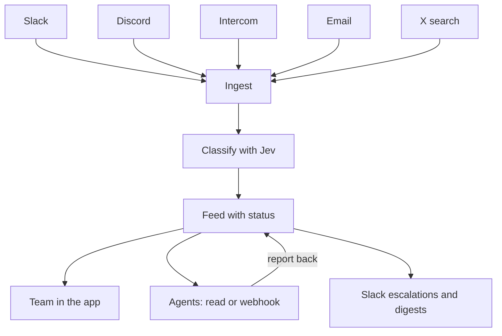
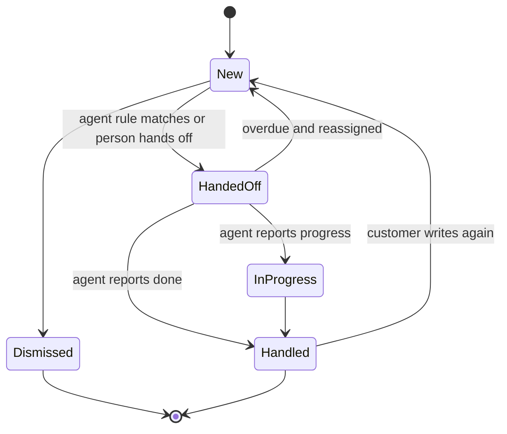

# happyhappy - Plan

## Goal Capsule

- **Objective:** Build the full happyhappy app: connect Every's customer channels, classify every message for sentiment, product, and category, keep a clean feed of sentiment and status, hand items to agents that report back, and push alerts and digests to Slack.
- **Product authority:** Kieran Klaassen. The whole app is active scope in this one plan, by his call.
- **Open blockers:** None block planning. Open items are listed under Outstanding questions.

---

## Product Contract

### Summary

happyhappy is an internal Every tool that listens to Slack, Discord, Intercom, email, and X. It classifies each message for sentiment, product, and category, and turns the result into one feed with a status per item. Agents read the feed or receive webhooks, handle items, and report back. Angry customers are escalated to a Slack support channel, and each product gets a regular Slack digest.

### Problem frame

Every runs several products, and customer sentiment about them lands in many places: community Slack and Discord servers, Intercom conversations, support email, and posts on X. Nobody sees all of it at once. A complaint in a Discord channel can sit unanswered while the same issue shows up in Intercom, and praise gets lost as easily as anger. There is no single place that says how people feel about each product right now and whether anyone has dealt with what they said.

Agents can now do much of the handling, but they need a clean, trustworthy input and a way to say what they did. Without that, agent work is invisible and the same item gets picked up twice or not at all.

### Actors

- A1. Every team member: signs in with an every.to account, reads the feed, corrects labels, changes status.
- A2. Admin: an Every team member who also configures products, categories, sources, agents, and alert rules.
- A3. Agent: an external agent that reads the feed or receives webhooks, handles items, and reports back.
- A4. Customer: the person who wrote the original message on a source channel. Never signs in.
- A5. Slack support channel: where escalations and digests land for the team.

### Key decisions

- **One plan for the whole app.** The four product areas ship as ordered delivery slices of one plan rather than separate brainstorms. (session-settled: user-directed, chosen over a first plan owning one area such as the feed: Kieran wants the full app planned now.)
- **Sign in with Every, like Baby Agent.** Every SSO is the only production login. Governs R1, R4. (session-settled: user-directed, chosen over Google OAuth as in Thinkroom: match how Every's other apps sign in.)
- **Only every.to people get in.** Governs R2. (session-settled: user-directed, chosen over an admin allowlist or several allowed domains: this is an internal Every tool.)
- **TypeSafe Jev is the classifier.** Classification runs through Jev via `ruby_llm-typesafe`, which answers each question as a calibrated probability. Kieran's call. Governs R14, R16.
- **Products and categories are lists admins define.** Jev picks from known options, so happyhappy classifies against configured lists rather than inventing labels. Governs R5, R6, R14.
- **Push-first ingestion, MCP on the way out.** Sources that can push (Slack events, Discord gateway, Intercom webhooks, inbound email) push; X is searched on a schedule. MCP is a candidate way for agents to read the feed, not the ingestion path. Governs R8, R21.
- **Kamal, not Render.** Deploy with the stack's env-driven Kamal setup. Governs R35. (session-settled: user-directed, chosen over Render as used for Every checks: Kamal is easier.)

### How the pieces connect

### Requirements

**Access**

- R1. Production sign-in uses Sign in with Every only; there are no passwords.
- R2. Only people with a verified every.to email address can sign in; anyone else sees a clear refusal.
- R3. Some team members are admins; only admins can change configuration.
- R4. Local development has a dev-only login that never exists in production.

**Products and taxonomy**

- R5. Admins can add, edit, and retire products, each with a name, a short description, and hint words such as aliases and feature names.
- R6. Admins can define the category list, such as bug, billing, feature request, onboarding, and praise.
- R7. Retiring a product or category keeps its past items and labels readable.

**Sources**

- R8. Admins can connect five source types: Slack public channels the bot has joined, Discord channels in servers the bot is invited to, Intercom new conversations and customer replies, a dedicated inbound email address, and X keyword or mention searches.
- R9. A source can carry a default product that classification may override.
- R10. The same message is stored once, even if it arrives twice.
- R11. Every item links back to the original message and keeps its author, channel, and time.
- R12. Each source shows its health: connected or not, last message received, and the latest error.
- R13. X searches run against an admin-set monthly spend limit and pause, visibly, when it is reached.

**Classification**

- R14. Each item is classified for sentiment (complaint, praise, question, or neutral), product, category, and an anger score, each with a probability.
- R15. An item that is not about any configured product is marked as not relevant and stays out of the default feed.
- R16. When a label's probability falls below an admin-set threshold, the item is flagged for human review instead of being trusted.
- R17. Team members can correct any label; the correction wins and is shown as human-set.

**Feed and status**

- R18. Every item has a status: new, handed off, in progress, handled, or dismissed.
- R19. The team feed filters by product, sentiment, category, status, source, and time range.
- R20. Each product has a sentiment overview showing volume and mix over time, with notable complaints and praise.
- R21. Agents can read the same feed, with the same filters, using a token an admin issues.
- R22. Each item has a timeline of what happened to it: arrival, classification, corrections, handoffs, agent reports, and status changes.

**Agent handoff and report-back**

- R23. Admins can register an agent with a webhook address and a rule for which items it receives, by product, category, sentiment, or anger score.
- R24. Webhook deliveries are signed, retried on failure, and logged with their outcome.
- R25. An item goes to one agent at a time; handing it to a second agent requires a person to reassign it.
- R26. An agent reports back on an item with what it did, an optional link, and a new status.
- R27. An item handed off but not reported back within an admin-set window is flagged as overdue.

**Alerts and reports**

- R28. When an item's anger score crosses an admin-set threshold, happyhappy posts an escalation to that product's Slack support channel within five minutes.
- R29. An escalation shows the quote, the product, the source, the customer's handle, and a link to the item.
- R30. One customer thread produces at most one escalation until its status changes.
- R31. Each product can have a scheduled Slack digest with sentiment mix, top categories, notable praise, and what agents handled.
- R32. Admins choose the Slack channel, threshold, and schedule per product.

**Reliability and hosting**

- R33. A failed classification or delivery retries and never drops the item.
- R34. Customer message content stays inside happyhappy and its configured model provider.
- R35. The app deploys with Kamal from the existing deploy setup.

### Item status lifecycle

### Key flows

- F1. Angry customer escalation
  - **Trigger:** A customer posts an angry message in a community Discord channel.
  - **Actors:** A4, A5, A1
  - **Steps:** The message is ingested and classified as a complaint about one product with a high anger score. happyhappy posts an escalation to that product's support channel. A team member opens the item from Slack and hands it off or handles it.
  - **Outcome:** The team sees it within minutes and the item's status shows who has it.
  - **Covered by:** R8, R14, R18, R28, R29, R30

- F2. Agent handoff and report-back
  - **Trigger:** A new item matches an agent's rule.
  - **Actors:** A3, A1
  - **Steps:** happyhappy sends a signed webhook and marks the item handed off. The agent handles it with its own tools, then reports back with what it did and a new status. The report appears on the item's timeline.
  - **Outcome:** Agent work is visible, and nothing is picked up twice.
  - **Covered by:** R22, R23, R24, R25, R26, R27

- F3. Admin setup
  - **Trigger:** An admin adds a new Every product.
  - **Actors:** A2
  - **Steps:** The admin creates the product with hint words, connects its Discord server and Intercom workspace, sets a default product on those sources, picks a Slack support channel, and sets the anger threshold and digest schedule.
  - **Outcome:** Messages about the product start flowing into the feed and alerts go to the right channel.
  - **Covered by:** R5, R8, R9, R12, R32

- F4. Human correction
  - **Trigger:** A team member sees an item filed under the wrong product.
  - **Actors:** A1
  - **Steps:** They change the product label. The item moves in the feed, the timeline records the correction, and agent rules re-evaluate against the corrected label.
  - **Outcome:** People can trust the feed because it can be fixed.
  - **Covered by:** R17, R22, R23

### Acceptance examples

- AE1. **Covers R2.** Given someone signs in with a gmail.com account through Every SSO, when sign-in completes, they see a refusal page and no session is created.
- AE2. **Covers R16.** Given the low-confidence threshold is 0.6, when an item's product probability is 0.45, the item shows the best-guess product flagged for review and is not sent to agents on product-based rules.
- AE3. **Covers R15.** Given a Slack message says "anyone up for lunch?", when classified, it is marked not relevant and does not appear in the default feed or trigger alerts.
- AE4. **Covers R13.** Given the X monthly limit is reached on the 20th, when the next scheduled search is due, it does not run, and the X source shows paused for budget until the limit is raised or the month resets.
- AE5. **Covers R30.** Given a customer sends three angry Intercom replies in one conversation within an hour, when all three cross the threshold, the support channel gets one escalation, and the later replies appear on the same item's timeline.
- AE6. **Covers R27.** Given the report-back window is four hours, when an agent received an item five hours ago and has not reported, the item is flagged overdue in the feed.
- AE7. **Covers R25.** Given an item is handed off to agent A, when a second agent's rule also matches, the item is not sent to agent B.

### Success criteria

- An angry message on any connected source reaches the product's Slack support channel within five minutes.
- The team can answer "how do people feel about this product this week, and what has been handled" from one screen.
- Every agent handoff ends in a report or an overdue flag; none disappear silently.
- Team corrections to labels become rarer over the first month as hint words and thresholds are tuned.

### Delivery order

The areas ship in slices that each work on their own:

- First: access, products and categories, and the feed with classification, proven on Intercom and Slack.
- Then: Discord, email, and X connectors, each joining the same feed.
- Then: agent handoff and report-back, which depends on the feed and status.
- Then: Slack escalations and digests, which depend on the feed and share the anger score with agent rules.

### Scope boundaries

**Deferred for later**

- Replying to customers on source channels from inside happyhappy. Agents reply with their own tools and report back.
- Other channels such as Reddit, Hacker News, app store reviews, and GitHub.
- Categories the model discovers on its own.
- Linking one person across sources into a single profile.
- Backfilling old Slack history beyond what the rate limits allow.

**Outside this product's identity**

- A multi-tenant product sold to other companies. happyhappy is for Every.
- A support inbox or ticketing system. Intercom stays the place support work happens.
- General social listening across the whole web.

### Dependencies and assumptions

- Every SSO is available to happyhappy the way it is to Baby Agent (`EveryInc/baby-agent`).
- `ruby_llm-typesafe` works with the stack's `ruby_llm` version.
- X costs $0.005 per post read with a cap of 3M post reads a month; 10k matching posts a month costs about $50.
- Discord needs a review once the bot can see 10,000 unique users; the bot must be invited to each server.
- Slack history reads are tightly limited for apps outside the Slack Marketplace, so live events are the main Slack path.
- The first agent is external to happyhappy and can receive signed webhooks.
- Assumption: the list of Every products and their channels comes from the team at setup, not from this plan.

### Outstanding questions

**Resolve before planning**

- None.

**Deferred to planning**

- Which agent is first to consume the feed, and does it want webhooks, polling, MCP, or all three?
- How are admins chosen: a named list in configuration, or promoted in the app?
- Are categories one global list or can products add their own?
- What are the default anger threshold, low-confidence threshold, and report-back window?
- Where does it run: confirm the Kamal target host (Kieran said "like we do in Hedströer", likely Hetzner).
- Should a digest skip a day with nothing notable?
- Which email path: a forwarding address per product, or one address with product detection?

### Sources and research

- `docs/modules/jobs.md`, `docs/modules/geneva_drive.md`, `docs/modules/ruby_llm.md`, `docs/modules/deploy.md`: background jobs, durable workflows, LLM access, and Kamal already in the stack.
- `config/application.rb`: loads `rails/all`, so Action Mailbox is available for inbound email but not installed.
- X API pay-per-use pricing: https://docs.x.com/x-api/getting-started/pricing
- Discord privileged intent review changes (June 2026): https://support-dev.discord.com/hc/en-us/articles/40281523410967
- Slack rate limit changes for non-Marketplace apps: https://docs.slack.dev/changelog/2025/05/29/rate-limit-changes-for-non-marketplace-apps/
- Intercom webhook topics: https://developers.intercom.com/docs/references/webhooks/webhook-models
- MCP servers: Slack hosted MCP, Intercom hosted MCP (`mcp.intercom.com/mcp`), X `xdevplatform/xmcp`, community Discord servers.
- Prior art: Modem (closest: Slack, Discord, Intercom, email into an agent that acts and exposes MCP), Octolens (public web listening with webhooks and MCP), Unwrap and Enterpret (enterprise feedback analysis with MCP).
