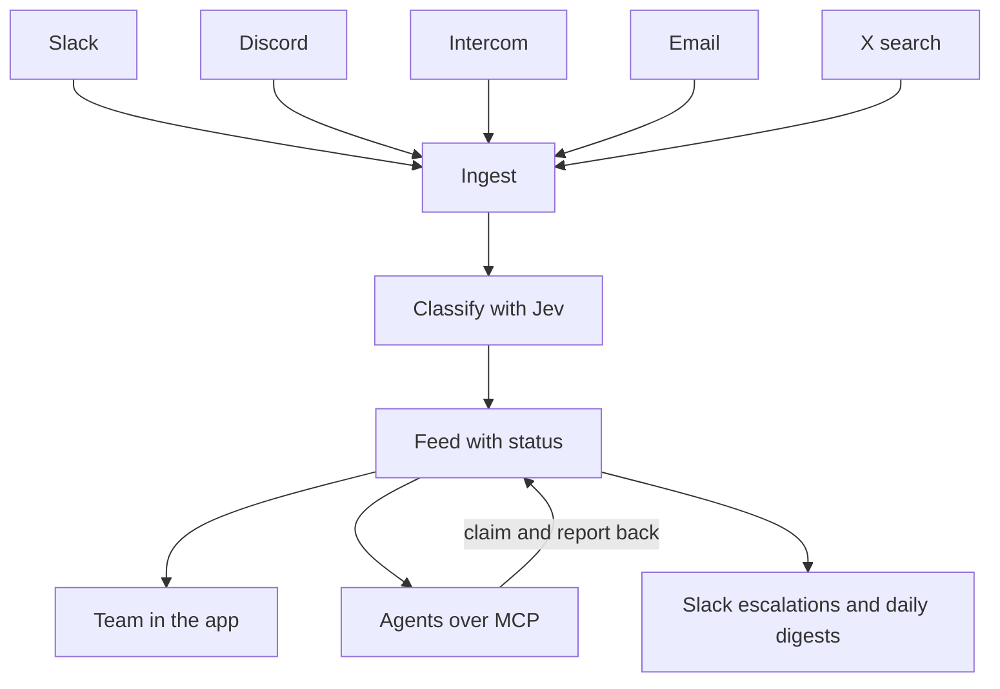
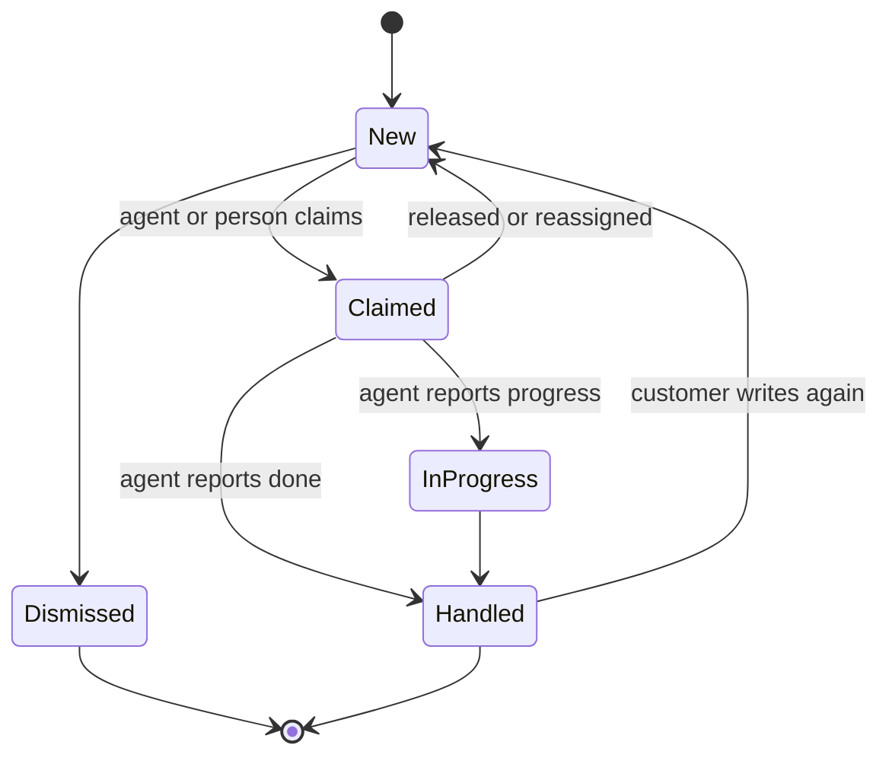

# happyhappy - Plan

## Goal Capsule

- **Objective:** Build the full happyhappy app: connect Every's customer channels, classify every message for sentiment, product, and category, keep a clean feed of sentiment and status, let any agent work that feed over MCP and report back, and push escalations and daily digests to Slack.
- **Product authority:** Kieran Klaassen. The whole app is active scope in this one plan, by his call.
- **Open blockers:** None block planning. Open items are listed under Outstanding questions.

---

## Product Contract

### Summary

happyhappy is an internal Every tool that listens to Slack, Discord, Intercom, email, and X. It classifies each message for sentiment, product, and category, and turns the result into one feed with a status per item. Any agent connects over MCP to read the feed, claim items, and report back. Angry customers are escalated to a Slack support channel, and each product gets a daily Slack digest of the good and the bad.

### Problem frame

Every runs several products, and customer sentiment about them lands in many places: community Slack and Discord servers, Intercom conversations, support email, and posts on X. Nobody sees all of it at once. A complaint in a Discord channel can sit unanswered while the same issue shows up in Intercom, and praise gets lost as easily as anger. There is no single place that says how people feel about each product right now and whether anyone has dealt with what they said.

Agents can now do much of the handling, but they need a clean, trustworthy input and a way to say what they did. Without that, agent work is invisible and the same item gets picked up twice or not at all.

### Actors

- A1. Every team member: signs in with an every.to account and can do everything, from reading the feed to configuring products, sources, agents, and alerts.
- A2. Agent: any MCP-capable agent, such as Cursor or Baby Agent, that reads the feed, claims items, handles them with its own tools, and reports back.
- A3. Customer: the person who wrote the original message on a source channel. Never signs in.
- A4. Slack support channel: where escalations and digests land for the team.

### Key decisions

- **One plan for the whole app.** The four product areas ship as ordered delivery slices of one plan rather than separate brainstorms. (session-settled: user-directed, chosen over a first plan owning one area such as the feed: Kieran wants the full app planned now.)
- **Sign in with Every, like Baby Agent.** Every SSO is the only production login. Governs R1, R4. (session-settled: user-directed, chosen over Google OAuth as in Thinkroom: match how Every's other apps sign in.)
- **Every every.to person gets full access.** No admin role in v1. Governs R2, R3. (session-settled: user-directed, chosen over a named admin list or promoting admins in the app: everyone at Every can use and configure it.)
- **TypeSafe Jev is the classifier.** Classification runs through Jev via `ruby_llm-typesafe`, which answers each question as a calibrated probability. Kieran's call. Governs R14, R16.
- **Products and one global category list are defined by the team.** Jev picks from known options, so happyhappy classifies against configured lists rather than inventing labels. Governs R5, R6, R14. (session-settled: user-directed, chosen over per-product categories: global first is simpler.)
- **Agents connect over MCP.** MCP is the one mechanism for agents to read, claim, and report, so any agent can plug in without happyhappy choosing one. Governs R21, R23, R24. (session-settled: user-directed, chosen over webhooks to Baby Agent or building webhooks, a token feed, and MCP at once: MCP lets Kieran pick any agent.)
- **Push-first ingestion.** Sources that can push (Slack events, Discord gateway, Intercom webhooks, inbound email) push; X is searched on a schedule. Governs R8.
- **Default thresholds come from Jev probabilities.** Low confidence below 0.6, escalation at 0.8 anger probability, and a four-hour report-back window, all adjustable. Kieran asked for these to be set here. Governs R16, R27, R28.
- **Kamal on Hetzner.** Deploy with the stack's env-driven Kamal setup to Hetzner, like Kieran's other apps. Governs R35. (session-settled: user-directed, chosen over Render as used for Every checks: Kamal on Hetzner is easier and matches his other apps.)
- **Digest every day.** Each product's digest posts daily and carries both positive and negative highlights. Governs R31. (session-settled: user-directed, chosen over skipping quiet days: a daily rhythm of good and bad is the point.)

### How the pieces connect

### Requirements

**Access**

- R1. Production sign-in uses Sign in with Every only; there are no passwords.
- R2. Only people with a verified every.to email address can sign in; anyone else sees a clear refusal.
- R3. Every signed-in person has full access, including configuration; there are no roles in v1.
- R4. Local development has a dev-only login that never exists in production.

**Products and taxonomy**

- R5. Team members can add, edit, and retire products, each with a name, a short description, and hint words such as aliases and feature names.
- R6. There is one global category list, such as bug, billing, feature request, onboarding, and praise, that team members can edit.
- R7. Retiring a product or category keeps its past items and labels readable.

**Sources**

- R8. Team members can connect five source types: Slack public channels the bot has joined, Discord channels in servers the bot is invited to, Intercom new conversations and customer replies, inbound email, and X keyword or mention searches.
- R9. A source can carry a default product that classification may override.
- R10. The same message is stored once, even if it arrives twice.
- R11. Every item links back to the original message and keeps its author, channel, and time.
- R12. Each source shows its health: connected or not, last message received, and the latest error.
- R13. X searches run against a team-set monthly spend limit and pause, visibly, when it is reached.

**Classification**

- R14. Each item is classified for sentiment (complaint, praise, question, or neutral), product, category, and anger, each as a probability.
- R15. An item that is not about any configured product is marked as not relevant and stays out of the default feed.
- R16. When a label's probability is below the low-confidence threshold, default 0.6, the item is flagged for human review instead of being trusted.
- R17. Team members can correct any label; the correction wins and is shown as human-set.

**Feed and status**

- R18. Every item has a status: new, claimed, in progress, handled, or dismissed.
- R19. The team feed filters by product, sentiment, category, status, source, and time range.
- R20. Each product has a sentiment overview showing volume and mix over time, with notable complaints and praise.
- R21. Agents reach the feed over MCP with the same filters the team uses.
- R22. Each item has a timeline of what happened to it: arrival, classification, corrections, claims, agent reports, and status changes.

**Agents over MCP**

- R23. Team members can issue a named access token to each agent, and revoking it cuts that agent off immediately.
- R24. Over MCP, an agent can list and read items, claim an item, and report back on it.
- R25. A claimed item belongs to that agent until it reports the item handled, releases it, or a person reassigns it.
- R26. An agent's report records what it did, an optional link, and a new status.
- R27. An item claimed without a report for longer than the report-back window, default four hours, is flagged as overdue.

**Alerts and reports**

- R28. When an item's anger probability reaches the escalation threshold, default 0.8, happyhappy posts an escalation to that product's Slack support channel within five minutes.
- R29. An escalation shows the quote, the product, the source, the customer's handle, and a link to the item.
- R30. One customer thread produces at most one escalation until its status changes.
- R31. Each product gets a Slack digest every day with sentiment mix, top categories, the day's standout praise and complaints, and what agents handled; a quiet day says so.
- R32. Team members choose each product's Slack channel, escalation threshold, and digest time.

**Reliability and hosting**

- R33. A failed classification or post retries and never drops the item.
- R34. Customer message content stays inside happyhappy, its configured model provider, and the agents the team has issued tokens to.
- R35. The app deploys with Kamal to Hetzner from the existing deploy setup.

### Item status lifecycle

### Key flows

- F1. Angry customer escalation
  - **Trigger:** A customer posts an angry message in a community Discord channel.
  - **Actors:** A3, A4, A1
  - **Steps:** The message is ingested and classified as a complaint about one product with anger above the threshold. happyhappy posts an escalation to that product's support channel. A team member opens the item from Slack and handles it or leaves it for an agent.
  - **Outcome:** The team sees it within minutes and the item's status shows who has it.
  - **Covered by:** R8, R14, R18, R28, R29, R30

- F2. Agent works the feed
  - **Trigger:** A team member points an agent, such as Cursor, at happyhappy's MCP with a token.
  - **Actors:** A2, A1
  - **Steps:** The agent lists new complaints for one product, claims one, handles it with its own tools, and reports back what it did with a new status. The report appears on the item's timeline.
  - **Outcome:** Agent work is visible, and no item is worked by two agents.
  - **Covered by:** R21, R22, R23, R24, R25, R26, R27

- F3. Product setup
  - **Trigger:** A team member adds a new Every product.
  - **Actors:** A1
  - **Steps:** They create the product with hint words, connect its Discord server and Intercom workspace, set a default product on those sources, pick a Slack support channel, and set the digest time.
  - **Outcome:** Messages about the product start flowing into the feed and alerts go to the right channel.
  - **Covered by:** R5, R8, R9, R12, R32

- F4. Human correction
  - **Trigger:** A team member sees an item filed under the wrong product.
  - **Actors:** A1
  - **Steps:** They change the product label. The item moves in the feed, and the timeline records the correction.
  - **Outcome:** People can trust the feed because it can be fixed.
  - **Covered by:** R17, R22

### Acceptance examples

- AE1. **Covers R2.** Given someone signs in with a gmail.com account through Every SSO, when sign-in completes, they see a refusal page and no session is created.
- AE2. **Covers R16.** Given the low-confidence threshold is 0.6, when an item's product probability is 0.45, the item shows the best-guess product flagged for review.
- AE3. **Covers R15.** Given a Slack message says "anyone up for lunch?", when classified, it is marked not relevant and does not appear in the default feed or trigger alerts.
- AE4. **Covers R13.** Given the X monthly limit is reached on the 20th, when the next scheduled search is due, it does not run, and the X source shows paused for budget until the limit is raised or the month resets.
- AE5. **Covers R30.** Given a customer sends three angry Intercom replies in one conversation within an hour, when all three cross the threshold, the support channel gets one escalation, and the later replies appear on the same item's timeline.
- AE6. **Covers R27.** Given the report-back window is four hours, when an agent claimed an item five hours ago and has not reported, the item is flagged overdue in the feed.
- AE7. **Covers R25.** Given agent A has claimed an item, when agent B tries to claim it, the claim is refused and agent B is told the item is taken.
- AE8. **Covers R31.** Given a product had no new items yesterday, when its digest time arrives, the digest still posts and says it was a quiet day.

### Success criteria

- An angry message on any connected source reaches the product's Slack support channel within five minutes.
- The team can answer "how do people feel about this product this week, and what has been handled" from one screen.
- Every agent claim ends in a report, a release, or an overdue flag; none disappear silently.
- Team corrections to labels become rarer over the first month as hint words and thresholds are tuned.

### Delivery order

The areas ship in slices that each work on their own:

- First: access, products and categories, and the feed with classification, proven on Intercom and Slack.
- Then: Discord, email, and X connectors, each joining the same feed.
- Then: agents over MCP, which depend on the feed and status.
- Then: Slack escalations and daily digests, which depend on the feed and classification.

### Scope boundaries

**Deferred for later**

- Pushing items to agents by webhook.
- Categories per product.
- Roles and permissions beyond every.to access.
- Replying to customers on source channels from inside happyhappy. Agents reply with their own tools and report back.
- Other channels such as Reddit, Hacker News, app store reviews, and GitHub.
- Categories the model discovers on its own.
- Linking one person across sources into a single profile.
- Backfilling old Slack history beyond what the rate limits allow.

**Outside this product's identity**

- A multi-tenant product sold to other companies. happyhappy is for Every.
- A support inbox or ticketing system. Intercom stays the place support work happens.
- General social listening across the whole web.

### Dependencies and assumptions

- Every SSO is available to happyhappy the way it is to Baby Agent (`EveryInc/baby-agent`).
- `ruby_llm-typesafe` works with the stack's `ruby_llm` version.
- The agents Kieran wants to use, such as Cursor and Baby Agent, can connect to a remote MCP server with a token.
- X costs $0.005 per post read with a cap of 3M post reads a month; 10k matching posts a month costs about $50.
- Discord needs a review once the bot can see 10,000 unique users; the bot must be invited to each server.
- Slack history reads are tightly limited for apps outside the Slack Marketplace, so live events are the main Slack path.
- Assumption: the list of Every products and their channels comes from the team at setup, not from this plan.

### Outstanding questions

**Resolve before planning**

- None.

**Deferred to planning**

- Which email path: a forwarding address per product, or one address with product detection?

### Sources and research

- `docs/modules/jobs.md`, `docs/modules/geneva_drive.md`, `docs/modules/ruby_llm.md`, `docs/modules/deploy.md`: background jobs, durable workflows, LLM access, and Kamal already in the stack.
- `config/application.rb`: loads `rails/all`, so Action Mailbox is available for inbound email but not installed.
- X API pay-per-use pricing: https://docs.x.com/x-api/getting-started/pricing
- Discord privileged intent review changes (June 2026): https://support-dev.discord.com/hc/en-us/articles/40281523410967
- Slack rate limit changes for non-Marketplace apps: https://docs.slack.dev/changelog/2025/05/29/rate-limit-changes-for-non-marketplace-apps/
- Intercom webhook topics: https://developers.intercom.com/docs/references/webhooks/webhook-models
- MCP servers: Slack hosted MCP, Intercom hosted MCP (`mcp.intercom.com/mcp`), X `xdevplatform/xmcp`, community Discord servers.
- Prior art: Modem (closest: Slack, Discord, Intercom, email into an agent that acts and exposes MCP), Octolens (public web listening with webhooks and MCP), Unwrap and Enterpret (enterprise feedback analysis with MCP).
